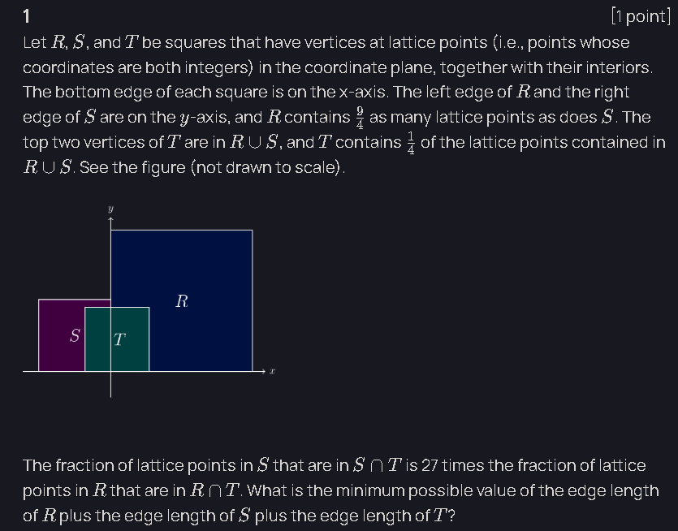

hi ^-^ i solve a lot of math, and wanted a place where i document fun, challenging, and elegant mathematical problems i've solved over time

---

## 2015 AMC 12B #25

### Problem

A bee starts flying from point $P_0$. She flies $1$ inch due east to point $P_1$. For $j \geq 1$, once the bee reaches $P_j$, she turns $30^\circ$ counterclockwise and then flies $j+1$ inches straight to point $P_{j+1}$. When the bee reaches $P_{2016}$, she is exactly $a\sqrt{b}+c\sqrt{d}$ inches away from $P_0$, where $a$, $b$, $c$, and $d$ are positive integers and $b$ and $d$ are square-free. Find $a+b+c+d$.

### Solution

#### Modeling the Flight with Complex Numbers

Represent the plane as the complex plane and place $P_0$ at the origin.

Let

$$
\omega=e^{i\pi/6}.
$$

Since the bee turns $30^\circ$ after each segment, the $k$-th flight segment has:

- Length $k$
- Direction angle $(k-1)\cdot 30^\circ$

Thus the displacement from $P_{k-1}$ to $P_k$ is

$$
k\omega^{k-1}.
$$

Therefore, the position of $P_{2016}$ relative to $P_0$ is

$$
S=\sum_{k=1}^{2016}k\omega^{k-1}.
$$

Our goal is to compute $|S|$.

#### Exploiting the Fact that $\omega^{12}=1$

Since

$$
\omega^{12}=e^{2\pi i}=1,
$$

and

$$
2016=168\cdot 12,
$$

we group the sum into $168$ blocks of $12$ consecutive terms:

$$
S=\sum_{m=0}^{167}\sum_{t=1}^{12}(12m+t)\omega^{t-1}.
$$

Expanding,

$$
S=\sum_{m=0}^{167}\left(12m\sum_{t=1}^{12}\omega^{t-1}+\sum_{t=1}^{12}t\omega^{t-1}\right).
$$

Because $\omega$ is a primitive $12$th root of unity,

$$
\sum_{t=1}^{12}\omega^{t-1}
=
1+\omega+\omega^2+\cdots+\omega^{11}
=
0.
$$

Hence all terms involving $12m$ vanish, giving

$$
S
=
168\sum_{t=1}^{12}t\omega^{t-1}.
$$

Let

$$
C=\sum_{t=1}^{12}t\omega^{t-1}.
$$

Then

$$
S=168C.
$$

#### Evaluating the Root-of-Unity Sum

Consider the finite geometric series

$$
1+x+x^2+\cdots+x^{11}
=
\frac{1-x^{12}}{1-x}.
$$

Differentiate both sides:

$$
\sum_{t=1}^{12}t\,x^{t-1}
=
\frac{-12x^{11}(1-x)+(1-x^{12})}{(1-x)^2}.
$$

Substituting $x=\omega$ and using $\omega^{12}=1$ gives

$$
C
=
\frac{-12\omega^{11}(1-\omega)}{(1-\omega)^2}
=
-\frac{12\omega^{11}}{1-\omega}.
$$

Since $\omega^{11}=\omega^{-1}$,

$$
C
=
-\frac{12\omega^{-1}}{1-\omega}.
$$

Multiplying numerator and denominator by $\omega$,

$$
C
=
-\frac{12}{\omega-\omega^2}.
$$

Factoring $\omega$ from the denominator,

$$
C
=
-\frac{12}{\omega(1-\omega)}
=
-\frac{12}{1-\omega}.
$$

Therefore,

$$
S
=
168\left(-\frac{12}{1-\omega}\right)
=
-\frac{2016}{1-\omega}.
$$

#### Computing $\frac{1}{1-\omega}$

Since

$$
\omega
=
\cos 30^\circ+i\sin 30^\circ
=
\frac{\sqrt3}{2}+\frac{i}{2},
$$

we have

$$
1-\omega
=
\frac{2-\sqrt3}{2}-\frac{i}{2}.
$$

A standard identity gives

$$
\frac{1}{1-e^{i\theta}}
=
\frac12+\frac{i}{2}\cot\left(\frac{\theta}{2}\right).
$$

Using $\theta=\frac{\pi}{6}$,

$$
\frac{1}{1-\omega}
=
\frac12+\frac{i}{2}\cot 15^\circ.
$$

Since

$$
\cot 15^\circ=2+\sqrt3,
$$

it follows that

$$
\frac{1}{1-\omega}
=
\frac12+\frac{i}{2}(2+\sqrt3).
$$

Therefore,

$$
S
=
-2016\left(\frac12+\frac{i}{2}(2+\sqrt3)\right)
=
-1008-1008(2+\sqrt3)i.
$$

#### Finding the Distance from the Origin

The distance from $P_0$ to $P_{2016}$ is

$$
|S|
=
1008\sqrt{1+(2+\sqrt3)^2}.
$$

Compute the quantity inside the square root:

$$
1+(2+\sqrt3)^2
=
1+4+4\sqrt3+3
=
8+4\sqrt3.
$$

Factor:

$$
8+4\sqrt3
=
4(2+\sqrt3).
$$

Hence

$$
|S|
=
2016\sqrt{2+\sqrt3}.
$$

Use the identity

$$
2+\sqrt3
=
\frac{(\sqrt3+1)^2}{2}.
$$

Thus

$$
\sqrt{2+\sqrt3}
=
\frac{\sqrt3+1}{\sqrt2}
=
\frac{\sqrt6+\sqrt2}{2}.
$$

Substituting,

$$
|S|
=
2016\cdot\frac{\sqrt6+\sqrt2}{2}
=
1008\sqrt6+1008\sqrt2.
$$

Therefore,

$$
a=1008,\quad b=6,\quad c=1008,\quad d=2.
$$

#### Computing the Requested Sum

$$
a+b+c+d
=
1008+6+1008+2
=
2024.
$$

**Final Answer:** **`2024`**

---

## 2004 AIME I #12

### Problem

Let $S$ be the set of ordered pairs $(x,y)$ such that $0<x\le1$, $0<y\le1$, and both

$$
\left\lfloor \log_2\left(\frac{1}{x}\right)\right\rfloor
$$

and

$$
\left\lfloor \log_5\left(\frac{1}{y}\right)\right\rfloor
$$

are even integers. Given that the area of the graph of $S$ is $\frac{m}{n}$, where $m$ and $n$ are relatively prime positive integers, find $m+n$.

### Solution

#### Determining the Valid Values of $x$

Suppose

$$
\left\lfloor \log_2\left(\frac{1}{x}\right)\right\rfloor=2k
$$

for some integer $k\ge0$.

By the definition of the floor function,

$$
2k\le\log_2\left(\frac{1}{x}\right)<2k+1.
$$

Exponentiating base $2$ gives

$$
2^{2k}\le\frac{1}{x}<2^{2k+1}.
$$

Taking reciprocals reverses the inequalities:

$$
2^{-(2k+1)}<x\le2^{-2k}.
$$

Therefore, for each $k\ge0$, the valid interval for $x$ is

$$
\left(2^{-(2k+1)},\,2^{-2k}\right].
$$

The length of this interval is

$$
2^{-2k}-2^{-(2k+1)}
=
2^{-(2k+1)}.
$$

Hence the total measure of all valid $x$-values is

$$
\sum_{k=0}^{\infty}2^{-(2k+1)}
=
\frac{1}{2}\sum_{k=0}^{\infty}\left(\frac{1}{4}\right)^k.
$$

Using the geometric series formula,

$$
\frac{1}{2}\cdot\frac{1}{1-\frac{1}{4}}
=
\frac{1}{2}\cdot\frac{4}{3}
=
\frac{2}{3}.
$$

Thus the total valid length in the $x$-direction is

$$
\frac{2}{3}.
$$

#### Determining the Valid Values of $y$

Similarly, suppose

$$
\left\lfloor \log_5\left(\frac{1}{y}\right)\right\rfloor=2m
$$

for some integer $m\ge0$.

Then

$$
2m\le\log_5\left(\frac{1}{y}\right)<2m+1.
$$

Exponentiating base $5$ yields

$$
5^{2m}\le\frac{1}{y}<5^{2m+1}.
$$

Taking reciprocals,

$$
5^{-(2m+1)}<y\le5^{-2m}.
$$

The length of this interval is

$$
5^{-2m}-5^{-(2m+1)}
=
4\cdot5^{-(2m+1)}.
$$

Therefore the total measure of all valid $y$-values is

$$
\sum_{m=0}^{\infty}4\cdot5^{-(2m+1)}
=
\frac{4}{5}\sum_{m=0}^{\infty}\left(\frac{1}{25}\right)^m.
$$

Again applying the geometric series formula,

$$
\frac{4}{5}\cdot\frac{1}{1-\frac{1}{25}}
=
\frac{4}{5}\cdot\frac{25}{24}
=
\frac{5}{6}.
$$

Thus the total valid length in the $y$-direction is

$$
\frac{5}{6}.
$$

#### Computing the Area of $S$

The conditions on $x$ and $y$ are independent, so the area of $S$ is the product of the valid lengths in the two directions:

$$
\text{Area}(S)
=
\frac{2}{3}\cdot\frac{5}{6}
=
\frac{10}{18}
=
\frac{5}{9}.
$$

Hence

$$
\frac{m}{n}
=
\frac{5}{9},
$$

so

$$
m=5,
\qquad
n=9.
$$

#### Computing $m+n$

Therefore,

$$
m+n
=
5+9
=
14.
$$

**Final Answer:** **`14`**

---

## 2010 AIME I #2

### Problem

For a positive integer $n$, let $\theta(n)$ denote the number of integers $0<x<2010$ such that

$$
x^2-n
$$

is divisible by $2010$.

Determine the remainder when

$$
\sum_{n=0}^{2009} n\cdot\theta(n)
$$

is divided by $2010$.

### Solution

#### Interpreting the Sum

For each integer $x$ with $0<x<2010$, there is exactly one residue

$$
n \in \{0,1,\dots,2009\}
$$

such that

$$
x^2 \equiv n \pmod{2010}.
$$

The value $\theta(n)$ counts how many integers $x$ produce the residue $n$.

Therefore, each $x$ contributes its corresponding residue $n$ exactly once to the sum

$$
\sum_{n=0}^{2009} n\cdot\theta(n).
$$

Hence

$$
\sum_{n=0}^{2009} n\cdot\theta(n)
=
\sum_{x=1}^{2009} (x^2 \bmod 2010).
$$

#### Reducing Modulo $2010$

Since

$$
x^2 \bmod 2010 \equiv x^2 \pmod{2010},
$$

we have

$$
\sum_{n=0}^{2009} n\cdot\theta(n)
\equiv
\sum_{x=1}^{2009} x^2
\pmod{2010}.
$$

Thus we only need to compute

$$
\sum_{x=1}^{2009} x^2.
$$

Using the sum-of-squares formula,

$$
\sum_{x=1}^{2009} x^2
=
\frac{2009\cdot2010\cdot4019}{6}.
$$

Since

$$
\frac{2010}{6}=335,
$$

this becomes

$$
2009\cdot335\cdot4019.
$$

#### Computing the Remainder

Working modulo $2010$,

$$
2009 \equiv -1 \pmod{2010}
$$

and

$$
4019 \equiv -1 \pmod{2010}.
$$

Therefore,

$$
2009\cdot335\cdot4019
\equiv
(-1)\cdot335\cdot(-1)
=
335
\pmod{2010}.
$$

So the required remainder is

$$
335.
$$

**Final Answer:** **`335`**

---

## 2025 AMC 12A #1

### Problem

### Solution

#### Counting Lattice Points

Let the side lengths of $R$, $S$, and $T$ be $r$, $s$, and $t$, respectively.

Since each square is aligned with the lattice, a square of side length $m$ contains

$$
(m+1)^2
$$

lattice points.

Thus,

$$
N(R)=(r+1)^2,
\qquad
N(S)=(s+1)^2.
$$

We are given

$$
(r+1)^2=\frac94(s+1)^2.
$$

Since $r+1$ and $s+1$ are integers,

$$
r+1=3k,
\qquad
s+1=2k
$$

for some positive integer $k$.

Hence

$$
r=3k-1,
\qquad
s=2k-1.
$$

#### Counting Points in $R\cup S$

Since $R$ and $S$ meet along the $y$-axis and $r>s$, their intersection contains exactly

$$
s+1
$$

lattice points.

Therefore

$$
N(R\cup S) = (r+1)^2+(s+1)^2-(s+1).
$$

Substituting $r+1=3k$ and $s+1=2k$ gives

$$
N(R\cup S) = 9k^2+4k^2-2k = 13k^2-2k.
$$

Since $T$ contains one-fourth of the lattice points in $R\cup S$,

$$
(t+1)^2 = \frac{13k^2-2k}{4}.
$$

#### Using the Fraction Condition

Let $x_1$ be the width of $S\cap T$ and $x_2$ the width of $R\cap T$.

Then

$$
t=x_1+x_2.
$$

Since $T$ has height $t$, the intersections contain

$$
N(S\cap T)=(x_1+1)(t+1),
$$

and

$$
N(R\cap T)=(x_2+1)(t+1)
$$

lattice points.

The given ratio becomes

$$
\frac{(x_1+1)(t+1)}{(s+1)^2} = 27\cdot \frac{(x_2+1)(t+1)}{(r+1)^2}.
$$

Using

$$
(r+1)^2=\frac94(s+1)^2,
$$

we obtain

$$
x_1+1 = 12(x_2+1).
$$

Hence

$$
x_1=12x_2+11.
$$

Since

$$
t=x_1+x_2,
$$

it follows that

$$
t=13x_2+11.
$$

Let

$$
X=13x_2+12=t+1.
$$

#### Deriving a Pell Equation

Since

$$
(t+1)^2 = \frac{13k^2-2k}{4},
$$

and $k=\frac{s+1}{2}$, letting

$$
M=s+1
$$

gives

$$
4X^2 = \frac{13M^2-4M}{4}.
$$

Multiplying by $4$,

$$
16X^2 = 13M^2-4M.
$$

Rearranging,

$$
13M^2-4M-16X^2=0.
$$

Multiply by $13$:

$$
169M^2-52M-208X^2=0.
$$

Complete the square:

$$
(13M-2)^2-4-208X^2=0.
$$

Thus

$$
(13M-2)^2-208X^2=4.
$$

Dividing by $4$ gives

$$
\left(\frac{13M-2}{2}\right)^2-52X^2=1.
$$

Let

$$
Y=\frac{13M-2}{2}.
$$

Then

$$
Y^2-52X^2=1.
$$

This is a Pell equation.

#### Solving the Pell Equation

The fundamental positive solution of

$$
Y^2-52X^2=1
$$

is

$$
(Y,X)=(649,90).
$$

Since

$$
X=t+1,
$$

we obtain

$$
t=89.
$$

Also,

$$
Y=\frac{13M-2}{2}=649,
$$

so

$$
13M-2=1298,
$$

and therefore

$$
M=100.
$$

Hence

$$
s=M-1=99.
$$

Since

$$
r+1=\frac32(s+1),
$$

we have

$$
r+1=150,
$$

so

$$
r=149.
$$

#### Computing the Sum

Therefore

$$
r+s+t = 149+99+89 = 337.
$$

**Final Answer:** **`337`**

---

## HMMT 2025 Problem 3

### Problem

A polynomial $P(x)$ is a base-$n$ polynomial if it is of the form

$$
a_dx^d+a_{d-1}x^{d-1}+\cdots+a_1x+a_0,
$$

where each $a_i$ is an integer between $0$ and $n-1$ inclusive and $a_d>0$.

Find the largest positive integer $n$ such that for any real number $c$, there exists at most one base-$n$ polynomial $P(x)$ for which

$$
P(\sqrt2+\sqrt3)=c.
$$

### Solution

#### Reformulating the Uniqueness Condition

Let

$$
\alpha=\sqrt2+\sqrt3.
$$

Suppose two distinct base-$n$ polynomials $P(x)$ and $Q(x)$ satisfy

$$
P(\alpha)=Q(\alpha).
$$

Then their difference

$$
D(x)=P(x)-Q(x)
$$

is a nonzero polynomial satisfying

$$
D(\alpha)=0.
$$

Since the coefficients of $P$ and $Q$ lie in

$$
\{0,1,\dots,n-1\},
$$

the coefficients of $D$ all lie in

$$
[-(n-1), n-1].
$$

Therefore uniqueness holds exactly when every nonzero integer polynomial vanishing at $\alpha$ has at least one coefficient whose absolute value is at least $n$.

Our task is therefore to determine the smallest possible value of

$$
\max |d_i|
$$

among all nonzero integer polynomials

$$
D(x)
$$

satisfying

$$
D(\alpha)=0.
$$

#### Finding the Minimal Polynomial of $\alpha$

We compute:

$$
\alpha^2 = (\sqrt2+\sqrt3)^2 = 5+2\sqrt6.
$$

Hence

$$
\alpha^2-5=2\sqrt6.
$$

Squaring again gives

$$
(\alpha^2-5)^2=24.
$$

Expanding,

$$
\alpha^4-10\alpha^2+25=24,
$$

so

$$
\alpha^4-10\alpha^2+1=0.
$$

Thus the minimal polynomial of $\alpha$ is

$$
m(x)=x^4-10x^2+1.
$$

Any integer polynomial vanishing at $\alpha$ must therefore be a multiple of $m(x)$.

#### Producing a Small Multiple

Consider

$$
(x^2+1)m(x).
$$

Multiplying,

$$
(x^2+1)(x^4-10x^2+1) = x^6-9x^4-9x^2+1.
$$

The coefficients are

$$
1, 0, -9, 0, -9, 0, 1.
$$

Therefore there exists a nonzero polynomial vanishing at $\alpha$ whose coefficients all have absolute value at most $9$.

Consequently, uniqueness fails for

$$
n=10,
$$

because the coefficients lie in

$$
[-9,9].
$$

Thus

$$
n\le 9.
$$

#### Showing That 9 Is Best Possible

We now prove that every nonzero multiple of

$$
m(x)=x^4-10x^2+1
$$

has some coefficient whose absolute value is at least $9$.

Let

$$
Q(x)=m(x)G(x),
$$

where

$$
G(x)=\sum g_i x^i
$$

is a nonzero integer polynomial.

Let

$$
M=\max |g_i|.
$$

Choose an index $k$ such that

$$
|g_k|=M.
$$

The coefficient of $x^{k+2}$ in $Q(x)$ equals

$$
q_{k+2} = g_{k+2}-10g_k+g_{k-2}.
$$

Therefore

$$
|q_{k+2}| \ge 10|g_k|-|g_{k+2}|-|g_{k-2}| \ge 10M-M-M = 8M.
$$

Since $M\ge1$,

$$
|q_{k+2}|\ge8.
$$

If every coefficient of $Q$ had absolute value at most $8$, equality would have to hold throughout.

That forces

$$
|g_{k+2}|=|g_{k-2}|=M
$$

and all three terms must have the same sign.

Repeating the argument shows that infinitely many coefficients of $G$ would have magnitude $M$, impossible because $G$ has finite degree.

Hence no nonzero multiple of $m(x)$ can have all coefficients bounded by $8$.

Therefore every nonzero polynomial vanishing at $\alpha$ has a coefficient with absolute value at least

$$
9.
$$

#### Finishing the Argument

We have shown:

* There exists a nonzero polynomial vanishing at $\alpha$ with all coefficients bounded by $9$.
* No nonzero polynomial vanishing at $\alpha$ can have all coefficients bounded by $8$.

Therefore the smallest possible coefficient bound is exactly

$$
9.
$$

Thus uniqueness holds for base-$9$ polynomials and fails for base-$10$ polynomials.

Hence the largest possible value of $n$ is

$$
\boxed{9}.
$$

**Final Answer:** **`9`**
