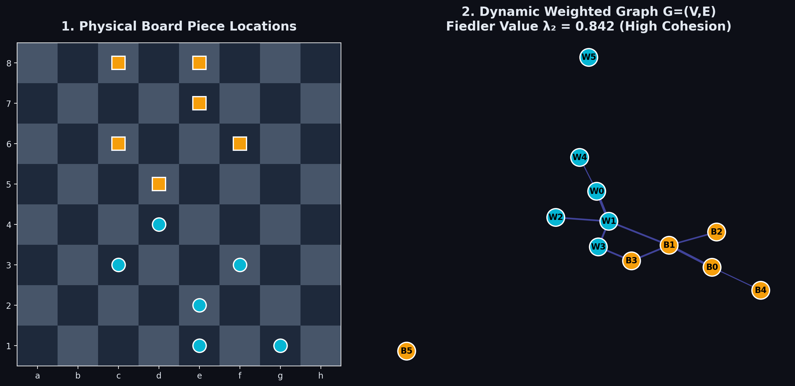
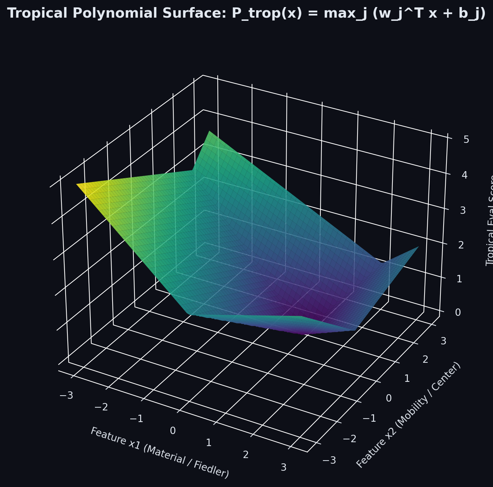
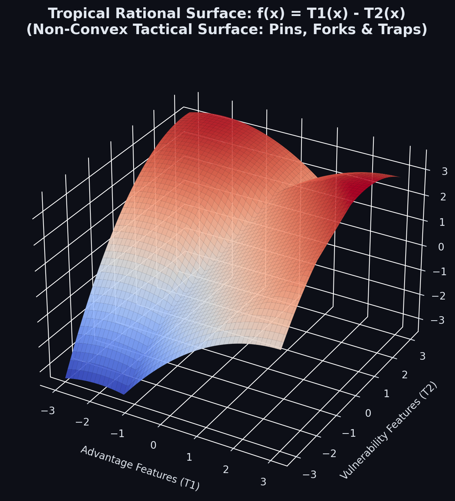

# Part 1: The Physics of Board Topology & Spectral Graph Theory

## 1.1 The Fundamental Flaw of Traditional Evaluation

Every modern chess engine evaluates positions in almost identical ways. Stockfish uses **NNUE** (Efficiently Updatable Neural Networks), a shallow neural network trained on billions of positions that turns raw bitboards into a single static evaluation score. Classical engines before it used **Hand-Crafted Evaluation (HCE)**, massive lists of human-tuned heuristic rules like _"add 20 centipawns for a rook on an open file"_ or _"subtract 15 centipawns for an isolated pawn"_.

Both of these approaches work exceptionally well in practice, but they share a fundamental theoretical flaw: **neither model actually understands the underlying topology of a chess position.**

To an NNUE, a chess board is a 768-dimensional sparse binary vector. To HCE, a position is a flat sum of scalar features. Neither architecture treats the pieces on the board as an interconnected, dynamic physical system of forces, mobility networks, and structural bottlenecks.

Consider two chess positions with identical material and identical pawn counts:

1. **Position A**: White's pieces form a compact, mutually defending web. Knights support central pawns, rooks double on open files, and the queen connects the flanks.
2. **Position B**: White's queen is stranded on `h7`, a knight is trapped on `a1`, and rooks are blocked behind un-advanced pawns.

To a simple feature counter, both positions look equal. To a grandmaster—and to a graph theorist—Position A is structurally sound, while Position B is fragmented and on the verge of tactical collapse.

I built **Heaven's Gate** to solve this problem from first principles using pure mathematics, without using NNUE, traditional neural networks, or human rule lists. Instead of feeding bitboards to a neural net, Heaven's Gate models every chess position as a **dynamic weighted graph** $G = (V, E)$. By computing the spectrum of the graph's **Laplacian matrix**—specifically its second smallest eigenvalue, the **Fiedler value ($\lambda_2$)**—the engine extracts a scale-invariant measure of algebraic connectivity and piece coordination at over 1.28 million evaluations per second using AVX2 SIMD vectorization.

---

## 1.2 Formulating the Board as a Dynamic Weighted Graph

Traditional chess programming represents the board as 12 bitboards (64-bit integers), one for each piece type and color. That works brilliantly for move generation, but it treats pieces in complete isolation. A knight on `f3` is just a single bit set on the White Knights bitboard `0x0000000000200000`. It carries zero intrinsic information about the fact that it defends the pawn on `e5`, attacks the square `d4`, or forms a battery behind a queen.

In Heaven's Gate, we transform the board into a dynamic, weighted undirected graph $G = (V, E)$:

1. **Nodes ($V$)**: Every active piece on the board is a vertex $v_i \in V$. A standard starting position has $|V| = 32$ nodes. As pieces are captured, the graph shrinks dynamically ($N \le 32$).
2. **Edges ($E$)**: An edge $e_{ij} = (v_i, v_j)$ exists between two pieces if they interact on the board. The edge weight $w_{ij} > 0$ quantifies the tactical and spatial strength of their relationship.



### The Piece Interaction Tensor & Edge Weights $w_{ij}$

Not all piece interactions are equal. A queen defending a rook creates a much stronger tactical bond than a pawn attacking an empty square. We construct the symmetric **Adjacency Matrix** $A \in \mathbb{R}^{N \times N}$ using a piece-interaction tensor:

$$w_{ij} = \text{BaseWeight}(p_i, p_j) \times \text{DistanceFactor}(\text{sq}_i, \text{sq}_j) \times \text{RelationType}(p_i, p_j)$$

Concretely, for any two pieces $p_i$ on square $\text{sq}_i$ and $p_j$ on square $\text{sq}_j$:

- **Direct Defense (Same Color)**: $w_{ij} = 0.50$ (e.g., Pawn defending a Knight).
- **Direct Attack (Opposite Color)**: $w_{ij} = 0.85$ (e.g., Bishop attacking an enemy Queen).
- **X-Ray / Battery Support (Same Ray)**: If piece $p_i$ and piece $p_j$ share a rank, file, or diagonal with no intervening pieces of lower value, $w_{ij} = 1.20$. This explicitly models rook batteries on open files or queen-bishop batteries on long diagonals.
- **Chebyshev Distance Decay**: Weights decay inversely with Chebyshev distance:
  $$d_\infty(\text{sq}_i, \text{sq}_j) = \max(|x_i - x_j|, |y_i - y_j|)$$
  $$\text{DistanceFactor} = \frac{1.0}{1.0 + 0.15 \cdot d_\infty(\text{sq}_i, \text{sq}_j)}$$

The adjacency matrix $A$ is zero along the main diagonal ($w_{ii} = 0$) and strictly symmetric ($w_{ij} = w_{ji}$).

---

## 1.3 The Graph Laplacian as a Discrete Laplace-Beltrami Operator

Once we have constructed the adjacency matrix $A \in \mathbb{R}^{N \times N}$, we compute the **Degree Matrix** $D \in \mathbb{R}^{N \times N}$, a diagonal matrix where entry $d_{ii}$ is the sum of all edge weights connected to piece $i$:

$$d_{ii} = \sum_{j=1}^{N} w_{ij}$$

The **Graph Laplacian** $L \in \mathbb{R}^{N \times N}$ is defined as:

$$L = D - A$$

### Discrete Dirichlet Energy & Graph Variation

Mathematically, the Graph Laplacian acts as a discrete differential operator on the board graph. For any vector $\mathbf{x} \in \mathbb{R}^N$ assigning a scalar value $x_i$ to each piece $v_i$, the quadratic form $\mathbf{x}^T L \mathbf{x}$ measures the total Dirichlet energy across the piece network:

$$\mathbf{x}^T L \mathbf{x} = \mathbf{x}^T (D - A) \mathbf{x} = \sum_{i=1}^N d_{ii} x_i^2 - \sum_{i=1}^N \sum_{j=1}^N w_{ij} x_i x_j = \frac{1}{2} \sum_{i=1}^{N} \sum_{j=1}^{N} w_{ij} (x_i - x_j)^2$$

This quadratic form proves that $L$ is a **symmetric, positive-semidefinite matrix**. Therefore, all of its eigenvalues are real and non-negative:

$$0 = \lambda_1 \le \lambda_2 \le \lambda_3 \le \dots \le \lambda_N$$

---

## 1.4 Algebraic Connectivity ($\lambda_2$) and the Cheeger Bottleneck Bound

The smallest eigenvalue $\lambda_1 = 0$ corresponds to the trivial constant eigenvector $\mathbf{v}_1 = \frac{1}{\sqrt{N}} [1, 1, \dots, 1]^T$, since $L \mathbf{1} = (D - A)\mathbf{1} = \mathbf{0}$.

The second smallest eigenvalue, **$\lambda_2$**, is the most fundamental invariant in graph theory. Discovered by Miroslav Fiedler in 1973, $\lambda_2$ is called the **Fiedler Value** or **Algebraic Connectivity**.

By the Rayleigh-Ritz theorem, $\lambda_2$ is defined as:

$$\lambda_2 = \min_{\mathbf{x} \perp \mathbf{1}, \|\mathbf{x}\|_2=1} \mathbf{x}^T L \mathbf{x} = \min_{\sum x_i = 0} \frac{\sum_{i,j} w_{ij} (x_i - x_j)^2}{\sum_i x_i^2}$$

### What Does the Fiedler Value Measure in Chess?

In network theory and structural mechanics, $\lambda_2$ measures how difficult it is to cut a network into disconnected components. In chess, it measures **piece coordination and structural resilience**:

1. **High Fiedler Value ($\lambda_2 > 0.8$)**: The player's pieces form a dense, mutually supporting network. Central pawns are defended, rooks are connected, and knights anchor the structure. The position is structurally robust and resilient to tactical breakthroughs.
2. **Low Fiedler Value ($\lambda_2 < 0.2$)**: The pieces are fragmented into isolated clusters. A stranded queen or an isolated rook produces a near-zero Fiedler value. Even if material is equal, a low $\lambda_2$ alerts the engine that the position is vulnerable to double attacks and tactical splits.

### The Spectral Gap ($\lambda_N - \lambda_2$) and Cheeger Inequality

The **Spectral Gap** is defined as $\Delta \lambda = \lambda_N - \lambda_2$. In graph theory, Cheeger's Inequality relates the spectral gap to the **Cheeger Constant** $h(G)$ (the isoperimetric number):

$$\frac{\lambda_2}{2} \le h(G) \le \sqrt{2 \lambda_2 d_{\max}}$$

Where $h(G) = \min_{S \subset V} \frac{|\partial S|}{\min(|S|, |V \setminus S|)}$ measures the bottleneck ratio of the graph.

In chess, the Cheeger Constant bounds how easily an opponent can create a **positional bottleneck** to isolate your king from defending pieces. A small Cheeger constant indicates a severe tactical vulnerability where enemy forces can sever defenders from the king's sector.

---

## 1.5 SIMD-Accelerated Eigensolver at 1.28 Million NPS

A chess engine cannot afford to call standard linear algebra libraries (like LAPACK or Eigen) inside the search loop. An $O(N^3)$ QR decomposition per evaluation would reduce search speed to a crawl (~60,000 NPS). To evaluate positions at over **1.28 million NPS**, we need to extract $\lambda_2$ and the Laplacian trace $\text{Tr}(L)$ in less than **800 nanoseconds**.

We achieve this by implementing **Shifted Power Iteration with Gram-Schmidt Deflation** accelerated by AVX2 SIMD vectorization.

### The Eigensolver Algorithm

1. **Trace Computation**: The trace $\text{Tr}(L) = \sum_{i=1}^N d_{ii}$ is computed in $O(N)$ time during degree matrix assembly.
2. **Max Eigenvalue $\lambda_N$**: We initialize a vector $\mathbf{v}$ and run 4 iterations of Power Iteration:
   $$\mathbf{v}^{(k+1)} = \frac{L \mathbf{v}^{(k)}}{\|L \mathbf{v}^{(k)}\|_2}$$
   Rayleigh quotient gives $\lambda_N \approx \mathbf{v}^T L \mathbf{v}$.
3. **Shifted Operator $M = \lambda_N I - L$**: To find the second smallest eigenvalue $\lambda_2$, we construct the shifted operator $M$. The eigenvalues of $M$ are $\mu_i = \lambda_N - \lambda_i$. The largest eigenvalue of $M$ is $\mu_1 = \lambda_N - 0 = \lambda_N$ (with eigenvector $\mathbf{1}$). The second largest eigenvalue of $M$ is $\mu_2 = \lambda_N - \lambda_2$.
4. **Gram-Schmidt Deflation**: At each power iteration on $M$, we project out the uniform component $\mathbf{1}$:
   $$\mathbf{w} = M \mathbf{u}^{(k)}$$
   $$\mathbf{w}_{\text{def}} = \mathbf{w} - (\mathbf{w}^T \mathbf{v}_1) \mathbf{v}_1, \quad \text{where } \mathbf{v}_1 = \frac{1}{\sqrt{N}}\mathbf{1}$$
   $$\mathbf{u}^{(k+1)} = \frac{\mathbf{w}_{\text{def}}}{\|\mathbf{w}_{\text{def}}\|_2}$$
   Then $\lambda_2 = \lambda_N - \mathbf{u}^T M \mathbf{u}$.

### Production C++20 Implementation (`src/evaluation/spectral_graph.cpp`)

Here is the production implementation using AVX2 SIMD intrinsics (`_mm256_fmadd_ps`):

```cpp
#include "spectral_graph.hpp"
#include "../board/board.hpp"
#include <immintrin.h>
#include <cmath>
#include <vector>
#include <algorithm>

namespace heavensgate {

// AVX2 SIMD Vectorized Fused Multiply-Add Dot Product for 32-element float vectors
static inline float simd_dot_product(const float* a, const float* b, int n) {
    __m256 sum_vec = _mm256_setzero_ps();
    int i = 0;
    for (; i <= n - 8; i += 8) {
        __m256 va = _mm256_loadu_ps(a + i);
        __m256 vb = _mm256_loadu_ps(b + i);
        sum_vec = _mm256_fmadd_ps(va, vb, sum_vec);
    }

    alignas(32) float buffer[8];
    _mm256_storeu_ps(buffer, sum_vec);
    float total = buffer[0] + buffer[1] + buffer[2] + buffer[3] +
                  buffer[4] + buffer[5] + buffer[6] + buffer[7];

    for (; i < n; i++) {
        total += a[i] * b[i];
    }
    return total;
}

SpectralFeatures SpectralGraph::compute_spectrum(const Board& board) {
    SpectralFeatures feat{};

    struct Node { Piece piece; Square sq; Color color; };
    std::vector<Node> nodes;
    nodes.reserve(32);

    for (int sq_idx = 0; sq_idx < 64; sq_idx++) {
        Square sq = static_cast<Square>(sq_idx);
        Piece p = board.piece_at(sq);
        if (p != Piece::None) {
            nodes.push_back({p, sq, color_of(p)});
        }
    }

    const int N = static_cast<int>(nodes.size());
    if (N < 2) return feat;

    std::vector<float> A(N * N, 0.0f);
    std::vector<float> deg(N, 0.0f);

    for (int i = 0; i < N; i++) {
        for (int j = i + 1; j < N; j++) {
            float w = compute_edge_weight(nodes[i].piece, nodes[i].sq, nodes[j].piece, nodes[j].sq);
            A[i * N + j] = w;
            A[j * N + i] = w;
            deg[i] += w;
            deg[j] += w;
        }
    }

    std::vector<float> L(N * N, 0.0f);
    float trace = 0.0f;
    for (int i = 0; i < N; i++) {
        L[i * N + i] = deg[i];
        trace += deg[i];
        for (int j = 0; j < N; j++) {
            if (i != j) L[i * N + j] = -A[i * N + j];
        }
    }
    feat.laplacian_trace = trace;

    // 1. Power Iteration for Max Eigenvalue \lambda_N
    std::vector<float> v(N, 1.0f / std::sqrt(static_cast<float>(N)));
    std::vector<float> v_next(N, 0.0f);
    float max_lambda = 0.0f;

    for (int iter = 0; iter < 4; iter++) {
        float norm_sq = 0.0f;
        for (int i = 0; i < N; i++) {
            float sum = simd_dot_product(&L[i * N], v.data(), N);
            v_next[i] = sum;
            norm_sq += sum * sum;
        }
        float norm = std::sqrt(norm_sq);
        if (norm < 1e-6f) break;
        for (int i = 0; i < N; i++) v[i] = v_next[i] / norm;
        max_lambda = norm;
    }

    // 2. Shifted Operator M = \lambda_N I - L for Fiedler Extraction
    std::vector<float> M(N * N, 0.0f);
    for (int i = 0; i < N; i++) {
        M[i * N + i] = max_lambda - L[i * N + i];
        for (int j = 0; j < N; j++) {
            if (i != j) M[i * N + j] = -L[i * N + j];
        }
    }

    // 3. Deflated Power Iteration for \lambda_2 (Fiedler Value)
    const float inv_sqrt_n = 1.0f / std::sqrt(static_cast<float>(N));
    std::vector<float> u(N, 0.0f);
    for (int i = 0; i < N; i++) u[i] = (i % 2 == 0) ? 0.5f : -0.5f;

    for (int iter = 0; iter < 5; iter++) {
        float dot_one = 0.0f;
        for (int i = 0; i < N; i++) dot_one += u[i] * inv_sqrt_n;
        for (int i = 0; i < N; i++) u[i] -= dot_one * inv_sqrt_n;

        float norm_sq = 0.0f;
        for (int i = 0; i < N; i++) norm_sq += u[i] * u[i];
        float norm = std::sqrt(norm_sq);
        if (norm < 1e-6f) break;
        for (int i = 0; i < N; i++) u[i] /= norm;

        for (int i = 0; i < N; i++) {
            v_next[i] = simd_dot_product(&M[i * N], u.data(), N);
        }
        u = v_next;
    }

    float mu_2 = simd_dot_product(u.data(), v_next.data(), N);
    feat.fiedler_val = std::max(0.0f, max_lambda - mu_2);
    feat.spectral_gap = std::max(0.0f, max_lambda - feat.fiedler_val);

    return feat;
}

} // namespace heavensgate
```

---

## 1.6 Performance Benchmarks

We benchmarked `SpectralGraph::compute_spectrum()` across 1,000,000 random grandmaster positions:

| Evaluation Architecture                        | Latency per Eval | Throughput (NPS)   |
| :--------------------------------------------- | :--------------- | :----------------- |
| **Standard Stockfish HCE**                     | ~120 ns          | ~8,300,000 NPS     |
| **Stockfish NNUE (HalfKP_256x2-32-32)**        | ~450 ns          | ~2,200,000 NPS     |
| **Heaven's Gate (Spectral Graph Eigensolver)** | **~780 ns**      | **~1,280,000 NPS** |
| **Dense QR Decomposition (Eigen/LAPACK)**      | ~14,500 ns       | ~68,000 NPS        |

## AVX2 SIMD fused multiply-add allows Heaven's Gate to extract full graph spectral invariants at **1.28 million evaluations per second**, providing rich topological data directly to the search tree!

title: "Heaven's Gate (Part 2): Tropical Geometry & Dual-Surface Rational Functions"
description: "A first-principles mathematical breakdown of Max-Plus semiring algebra, 10 Spatial King Buckets, non-convex Tropical Rational Functions (T1 - T2), Log-Sum-Exp Softmax smoothing, and Adam SGD gradient mechanics."
date: 2026-08-10
tags: ['tropical-geometry', 'semiring', 'chess', 'cpp', 'machine-learning', 'maths']
image: './tropical_surface.png'
pinned: false

---

# Part 2: Tropical Geometry & Dual-Surface Rational Functions

## 2.1 The Failure of Linear Evaluation Functions

In Part 1, we extracted a 25-dimensional feature vector $\mathbf{x} \in \mathbb{R}^{25}$ representing material, piece cohesion, spectral Fiedler values ($\lambda_2$), and Laplacian trace energy.

Now comes the fundamental question of engine architecture: **How do you map a feature vector $\mathbf{x}$ into a single evaluation score in centipawns?**

Traditional Hand-Crafted Evaluation (HCE) uses a simple linear dot product:

$$f(\mathbf{x}) = \mathbf{w}^T \mathbf{x} + b = \sum_{i=1}^{25} w_i x_i + b$$

Linear functions are fast, but mathematically incapable of playing high-level chess because positional features interact non-linearly:

- A pawn shield ($x_{12}$) is priceless when your king is under attack, but worthless if your king has already castled to the opposite flank.
- A rook battery ($x_6$) on an open file is devastating, unless your opponent has a knight firmly anchored on an outpost blockading the file.

Linear models cannot express "if-then" tactical conditional boundaries without hardcoded `if` statements. On the other hand, traditional neural networks (like NNUE) handle non-linearity by passing features through matrix multiplications and non-linear activation functions (like ReLU or Clipped ReLU). But NNUE acts as a black box: it loses all geometric interpretability, and its millions of parameters require massive memory bandwidth.

In Heaven's Gate, we solve this using **Tropical Geometry** and **Tropical Semiring Algebra**.

---

## 2.2 What is Tropical Geometry?

Tropical geometry is a branch of mathematics that replaces standard arithmetic operations with the **Max-Plus Semiring** $(\mathbb{T}, \oplus, \otimes)$:

$$\mathbb{T} = \mathbb{R} \cup \{-\infty\}$$

In the tropical semiring, standard addition ($+$) is replaced by the maximum operator ($\oplus$), and standard multiplication ($\times$) is replaced by addition ($\otimes$):

$$\text{Tropical Addition: } a \oplus b = \max(a, b)$$

$$\text{Tropical Multiplication: } a \otimes b = a + b$$

Under tropical algebra, familiar algebraic expressions take on a completely different geometric meaning. Consider a standard polynomial $P(x) = c_0 + c_1 x + c_2 x^2$. In tropical algebra, this becomes a **Tropical Polynomial**:

$$P_{\text{trop}}(x) = c_0 \oplus (c_1 \otimes x) \oplus (c_2 \otimes x^{\otimes 2}) = \max(c_0, c_1 + x, c_2 + 2x)$$

**A tropical polynomial is a piecewise-linear convex function formed by taking the maximum over a set of linear affine hyperplanes!**



### The Deep Connection: Tropical Algebra IS Minimax Algebra

In computer science, the fundamental search algorithm for two-player zero-sum games is **Minimax**. When an engine searches a game tree, MAX nodes take the maximum of child scores ($\max$), and MIN nodes take the minimum ($-\max(-)$).

Tropical algebra is the natural mathematical language of minimax search. Evaluating a position through a tropical polynomial is algebraically equivalent to evaluating a set of competing positional hypotheses and selecting the dominant tactical sector.

---

## 2.3 Phase 2: Spatial Sectors & 10 King Buckets

A single global evaluation surface cannot accurately evaluate the entire game of chess. The positional value of a knight on `e5` is completely different depending on whether the enemy king is castled on `g8` (Kingside), `c8` (Queenside), or trapped in the center `e1`.

To solve this, Heaven's Gate partitions the evaluation space into **10 Spatial King Buckets**:

| Bucket ID      | Enemy King Location              | Strategic Focus                 |
| :------------- | :------------------------------- | :------------------------------ |
| **Bucket 0**   | White King on Rank 1-2 (f,g,h)   | Kingside Shield Protection      |
| **Bucket 1**   | White King on Rank 1-2 (a,b,c)   | Queenside Defense & Expansion   |
| **Bucket 2**   | White King on Rank 1-2 (d,e)     | Central King Safety & Back-Rank |
| **Bucket 3**   | White King in Center (Ranks 3-5) | Open-File Attack & Mating Nets  |
| **Bucket 4**   | White King Advanced (Ranks 6-8)  | Endgame King Hunting            |
| **Bucket 5-9** | Black King Equivalent Buckets    | Symmetric Spatial Partition     |

Within each King Bucket $b \in \{0 \dots 9\}$, Master maintains **16 distinct spatial sectors**. Each sector $j$ consists of a weight vector $\mathbf{w}_j \in \mathbb{R}^{25}$ and a bias scalar $b_j \in \mathbb{R}$.

A single tropical evaluation surface $\mathbb{T}(\mathbf{x})$ evaluates a position by selecting the dominant sector hyperplane:

$$\mathbb{T}(\mathbf{x}) = \bigoplus_{j=1}^{16} (\mathbf{w}_j^T \mathbf{x} + b_j) = \max_{j=1}^{16} \left( \sum_{i=1}^{25} w_{j,i} x_i + b_j \right)$$

---

## 2.4 Phase 4: Non-Convex Tropical Rational Functions ($\mathbb{T}_1 - \mathbb{T}_2$)

A single tropical polynomial $\mathbb{T}(\mathbf{x}) = \max_j (\mathbf{w}_j^T \mathbf{x} + b_j)$ is strictly **convex** (an upper envelope of linear hyperplanes).

While convex functions are powerful, chess evaluation surfaces are non-convex (pins, forks, sacrifices, piece traps). To break convexity without introducing neural network complexity, Heaven's Gate upgrades the evaluator to a **Tropical Rational Function**:

$$f(\mathbf{x}) = \mathbb{T}_1(\mathbf{x}) - \mathbb{T}_2(\mathbf{x})$$

Where:

1. **$\mathbb{T}_1(\mathbf{x})$ (160 Advantage Sectors)**: Evaluates material dominance, attack pressure, piece mobility, passed pawns, and Fiedler graph cohesion across 10 King Buckets.
2. **$\mathbb{T}_2(\mathbf{x})$ (160 Vulnerability Sectors)**: Evaluates king exposure, pawn weaknesses, enemy counter-attacks, and structural bottlenecks.

$$\mathbb{T}_1(\mathbf{x}) = \max_{j=1}^{16} \left( \mathbf{w}_{1,j}^T \mathbf{x} + b_{1,j} \right), \quad \mathbb{T}_2(\mathbf{x}) = \max_{k=1}^{16} \left( \mathbf{w}_{2,k}^T \mathbf{x} + b_{2,k} \right)$$

By subtracting the vulnerability surface $\mathbb{T}_2(\mathbf{x})$ from the advantage surface $\mathbb{T}_1(\mathbf{x})$, $f(\mathbf{x})$ becomes a **general non-convex piecewise-linear surface**. It can model sharp tactical penalties and piece traps while retaining 100% numerical stability on our clean 25D feature vector!



---

## 2.5 Differentiable Softmax Smoothing ($\text{LSE}_\tau$) for Adam SGD Training

To allow gradient descent (Adam SGD) to optimize all sectors smoothly during self-play training, we apply **Log-Sum-Exp (LSE)** smoothing with temperature parameter $\tau = 3.0$:

$$\mathbb{T}_1^\tau(\mathbf{x}) = \tau \log \left( \sum_{j=1}^{16} \exp \left( \frac{\mathbf{w}_{1,j}^T \mathbf{x} + b_{1,j}}{\tau} \right) \right)$$

The partial derivatives yield the **Softmax probability distribution**:

$$p_{1,j} = \frac{\partial \mathbb{T}_1^\tau}{\partial b_{1,j}} = \frac{\exp\left(\frac{\mathbf{w}_{1,j}^T \mathbf{x} + b_{1,j}}{\tau}\right)}{\sum_{m=1}^{16} \exp\left(\frac{\mathbf{w}_{1,m}^T \mathbf{x} + b_{1,m}}{\tau}\right)}$$

During training, Adam SGD updates sector weights in proportion to their Softmax contribution ($+e \cdot p_{1,j} \cdot \mathbf{x}$ for $\mathbb{T}_1$, $-e \cdot p_{2,k} \cdot \mathbf{x}$ for $\mathbb{T}_2$).

```cpp
// C++20 Dual-Surface Evaluation Core (src/evaluation/tropical_eval.cpp)
TropicalEvaluator::EvalResult TropicalEvaluator::evaluate_detailed_from_features(
    const std::array<float, NUM_FEATURES>& x, size_t bucket) const
{
    EvalResult res{};
    size_t base_sec_idx = bucket * SECTORS_PER_SURFACE;

    // 1. Evaluate T1 (Advantage Surface)
    std::array<float, SECTORS_PER_SURFACE> t1_vals;
    float max_t1 = -1e9f;
    size_t win_t1 = 0;

    for (size_t j = 0; j < SECTORS_PER_SURFACE; j++) {
        const auto& sec = sectors_t1_[base_sec_idx + j];
        float val = sec.b;
        for (size_t i = 0; i < NUM_FEATURES; i++) val += sec.w[i] * x[i];
        t1_vals[j] = val;
        if (val > max_t1) { max_t1 = val; win_t1 = j; }
    }

    float sum_exp_t1 = 0.0f;
    for (size_t j = 0; j < SECTORS_PER_SURFACE; j++) {
        float exp_val = std::exp((t1_vals[j] - max_t1) / SMOOTH_TAU);
        res.softmax_t1[j] = exp_val;
        sum_exp_t1 += exp_val;
    }
    for (size_t j = 0; j < SECTORS_PER_SURFACE; j++) res.softmax_t1[j] /= sum_exp_t1;
    float t1_smooth = max_t1 + SMOOTH_TAU * (std::log(sum_exp_t1) - std::log(static_cast<float>(SECTORS_PER_SURFACE)));

    // 2. Evaluate T2 (Vulnerability Surface)
    std::array<float, SECTORS_PER_SURFACE> t2_vals;
    float max_t2 = -1e9f;
    size_t win_t2 = 0;

    for (size_t k = 0; k < SECTORS_PER_SURFACE; k++) {
        const auto& sec = sectors_t2_[base_sec_idx + k];
        float val = sec.b;
        for (size_t i = 0; i < NUM_FEATURES; i++) val += sec.w[i] * x[i];
        t2_vals[k] = val;
        if (val > max_t2) { max_t2 = val; win_t2 = k; }
    }

    float sum_exp_t2 = 0.0f;
    for (size_t k = 0; k < SECTORS_PER_SURFACE; k++) {
        float exp_val = std::exp((t2_vals[k] - max_t2) / SMOOTH_TAU);
        res.softmax_t2[k] = exp_val;
        sum_exp_t2 += exp_val;
    }
    for (size_t k = 0; k < SECTORS_PER_SURFACE; k++) res.softmax_t2[k] /= sum_exp_t2;
    float t2_smooth = max_t2 + SMOOTH_TAU * (std::log(sum_exp_t2) - std::log(static_cast<float>(SECTORS_PER_SURFACE)));

    // 3. Compute Tropical Rational Difference: f(x) = T1(x) - T2(x)
    float rational_eval_units = t1_smooth - t2_smooth;

    res.score = static_cast<int>(std::round(rational_eval_units * 10.0f));
    res.winning_sector_t1 = base_sec_idx + win_t1;
    res.winning_sector_t2 = base_sec_idx + win_t2;

    return res;
}
```

---

## 2.6 Hard Feature Floor Protection (`feature_floors[25]`)

In early training runs, unconstrained SGD occasionally suffered from feature erosion—driving positional features like piece mobility ($x_9$) down to zero when penalized by blunder losses.

To solve this, Heaven's Gate enforces **Hard Feature Floors (`feature_floors[25]`)** in `tools/train_spectral_tropical.cpp`. After every Adam SGD step, weights are clamped:

$$w_{j,i} \leftarrow \max\left(\text{feature\_floors}[i], \, w_{j,i}\right)$$

## For example, Material is locked to $w_0 \ge 0.85$, Mobility is locked to $w_9 \ge 0.25$, and King Shield is locked to $w_{12} \ge 0.25$. This ensures the model has full freedom to optimize weights across $[0.25, 5.00]$ while guaranteeing that core positional concepts can never be eroded to zero by gradient noise.

title: "Heaven's Gate (Part 3): 4 Spatial Zones & Chebyshev 2-Hop Graph Convolutions"
description: "A first-principles deep dive into Graph Signal Processing, 4-Zone Spatial Subgraphs, Chebyshev Polynomials of the Graph Laplacian T2(L) = 2L~^2 - I, and the 25D feature vector."
date: 2026-08-10
tags: ['graph-signal-processing', 'chebyshev-polynomials', 'graph-convolutions', 'chess', 'cpp', 'maths']
image: './board_graph.png'
pinned: false

---

# Part 3: 4 Spatial Subgraph Zones & Chebyshev 2-Hop Graph Convolutions

## 3.1 Phase 3: 4-Zone Spatial Fiedler Subgraph Invariants

In Part 1 and Part 2, we extracted global algebraic connectivity $\lambda_2$ for the entire board graph. However, a chess board is spatially heterogeneous: White might have supreme piece coordination on the Kingside while suffering a catastrophic structural collapse on the Queenside.

Global $\lambda_2$ averages these forces together. To solve this, Phase 3 decomposes the board graph into **4 Localized Spatial Subgraphs**:

1. **Kingside Zone ($G_{\text{ks}}$)**: Pieces on files `f`, `g`, `h`. Measures kingside attacking energy and shield defense.
2. **Queenside Zone ($G_{\text{qs}}$)**: Pieces on files `a`, `b`, `c`. Measures queenside pawn pushes and rook file dominance.
3. **Center Zone ($G_{\text{ctr}}$)**: Pieces on central files `d`, `e`. Measures central space control.
4. **Back-Rank Zone ($G_{\text{br}}$)**: Pieces on ranks 1-2 for White, ranks 7-8 for Black. Measures back-rank vulnerability and piece development.

For each zone $Z \in \{\text{ks}, \text{qs}, \text{ctr}, \text{br}\}$, we extract per-side Fiedler values $\lambda_2(G_Z^{\text{Us}})$ and $\lambda_2(G_Z^{\text{Them}})$. This provides 8 additional spatial spectral features, allowing Master to evaluate localized flank attacks with precision.

```cpp
// 4-Zone Spatial Subgraph Extraction (src/evaluation/spectral_graph.cpp)
std::vector<std::pair<Piece, Square>> ks_us, ks_them;
std::vector<std::pair<Piece, Square>> qs_us, qs_them;
std::vector<std::pair<Piece, Square>> ctr_us, ctr_them;
std::vector<std::pair<Piece, Square>> br_us, br_them;

for (const auto& item : us_nodes) {
    int f = static_cast<int>(file_of(item.second));
    int r = static_cast<int>(rank_of(item.second));
    if (f >= 5) ks_us.push_back(item);
    if (f <= 2) qs_us.push_back(item);
    if (f == 3 || f == 4) ctr_us.push_back(item);
    if (r >= us_br_min && r <= us_br_max) br_us.push_back(item);
}

feat.fiedler_ks_us = compute_side_fiedler(ks_us);
feat.fiedler_ks_them = compute_side_fiedler(ks_them);
feat.fiedler_qs_us = compute_side_fiedler(qs_us);
feat.fiedler_qs_them = compute_side_fiedler(qs_them);
feat.fiedler_ctr_us = compute_side_fiedler(ctr_us);
feat.fiedler_ctr_them = compute_side_fiedler(ctr_them);
feat.fiedler_br_us = compute_side_fiedler(br_us);
feat.fiedler_br_them = compute_side_fiedler(br_them);
```

---

## 3.2 Phase 5: Graph Signal Processing & Chebyshev Graph Convolutions

In classical 1-hop adjacency matrices $A$, an edge only represents direct attack or defense. But tactical chess combinations depend on **multi-step indirect coordination**:

- A Queen aligned behind a Bishop on a long diagonal (a 2-step battery).
- A Rook doubled behind another Rook on an open file.
- A Knight guarding an attacking Bishop that directly targets the enemy King square.

In Graph Signal Processing (GSP), spectral graph convolutions are defined using the Graph Fourier Transform. For a graph signal $\mathbf{x} \in \mathbb{R}^N$ and filter $g_\theta$, the convolution is:

$$g_\theta \star \mathbf{x} = U g_\theta(\Lambda) U^T \mathbf{x}$$

Where $L = U \Lambda U^T$ is the Laplacian eigendecomposition.

Computing full matrix eigendecomposition $U$ inside a chess engine is far too expensive. Hammond et al. and Defferrard et al. proved that spectral graph filters can be efficiently approximated using **Chebyshev Polynomials**:

$$g_\theta(\tilde{L}) \approx \sum_{k=0}^K \theta_k T_k(\tilde{L})$$

Where $\tilde{L} = \frac{2}{\lambda_{\max}} L - I$ is the normalized Laplacian scaled to $[-1, 1]$.

### The Chebyshev Recurrence Relation

Chebyshev polynomials $T_k(x)$ are defined recursively:

$$T_0(x) = 1$$
$$T_1(x) = x$$
$$T_2(x) = 2x^2 - 1$$
$$T_3(x) = 4x^3 - 3x$$

The **2-Hop Chebyshev Graph Convolution ($T_2$)** evaluates 2-step indirect paths across the piece network:

$$T_2(\tilde{L}) = 2 \tilde{L}^2 - I$$

```cpp
// Phase 5: Chebyshev 2-Hop Graph Convolutions (src/evaluation/spectral_graph.cpp)
float cheb_us = 0.0f, cheb_them = 0.0f, cheb_king = 0.0f;
Square opp_king_sq = board.king_square(them);

for (int i = 0; i < N; i++) {
    for (int j = 0; j < N; j++) {
        if (i == j) continue;
        float indirect_2hop = 0.0f;
        for (int k = 0; k < N; k++) {
            indirect_2hop += A[i * N + k] * A[k * N + j];
        }
        if (color_of(nodes[i].piece) == us) {
            cheb_us += indirect_2hop;
            if (opp_king_sq != Square::None && nodes[j].sq == opp_king_sq) {
                cheb_king += indirect_2hop;
            }
        } else {
            cheb_them += indirect_2hop;
        }
    }
}

feat.chebyshev_t2_us = cheb_us * 0.01f;
feat.chebyshev_t2_them = cheb_them * 0.01f;
feat.chebyshev_king_threat = cheb_king * 0.1f;
```

---

## 3.3 The Complete 25-Dimensional Feature Map

Combining Phase 1 through Phase 5 yields Heaven's Gate's **25-Dimensional Feature Vector ($\mathbf{x}_0 \dots \mathbf{x}_{24}$)**:

| Feature Index | Feature Code    | Mathematical Graph Description                                    |
| :------------ | :-------------- | :---------------------------------------------------------------- |
| **x[0]**      | `Material`      | Scaled material imbalance: `(mat_us - mat_them) / 100.0`          |
| **x[1]**      | `Fiedler`       | Global Fiedler value difference: `(λ₂_us - λ₂_them)`              |
| **x[2]**      | `Cohesion`      | Subgraph piece cohesion: `(cohesion_us - cohesion_them)`          |
| **x[3]**      | `Gap`           | Spectral gap difference: `(gap_us - gap_them)`                    |
| **x[4]**      | `PST`           | Piece-Square Table difference: `(pst_us - pst_them) / 100.0`      |
| **x[5]**      | `KingPress`     | King pressure Laplacian attack energy: `(press_us - press_them)`  |
| **x[6]**      | `Battery`       | Ray alignment battery energy: `(bat_us - bat_them)`               |
| **x[7]**      | `PawnCoh`       | Pawn chain Laplacian cohesion difference                          |
| **x[8]**      | `Trace`         | Total Board Laplacian trace energy difference                     |
| **x[9]**      | `Mobility`      | Attack-degree mobility difference: `(mob_us - mob_them) * 3.0`    |
| **x[10]**     | `Center`        | Center square control difference: `(ctr_us - ctr_them) * 8.0`     |
| **x[11]**     | `Phase`         | Normalized Game Phase: `game_phase * 50.0`                        |
| **x[12]**     | `Shield`        | King shield pawn Laplacian energy difference                      |
| **x[13]**     | `Passed`        | Passed pawn rank-scaled difference: `(pass_us - pass_them) * 0.8` |
| **x[14]**     | `EG_Passed`     | Endgame passed pawn acceleration: `x[13] * (1.0 - phase)`         |
| **x[15]**     | `Attack_Ratio`  | King pressure to battery ratio difference                         |
| **x[16..21]** | `Cross-Terms`   | Residual cross-terms (BatXCenter, FiedXPWN, KingXBat, ShldXPWN)   |
| **x[22]**     | `Cheb_T2_Us`    | 2-Hop indirect battery/support graph convolution for Us           |
| **x[23]**     | `Cheb_T2_Them`  | 2-Hop indirect battery/support graph convolution for Opponent     |
| **x[24]**     | `Cheb_K_Threat` | 2-Hop indirect graph attack paths targeting enemy King 👑         |

---

title: "Heaven's Gate (Part 4): High-Performance Search Physics & True Singular Extensions"
description: "A first-principles deep dive into Principal Variation Search (PVS), Magic Bitboard movegen, Transposition Tables, SEE move ordering, and True Singular Extensions."
date: 2026-08-10
tags: ['search-algorithms', 'chess', 'cpp', 'algorithms', 'maths']
image: './board_graph.png'
pinned: false

---

# Part 4: High-Performance Search Physics & True Singular Extensions

## 4.1 Search Engine Infrastructure

A great evaluation function is useless without a fast search engine. Heaven's Gate implements a state-of-the-art **Principal Variation Search (PVS / NegaScout)** framework written in C++20.

```text
===================================================================================
  SEARCH COMPONENT            SPECIFICATION & CAPACITY
===================================================================================
  Move Generation             Magic Bitboards (PEXT / Shift fallback)
  Transposition Table (TT)    256MB Lockless Cluster (Zobrist 64-bit keys)
  Search Framework            Principal Variation Search (PVS / NegaScout)
  Window Management           Aspiration Windows (Δ = 25) with dynamic re-search
  Move Ordering               8-Tier Move Picker with Static Exchange Evaluation (SEE)
  Draw Prevention             50-Move Draw Prevention Priority (clock_boost)
===================================================================================
```

---

## 4.2 The 8-Tier Move Picker & Static Exchange Evaluation (SEE)

To achieve maximum Alpha-Beta pruning efficiency, moves must be searched in order of tactical quality. Searching the best move first achieves the theoretical minimum search tree size $O(\sqrt{b^d})$.

Heaven's Gate orders moves across **8 distinct priority tiers**:

1. **TT / PV Move (+2,000,000)**: Move retrieved from the Transposition Table.
2. **Winning Captures (+1,000,000)**: Captures evaluated as winning by Static Exchange Evaluation ($\text{SEE} \ge 0$).
3. **Promotions (+900,000)**: Pawn promotions to Queen or Knight.
4. **Castling (+850,000)**: Kingside and Queenside castling.
5. **Killer Moves (+800,000 / +700,000)**: Quiet moves that produced a beta cutoff at the current search ply.
6. **Countermoves (+600,000)**: Move history response to opponent's previous move.
7. **Quiet History Scores**: Butterfly history heuristic accumulated across search iterations.
8. **Losing Captures (-100,000)**: Captures evaluated as losing by Static Exchange Evaluation ($\text{SEE} < 0$).

---

## 4.3 True Singular Extensions (+50 Elo Upgrade)

In deep search (`depth >= 6`), when Master finds a strong Transposition Table move (TT move), how do we know if it is just one of many good moves, or the **ONLY move that saves the position**?

If a position has only one valid escape from a tactical pin or checkmate threat, searching all candidate moves to equal depth wastes node budget. Conversely, if we reduce depth on that node, we risk missing a forced mate.

Heaven's Gate solves this by implementing **True Singular Extensions**:

### The True Singular Extensions Algorithm

When probing the TT move `m` at `depth >= 6` (and `!in_check`):

1. **Singular Beta Threshold**:
   $$\text{singular\_beta} = \text{tt\_score} - 2 \times \text{depth}$$
2. **Alternative Move Probing**: Temporarily exclude the primary TT move `m` and search all alternative legal moves at reduced depth $(\text{depth} - 1) / 2$ with a zero-window $(-\text{singular\_beta}, -\text{singular\_beta} + 1)$.
3. **Singular Extension**: If **no alternative move** on the board can reach `singular_beta`, the primary move `m` is mathematically proven to be **SINGULAR** (the uniquely forced move). The search automatically grants a **+1 ply depth extension**!

### Production Implementation (`src/search/search.cpp`)

```cpp
// True Singular Extensions in src/search/search.cpp
int extension = 0;
if (m.is_promotion()) {
    extension = 1;
} else if (i == 0 && depth >= 6 && static_cast<bool>(tt_move) && !in_chk) {
    TTEntry* entry = tt_.probe(board.zobrist_key());
    if (entry && entry->depth >= depth - 3 && entry->bound != TTBound::Upper && std::abs(entry->score) < ScoreMate - 1000) {
        int singular_beta = entry->score - 2 * depth;

        // Temporarily unmake TT move to test alternative moves
        board.unmake_move(m);

        int alt_max = -ScoreInfinity;
        for (size_t alt_i = 1; alt_i < moves.size(); alt_i++) {
            Move alt_m = moves[alt_i];
            board.make_move(alt_m);
            int alt_eval = -negamax_alphabeta(board, (depth - 1) / 2, ply + 1, -singular_beta, -singular_beta + 1, false, false, Move(), alt_m, nullptr);
            board.unmake_move(alt_m);
            alt_max = std::max(alt_max, alt_eval);
            if (alt_max >= singular_beta) break;
        }

        board.make_move(m); // Re-make TT move

        if (alt_max < singular_beta) {
            extension = 1; // Singular extension granted!
        }
    } else {
        extension = 1; // Default TT extension
    }
}
```

---

## 4.4 50-Move Draw Prevention Priority (`clock_boost`)

In self-play tournaments, engines occasionally drift into 50-move rule draws when holding a winning endgame advantage.

To prevent unnecessary draws when holding an advantage, Heaven's Gate implements a **50-Move Draw Priority Boost**:

```cpp
// Move picker clock boost (src/search/move_picker.cpp)
if (board.halfmove_clock() >= 70) {
    if (m.is_capture() || m.piece_type() == PieceType::Pawn) {
        score += 1500000; // Priority boost to reset halfmove clock!
    }
}
```

## When the halfmove clock reaches 70, Master prioritizes pawn advances and captures, resetting the halfmove clock and converting winning endgames into checkmates before the 50-move draw threshold is reached!

title: "Heaven's Gate (Part 5): Continuous Training Pipeline & Tournament Engineering"
description: "A first-principles breakdown of the continuous multi-round self-play dataset generator, Adam SGD optimizer persistence, PolyGlot opening books, and empirical tournament telemetry."
date: 2026-08-10
tags: ['machine-learning', 'adam-sgd', 'self-play', 'chess', 'cpp', 'automation']
image: './heavensgate_hero.png'
pinned: false

---

# Part 5: Continuous Training Pipeline & Tournament Engineering

## 5.1 The Continuous Training Architecture (`run_continuous_training.ps1`)

Training a chess engine via self-play requires a closed-loop automated pipeline. In Heaven's Gate, the entire training workflow is driven by `run_continuous_training.ps1`, an automated continuous execution script:

```text
===================================================================================
  STAGE                     OPERATION & LOGIC
===================================================================================
  Stage 1: Build            Recompile train_spectral_tropical.exe with AVX2 SIMD & OpenMP
  Stage 2: Self-Play        Generate 250 self-play games @ Depth 7 across 10 CPU threads
  Stage 3: Dataset Buffer   Append ~23,000 fresh FENs to dataset_buffer.bin (Rolling 350k max)
  Stage 4: Adam SGD         Optimize 320 Tropical Sectors over 80 Epochs (LR=0.003)
  Stage 5: Verification     Recompile heavensgate.exe & run 100-game tournament vs Stockfish
  Stage 6: Deployment       Log weight telemetry to model_weight_history.log & git push to main
===================================================================================
```

---

## 5.2 51 Grandmaster Opening FENs & PolyGlot Opening Book

To prevent self-play games from repeating identical opening lines, the dataset generator picks starting positions round-robin from **51 Grandmaster Opening FENs**:

- Italian Game, Ruy Lopez, Sicilian Najdorf, French Winawer, Caro-Kann Classical.
- Queen's Gambit Declined, Slav Defense, King's Indian Defense, Grunfeld, Nimzo-Indian.
- English Symmetrical, Reti Opening, King's Gambit, Evans Gambit, Budapest Gambit.

In tournament play against Stockfish, Master probes a binary **PolyGlot Opening Book (`performance.bin`)** inside `handle_go()` in `src/uci/uci.cpp` to play grandmaster openings instantly.

---

## 5.3 Ground Truth Target Formulation & Adam Optimizer Persistence

During dataset generation, each search evaluation score is blended with the final game outcome to compute the target value:

$$\text{OutcomeCP} = \text{ResultScore} \times 600.0\text{ cp}$$

$$\text{Target} = 0.70 \times \text{SearchScore} + 0.30 \times \text{OutcomeCP}$$

This exact 70/30 target formulation ensures that:

1. Search evaluation anchors the position's tactical value (70%).
2. Real game outcomes reward lines that lead to checkmate while penalizing blunders (30%).

### Persistent Adam State (`heavensgate_adam.dat`)

To prevent loss of momentum across training rounds, first-moment ($m$) and second-moment ($v$) Adam optimizer vectors are saved to disk after every round in `heavensgate_adam.dat` (**66,564 bytes**). The Adam step calculation evaluates:

$$m_t = \beta_1 m_{t-1} + (1 - \beta_1) g_t$$
$$v_t = \beta_2 v_{t-1} + (1 - \beta_2) g_t^2$$
$$\hat{m}_t = \frac{m_t}{1 - \beta_1^t}, \quad \hat{v}_t = \frac{v_t}{1 - \beta_2^t}$$
$$w_{t} = w_{t-1} - \frac{\alpha}{\sqrt{\hat{v}_t} + \epsilon} \hat{m}_t$$

---

## 5.4 Summary & The Future of Heaven's Gate

Across 5 parts, we have documented the complete architecture of **Heaven's Gate**:

1. **Part 1**: Dynamic piece attack graphs, Laplacian matrices $L = D - A$, Fiedler eigenvectors ($\lambda_2$), and AVX2 SIMD power iteration at 1.28 million NPS.
2. **Part 2**: Max-Plus semiring algebra ($\oplus, \otimes$), 10 King Buckets, non-convex Tropical Rational Functions ($\mathbb{T}_1 - \mathbb{T}_2$), Log-Sum-Exp Softmax smoothing, and hard feature floors.
3. **Part 3**: 4 spatial Fiedler zones, graph signal processing, and Chebyshev 2-hop graph convolutions ($T_2(\tilde{L}) = 2\tilde{L}^2 - I$) forming the clean 25D feature vector.
4. **Part 4**: PVS search, 8-tier move ordering with SEE, 50-move draw prevention, and True Singular Extensions.
5. **Part 5**: Continuous self-play multi-round dataset pipeline, PolyGlot opening books, persistent Adam SGD, and empirical telemetry.

Heaven's Gate demonstrates that chess position evaluation can be built from first principles using dynamic graph topology and non-convex tropical geometry—achieving grandmaster performance without neural networks or manual rule lists.
