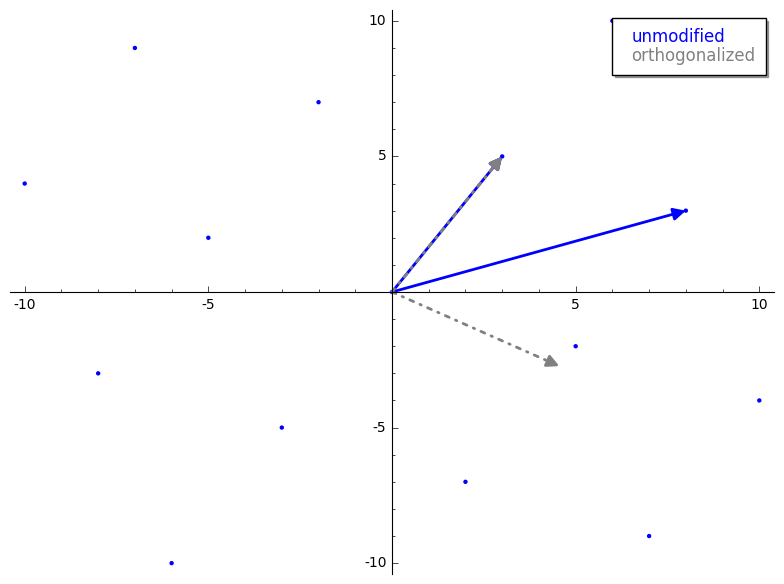
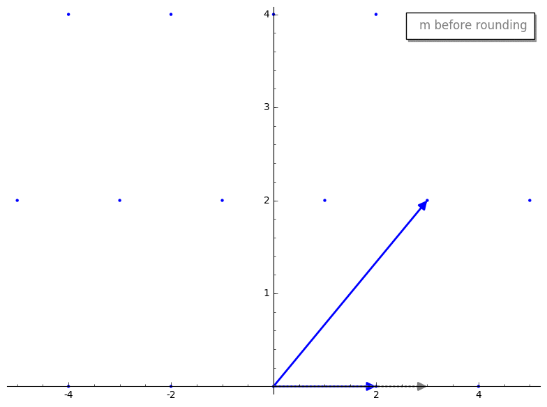
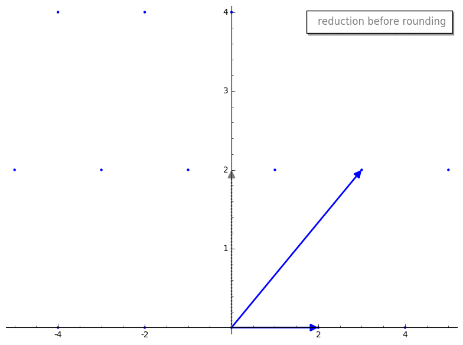
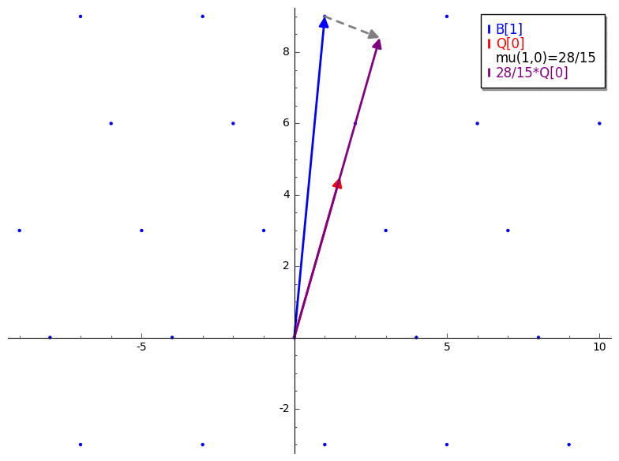
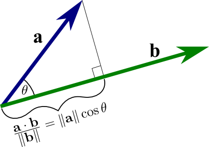

The Lenstra–Lenstra–Lovász (LLL) algorithm efficiently transforms a "bad" (long and non-orthogonal) basis for a lattice $L$ into a "pretty good" (short and nearly orthogonal) basis for the same lattice. This transformation is known as **lattice reduction**, and it has incredibly useful applications. For example, there is a famous attack against [ECDSA implementations that leverage biased RNGs](https://pdfs.semanticscholar.org/0eb1/8a42b623dd8e7cdd4221085a6fd5503708ea.pdf) that can lead to private key recovery.

However, learning _why_ LLL works can be pretty rough. Most material covering LLL seems targeted towards mathematicians, requiring you to spend a lot of time trying to weasel out the intuition and mechanics of the algorithm. This blog post is a semi organized brain dump of that process, designed to slowly ratchet down the hand waving so you can read until you are happy with your level of understanding.

---

## LLL in Relation to Euclid's Algorithm

LLL is frequently compared to [Euclid's Algorithm for finding GCDs](https://holdenlee.wordpress.com/2015/10/09/the-lll-lattice-basis-reduction-algorithm/). While it is an imperfect analogy, at a high-level they share a core similarity: both LLL and Euclid's algorithm can be broken down into two repeated steps: **"reduction"** and **"swap"**.

Consider the pseudocode for both algorithms:

```python
def euclid_gcd(a, b):
    if b == 0: # base case
        return a
    x = a % b  # reduction step
    return euclid_gcd(b, x) # swap step
```

```python
def lll(basis):
    while k <= n:
        for j in reversed(range(k)): # reduction step loop
            mu = calculate_mu(k, j)
            basis[k] = basis[k] - round(mu) * basis[j] # vector reduction
            # update orthogonalized basis

        if lovasz_condition:
            k += 1
        else:
            basis[k], basis[k-1] = basis[k-1], basis[k] # swap step
            # update orthogonalized basis
            k = max(k-1, 1)
    return basis
```

If you squint a bit, you can see the structural similarities. LLL is essentially an extension of Euclid's algorithm that applies to a set of $n$-dimensional vectors instead of simple integers.

---

## LLL in Relation to Gram-Schmidt

Another closely related process is the [Gram-Schmidt (GS) orthogonalization process](https://en.wikipedia.org/wiki/Gram%E2%80%93Schmidt_process). At a high level, Gram-Schmidt takes an input basis for a vector space and returns an orthogonalized basis (where all vectors are mutually perpendicular) that spans the same space. It achieves this by leveraging vector projections to "decompose" each vector into related components and removing redundant components.

You might ask: _"Why don't we just use Gram-Schmidt to reduce our lattice basis?"_

Unfortunately, we can't because Gram-Schmidt is not guaranteed to produce orthogonal vectors that lie _within_ our lattice. Let's look at this comparison:



Notice how the orthogonalized (dashed grey) vectors do not touch actual lattice points? Although we cannot use GS directly to get our lattice basis, LLL still uses Gram-Schmidt as a crucial guide and subroutine.

---

## LLL in Relation to Gaussian Lattice Reduction

Unless you are a sorceress, starting with 2-dimensional lattice basis reduction is highly recommended. Thankfully, we have [Gauss's algorithm for reducing bases in dimension 2](https://www.math.auckland.ac.nz/~sgal018/crypto-book/ch17.pdf), which is perfect for a few reasons:

- Gaussian lattice reduction is structurally similar to LLL.
- It acts as a perfect bridge between Euclid's algorithm and LLL.
- 2D vectors are easy to graph and visualize.

Gauss's algorithm is defined as follows:

```python
def gauss_reduction(v1, v2):
    while True:
        if v2.norm() < v1.norm():
            v1, v2 = v2, v1 # swap step
        m = round((v1 * v2) / (v1 * v1))
        if m == 0:
            return (v1, v2)
        v2 = v2 - m * v1 # reduction step
```

Let's break this down. `gauss_reduction` takes two vectors representing our lattice basis. The **swap step** ensures that the length of $v_1$ is smaller than $v_2$. This guarantees that the resulting basis is ordered by length, which is crucial for proving the algorithm's termination and efficiency.

What does $m$ represent? It is the scalar projection of $v_2$ onto $v_1$ (the longer vector onto the shorter one). This is the exact same scalar produced during Gram-Schmidt, except we **round it to the nearest integer** to ensure our reduced vectors remain within the integer span of the lattice.

Let's visualize this. First, we project $v_2$ onto $v_1$. Here is what the projected vector looks like before and after rounding:



We then compute our new reduced vector $v_2 - m \cdot v_1$. Here is the reduction step before and after rounding $m$:



By rounding $m$ prior to subtraction, we "knock over" our new reduced vector so that it lands exactly on a valid lattice point. Crucially, the reduced $v_2$ is shorter than the original $v_2$, and the resulting basis vectors are "nearly" orthogonal.

Gaussian 2D reduction is guaranteed to terminate and return a short, nearly orthogonal basis.

---

## LLL tl;dr

LLL extends Gauss's 2D algorithm to work with $n$ dimensions.

At a high level, LLL iterates through the input basis vectors and performs a length-reduction (similar to Gauss's algorithm). However, because we are dealing with $n$ vectors, the ordering of the input basis matters. To sort the basis vectors by length, LLL uses a heuristic called the **Lovász condition** to determine if adjacent vectors need to be swapped. The algorithm terminates once all basis vectors have been successfully size-reduced and ordered.

---

## A Deeper Dive into LLL

To understand the mechanics of LLL, let's walk through its core implementation details:

```python
def LLL(B, delta=0.75):
    Q = gram_schmidt(B)

    def mu(i, j):
        v = B[i]
        u = Q[j]
        return (v * u) / (u * u)

    n, k = B.nrows(), 1
    while k < n:
        # Length reduction step
        for j in reversed(range(k)):
            if abs(mu(k, j)) > 0.5:
                B[k] = B[k] - round(mu(k, j)) * B[j]
                Q = gram_schmidt(B)

        # Swap step (Lovász condition)
        if Q[k] * Q[k] >= (delta - mu(k, k-1)**2) * (Q[k-1] * Q[k-1]):
            k = k + 1
        else:
            B[k], B[k-1] = B[k-1], B[k]
            Q = gram_schmidt(B)
            k = max(k-1, 1)

    return B
```

There is some seemingly magical logic here. Let's demystify it piece by piece, starting with $\mu$.

### The $\mu$ Coefficient

The coefficient $\mu_{ij}$ is the scalar projection of the $i$-th lattice basis vector ($B_i$) onto the $j$-th Gram-Schmidt orthogonalized vector ($Q_j$):

$$
\mu_{ij} = \frac{B_i \cdot Q_j}{\|Q_j\|^2}
$$

Unlike Gauss's algorithm, we are not projecting a lattice vector onto another lattice vector; we are projecting it onto a Gram-Schmidt orthogonalized vector, as shown below:



Since we cannot use the "ideal" orthogonalized GS matrix directly (as its vectors don't lie in the lattice), $\mu$ acts as our reference guide to measure how far our lattice vectors are from being perfectly orthogonal.

### Length Reduction

Isolating the size-reduction loop:

```python
for j in reversed(range(k)):
    if abs(mu(k, j)) > 0.5:
        B[k] = B[k] - round(mu(k, j)) * B[j]
        Q = gram_schmidt(B)
```

The loop iterates from $k-1$ down to $0$ and checks if the absolute value of $\mu_{kj}$ is greater than $0.5$. Since we round $\mu_{kj}$ to the nearest integer, any coefficient less than $0.5$ rounds to $0$, meaning no reduction would take place.

This loop performs size-reduction on $B_k$ against all preceding vectors. It is mathematically equivalent to the Gram-Schmidt reduction step, but with integer rounding:

$$
B_k \leftarrow B_k - \sum_{j=0}^{k-1} \lfloor \mu_{kj} \rceil B_j
$$

After modifying the basis vector, we re-run Gram-Schmidt to keep our reference vectors $Q$ up to date.

### The Lovász Condition and the Swap Step

Once a vector is size-reduced, LLL checks the Lovász condition to decide whether to move forward or swap:

```python
if Q[k] * Q[k] >= (delta - mu(k, k-1)**2) * (Q[k-1] * Q[k-1]):
    k = k + 1
else:
    B[k], B[k-1] = B[k-1], B[k]
    Q = gram_schmidt(B)
    k = max(k-1, 1)
```

Think of LLL as a sorting algorithm: **it is a vector sorting algorithm that occasionally shrinks vectors, requiring it to re-sort.**

If the Lovász condition is met, the vector at index $k$ is in a "good" position relative to $k-1$, and we increment $k$. If it fails, the vector at $k$ is significantly shorter than $k-1$, so we swap them and decrement $k$ to re-evaluate and re-reduce the swapped vector in its new position.

The parameter $\delta$ is a constant chosen between $0.25$ and $1$ (usually $0.75$ or $0.99$) that determines how strictly we enforce the length sorting.

---

## Things that Stumped Me When Learning LLL

### Is the Gaussian length-reduction step guaranteed to provide short and nearly orthogonal vectors?

Yes. Rounding $\mu$ might seem like it would ruin the orthogonality, but the math guarantees that the angle $\theta$ between our reduced vectors will always lie between $60^\circ$ and $120^\circ$.

This guarantee stems from the fact that $B_k$'s projection onto $B_j$ will always have a magnitude of at most $\frac{1}{2} \|B_j\|$ because we have removed all possible integer components of $B_j$ from $B_k$. Using the definition of vector projection:



$$
\|B_k\| \cos\theta = \text{proj}_{B_j}(B_k)
$$

$$
\implies \|B_k\| |\cos\theta| \le \frac{1}{2} \|B_j\|
$$

$$
\implies \left(\frac{\|B_k\|}{\|B_j\|}\right) |\cos\theta| \le \frac{1}{2}
$$

Since Gaussian reduction ensures that our final vector $B_k$ is shorter than $B_j$ ($\frac{\|B_k\|}{\|B_j\|} \ge 1$ when ordered), the value of $|\cos\theta|$ must be at most $\frac{1}{2}$, forcing $\theta$ to be between $60^\circ$ and $120^\circ$ (nearly orthogonal!).

### Why doesn't Gaussian lattice reduction easily generalize to higher dimensions?

As explained in _"Mathematics of Public Key Cryptography"_:

> _"Choosing the right linear combination to size-reduce $b_n$ using $b_1, \dots, b_{n-1}$ is equivalent to solving the Closest Vector Problem (CVP) in a sublattice, which is NP-hard. Furthermore, there is no guarantee that the resulting basis actually has good properties in high dimensions."\_

LLL overcomes this by breaking the $n$-dimensional problem down into a series of $2$-dimensional sub-problems (adjacent vector pairs) and solving them one pair at a time. This local size-reduction, combined with length-sorting approximations, works incredibly well in practice.

### How does LLL use Gram-Schmidt as a guide?

A lattice basis is close to orthogonal if the lengths of its Gram-Schmidt vectors do not decrease too rapidly. By using the Lovász condition to compare adjacent Gram-Schmidt vectors, LLL prevents their lengths from dropping too fast, keeping the entire lattice basis "sufficiently close to orthogonal".

---
