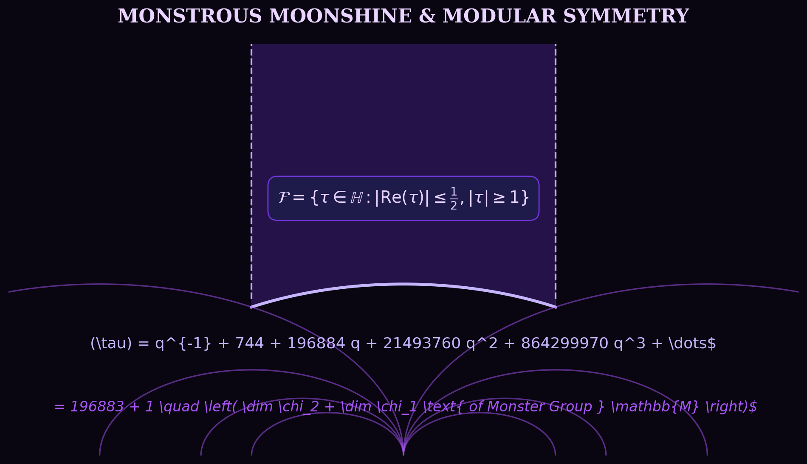
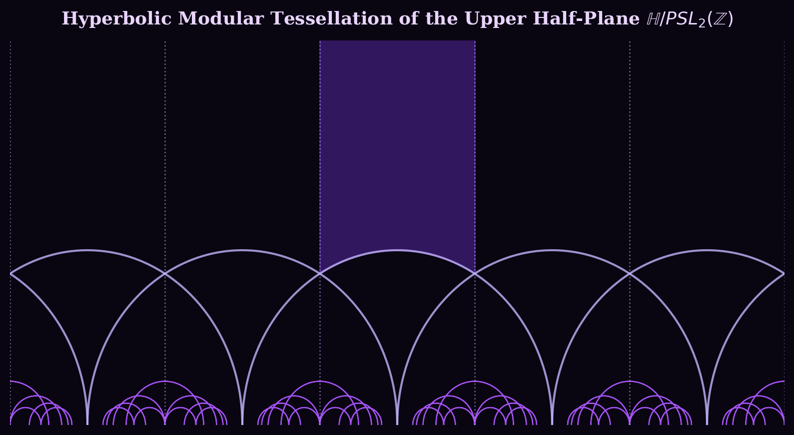
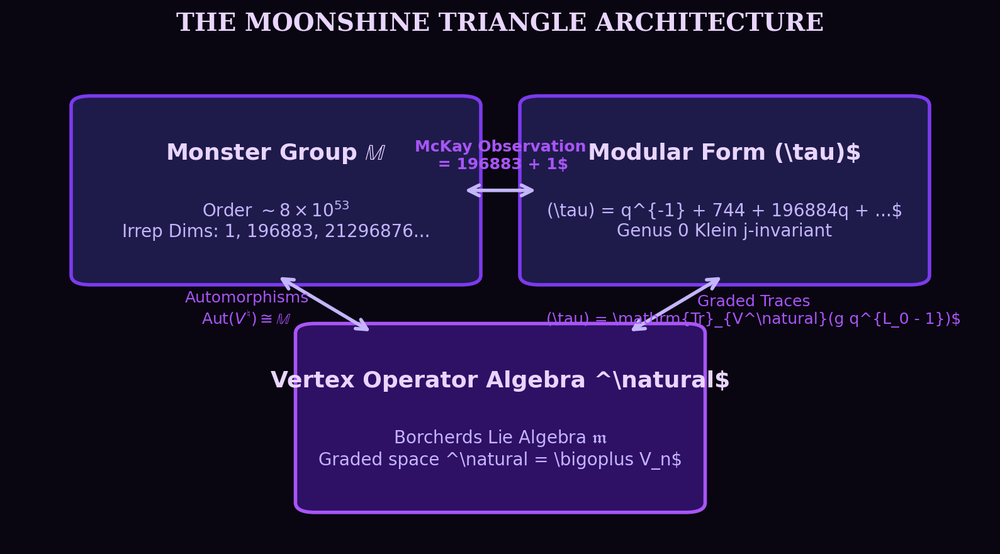

In 1978, the British mathematician John McKay noticed something that looked like absurd numerology. 

He was looking at the Fourier coefficients of the elliptic modular invariant $j(\tau)$, a cornerstone of 19th-century complex analysis:

$$j(\tau) - 744 = \frac{1}{q} + 196884\,q + 21493760\,q^2 + 864299970\,q^3 + \dots \quad \left(q = e^{2\pi i \tau}\right)$$

And he happened to remember a number from finite group theory: the dimension of the smallest non-trivial irreducible representation of the **Monster Group** $\mathbb{M}$ is **$196,883$**.

McKay wrote down an innocent equation:

$$196884 = 196883 + 1$$

When he showed this to John Conway, Conway famously remarked that it was "moonshine"—English slang for illicit whiskey or utter foolishness. The two subjects belonged to completely distinct universes. One was the study of discrete, finite symmetries; the other was the study of smooth, continuous analytic functions on the hyperbolic plane.

Yet within a decade, this bizarre coincidence would birth **Vertex Operator Algebras**, earn Richard Borcherds the Fields Medal in 1998, and reveal an intimate connection between finite groups and the quantum structure of spacetime.



---

## 1. The Two Distant Continents

To see why McKay's observation was shocking, we need to stand on both continents.

### Continent A: The Monster Group $\mathbb{M}$

In abstract algebra, the Classification of Finite Simple Groups (often called the Enormous Theorem) proves that every finite simple group is either:
1. A cyclic group of prime order $\mathbb{Z}/p\mathbb{Z}$,
2. An alternating group $A_n$ ($n \geq 5$),
3. A simple group of Lie type (like $PSL_n(\mathbb{F}_q)$), or
4. One of **26 sporadic groups** that do not fit into any infinite family.

The largest and most enigmatic of these sporadic outliers is the **Monster Group** $\mathbb{M}$ (sometimes called the *Fischer–Griess Monster*).

$$\begin{aligned}
|\mathbb{M}| &= 2^{46} \cdot 3^{20} \cdot 5^9 \cdot 7^6 \cdot 11^2 \cdot 13^3 \cdot 17 \cdot 19 \cdot 23 \cdot 29 \cdot 31 \cdot 41 \cdot 47 \cdot 59 \cdot 71 \\
&\approx 8.080174247945 \times 10^{53}
\end{aligned}$$

To put that number in perspective, the Monster has more elements than the number of atoms in Jupiter. 

Because $\mathbb{M}$ is a finite group, we can study how it acts linearly on vector spaces via representation theory. Its character table reveals the dimensions of its smallest irreducible representations:

$$d_1 = 1, \quad d_2 = 196883, \quad d_3 = 21296876, \quad d_4 = 842609326, \quad d_5 = 18538750076, \dots$$

There is no natural geometric representation of $\mathbb{M}$ in 3D or 4D space. The smallest non-trivial space on which $\mathbb{M}$ can act by rotations and reflections without collapsing has **196,883 dimensions**.

---

### Continent B: Klein's Modular $j$-Invariant

Now travel 150 years earlier into complex analysis. Consider the upper half of the complex plane:

$$\mathbb{H} = \{ \tau \in \mathbb{C} \mid \text{Im}(\tau) > 0 \}$$

The special linear group $SL_2(\mathbb{Z}) = \left\{ \begin{pmatrix} a & b \\ c & d \end{pmatrix} \in M_2(\mathbb{Z}) \;\middle|\; ad - bc = 1 \right\}$ acts on $\mathbb{H}$ by Möbius transformations:

$$\tau \mapsto \frac{a\tau + b}{c\tau + d}$$

This action generates the famous modular tessellation of the hyperbolic plane, tiling $\mathbb{H}$ into infinitely many copies of the fundamental domain $\mathcal{F}$:

$$\mathcal{F} = \left\{ \tau \in \mathbb{H} \;\middle|\; |\text{Re}(\tau)| \le \frac{1}{2}, \; |\tau| \ge 1 \right\}$$



A **modular function** of weight 0 is a meromorphic function $f: \mathbb{H} \to \mathbb{C}$ invariant under $SL_2(\mathbb{Z})$:

$$f\left(\frac{a\tau + b}{c\tau + d}\right) = f(\tau)$$

The "king" of all modular functions is **Klein's $j$-invariant** $j(\tau)$. It maps the quotient Riemann surface $\mathbb{H} / SL_2(\mathbb{Z})$ bijectively to the Riemann sphere $\mathbb{C} \cup \{\infty\}$, parameterizing isomorphism classes of complex elliptic curves.

Because $j(\tau + 1) = j(\tau)$, it has a Fourier series in terms of the nome $q = e^{2\pi i \tau}$:

$$j(\tau) = \frac{1}{q} + 744 + 196884\,q + 21493760\,q^2 + 864299970\,q^3 + 20245856256\,q^4 + \dots$$

Notice the coefficients $c_n$:
- $c_{-1} = 1$
- $c_0 = 744$
- $c_1 = 196884$
- $c_2 = 21493760$
- $c_3 = 864299970$

---

## 2. The Numerical Resonance

Look at what happens when you compare the $j$-function coefficients $c_n$ with the Monster representation dimensions $d_k$:

$$\begin{aligned}
196884 &= 196883 + 1 = d_2 + d_1 \\
21493760 &= 21296876 + 196883 + 1 = d_3 + d_2 + d_1 \\
864299970 &= 842609326 + 21296876 + 2(196883) + 2(1) = d_4 + d_3 + 2d_2 + 2d_1 \\
20245856256 &= d_5 + d_4 + 2d_3 + 3d_2 + 2d_1
\end{aligned}$$

Every single Fourier coefficient of $j(\tau)$ is a simple, non-negative integer linear combination of the dimensions of the irreducible representations of the Monster group.

This was not a coincidence.

In 1979, John Conway and Simon Norton published their seminal paper *"Monstrous Moonshine"*. They conjectured that there exists an infinite-dimensional graded representation space:

$$V^\natural = \bigoplus_{n=-1}^\infty V_n$$

such that:
1. $\mathbb{M}$ acts naturally on $V^\natural$ by degree-preserving automorphisms ($\mathrm{Aut}(V^\natural) \cong \mathbb{M}$).
2. The graded dimension of $V^\natural$ reproduces the normalized $j$-function:

$$\sum_{n=-1}^\infty \left(\dim V_n\right) q^n = j(\tau) - 744 = \frac{1}{q} + 196884\,q + 21493760\,q^2 + \dots$$

3. For **every element** $g \in \mathbb{M}$, the graded trace (the McKay-Thompson series):

$$T_g(\tau) = \sum_{n=-1}^\infty \mathrm{Tr}_{V_n}(g)\, q^n$$

is a *Hauptmodul* (generator of the function field) for a genus-0 subgroup $\Gamma_g \subseteq SL_2(\mathbb{R})$.

---

## 3. The Moonshine Triangle Architecture



How could such an infinite-dimensional space $V^\natural$ exist?

In 1988, Igor Frenkel, James Lepowsky, and Arne Meurman constructed the space $V^\natural$ by taking the Leech lattice $\Lambda_{24}$ (the unique unimodular, positive-definite, even 24-dimensional lattice with no vectors of length 2) and performing a conformal field theory $\mathbb{Z}_2$-orbifold construction.

The resulting structure was not just a vector space—it was a **Vertex Operator Algebra (VOA)** of central charge $c = 24$.

```
   [24-Dimensional Leech Lattice Λ₂₄]
                  │
                  ▼ (Fock Space Bosonization)
      [Heisenberg Chiral Algebra]
                  │
                  ▼ (ℤ₂ Parity Orbifold Twist)
       [Moonshine Module V♮]
```

In physical terms, $V^\natural$ represents the chiral state space of a 2D conformal field theory of 24 free bosons moving on a 24-dimensional torus $T^{24} = \mathbb{R}^{24}/\Lambda_{24}$, quotiented by the spatial reflection $x \mapsto -x$.

---

## 4. Borcherds' Proof and the Monster Lie Algebra

The ultimate proof of the Conway-Norton Moonshine Conjecture was delivered by **Richard Borcherds** in 1992.

Borcherds introduced a new mathematical object: **Generalized Kac-Moody Algebras** (now known as *Borcherds algebras*).

He constructed the **Monster Lie algebra** $\mathfrak{m}$ by applying the Goddard–Thorn No-Ghost Theorem from string theory to the tensor product:

$$\mathfrak{m} = \bigoplus_{(m, n) \in \mathbb{Z}^2} \mathfrak{m}_{(m, n)}$$

where the roots of the Lie algebra correspond to Lorentzian vectors in the signature $(1, 1)$ hyperbolic lattice $\mathrm{II}_{1,1}$.

The denominator formula for the Monster Lie algebra yields the extraordinary product identity:

$$p^{-1} \prod_{m>0, n \in \mathbb{Z}} \left(1 - p^m q^n\right)^{c(mn)} = j(p) - j(q)$$

where $p = e^{2\pi i \sigma}$, $q = e^{2\pi i \tau}$, and $c(k)$ are the Fourier coefficients of $j(\tau) - 744$.

Using this denominator formula together with Adams operations in representation ring $R(\mathbb{M})$, Borcherds proved that all McKay-Thompson series $T_g(\tau)$ satisfy the genus-0 Hauptmodul properties conjectured by Conway and Norton.

---

## 5. Moonshine in Modern Physics: Quantum Gravity in AdS$_3$

In 2007, Edward Witten suggested that Monstrous Moonshine is not just a mathematical curiosity, but the key to **pure three-dimensional quantum gravity**.

In $2+1$ dimensions, Einstein's gravity with negative cosmological constant $\Lambda = -1/\ell^2$ has no local propagating degrees of freedom (gravitons). However, via the $\text{AdS}_3/\text{CFT}_2$ correspondence, quantum gravity in the bulk is dual to a 2D Conformal Field Theory on the boundary cylinder.

```
       ┌──────────────────────────────────────┐
       │     3D Anti-de Sitter Space (AdS₃)   │
       │       BTZ Black Hole Geometry        │
       │                                      │
       │    Bulk Partition Function Z_grav    │
       └──────────────────┬───────────────────┘
                          │ (Holographic Duality)
                          ▼
       ┌──────────────────────────────────────┐
       │      Boundary 2D CFT at Infinity     │
       │   Central Charge c = 24k (k = 1)     │
       │   State Space: Moonshine Module V♮   │
       │                                      │
       │     Z_CFT(τ) = Tr(q^(L₀ - c/24))     │
       │              = j(τ) - 744            │
       └──────────────────────────────────────┘
```

Witten showed that the partition function of holomorphically factorized extremal $c = 24$ CFT:

$$Z(\tau) = \text{Tr}\left(q^{L_0 - 1}\right) = j(\tau) - 744$$

describes the thermal partition function of the 3D BTZ (Banþados–Teitelboim–Zanelli) black hole!
- The $q^{-1}$ pole corresponds to the ground state (pure AdS$_3$ spacetime).
- The zero-mode $c_0 = 0$ reflects the absence of boundary single-particle gravitons.
- The coefficient $196884$ is the microstate count of the lightest quantum BTZ black hole!

---

## 6. Takeaways & The Web of Moonshine

Monstrous Moonshine taught mathematics a profound lesson: structures that appear entirely unrelated on the surface—discrete sporadic symmetry groups, modular forms on Riemann surfaces, vertex operator algebras, and black hole microstates—are often reflections of a deeper underlying unity.

| Domain | Mathematical Object | Role in Moonshine |
| :--- | :--- | :--- |
| **Finite Algebra** | Monster Group $\mathbb{M}$ | Symmetry group of the universe $\dim \approx 10^{53}$ |
| **Complex Analysis** | Klein $j$-invariant $j(\tau)$ | Genus-0 modular generator on $\mathbb{H}/SL_2(\mathbb{Z})$ |
| **Lattice Geometry** | Leech Lattice $\Lambda_{24}$ | 24-dimensional sphere packing without length-2 vectors |
| **Conformal Physics** | Moonshine VOA $V^\natural$ | Chiral CFT state space with $c = 24$ |
| **Lie Theory** | Borcherds Algebra $\mathfrak{m}$ | Infinite-dimensional generalized Kac-Moody Lie algebra |
| **Quantum Gravity** | AdS$_3$ BTZ Black Holes | Holographic boundary states counted by $j(\tau)$ |

What began as John McKay writing $196884 = 196883 + 1$ on a blackboard became one of the most beautiful intellectual journeys of 20th-century pure mathematics.
