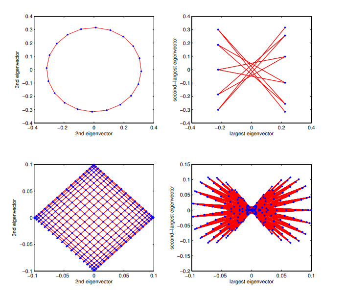

Graphs are weirdly frustrating to visualize. 

If someone hands you an abstract list of 500 vertices and 2,000 edges, how on earth do you draw it on a screen? If you place the vertices randomly, you end up with a hairball of crossed lines. If you try to hand-tune it, you'll be dragging dots around for hours.

And what if you need to chop that network in half along its natural "weak spot" (like finding clusters in a social network or dividing a circuit layout across two chips)? Checking all possible cuts is a brutal NP-hard combinatorial nightmare.

The punchline is that both problems have the exact same solution, and it comes from physics and linear algebra. You pretend every edge in your graph is a little physical spring, write down a single matrix called the **Graph Laplacian**, compute its eigenvectors, and everything falls right into place ^\_^

---

## Turning a Graph into a Physical Spring Mesh

Let's say we have an undirected graph $G = (V, E)$ with $n$ vertices. 

To turn it into math, we build two simple matrices:
1. **The Degree Matrix ($D$)**: an $n \times n$ diagonal matrix where each diagonal entry $D_{uu}$ is just the number of neighbors vertex $u$ has.
2. **The Adjacency Matrix ($A$)**: where $A_{uv} = 1$ if there is an edge between $u$ and $v$, and $0$ otherwise.

The **Graph Laplacian** $L$ is just their difference:

$$L = D - A$$

Here is why this matrix is special. Suppose we assign a 1D coordinate $x_u \in \mathbb{R}$ to each vertex $u$, packing them into a vector $x = (x_1, x_2, \dots, x_n)^T$. 

Watch what happens when you compute the quadratic form $x^T L x$:

$$x^T L x = x^T D x - x^T A x = \sum_{u \in V} \text{deg}(u) x_u^2 - 2 \sum_{(u, v) \in E} x_u x_v$$

Since $\text{deg}(u)$ is just the count of edges touching $u$, each edge $(u, v)$ contributes $x_u^2$ once and $x_v^2$ once. Grouping them by edges gives:

$$x^T L x = \sum_{(u, v) \in E} (x_u - x_v)^2$$

This is Hooke's Law for springs. If every edge is a spring of unit stiffness, $x^T L x$ is the total potential energy stored in the stretched springs. 

If connected nodes sit near each other, the energy is small. If connected nodes get pulled far apart, the energy shoots up. 

Because $(x_u - x_v)^2 \ge 0$ for every edge, $x^T L x \ge 0$ for every possible vector $x$. That means $L$ is always **positive semidefinite**, so its eigenvalues are all real and non-negative:

$$0 = \lambda_1 \le \lambda_2 \le \lambda_3 \le \dots \le \lambda_n$$

---

## A Concrete 4-Node Example

Let's work through a toy example so this isn't just floating in the abstract. 

Take a simple 4-node path graph:

```
(1) --- (2) --- (3) --- (4)
```

The degree matrix $D$ and adjacency matrix $A$ are:

$$D = \begin{pmatrix} 1 & 0 & 0 & 0 \\ 0 & 2 & 0 & 0 \\ 0 & 0 & 2 & 0 \\ 0 & 0 & 0 & 1 \end{pmatrix}, \quad A = \begin{pmatrix} 0 & 1 & 0 & 0 \\ 1 & 0 & 1 & 0 \\ 0 & 1 & 0 & 1 \\ 0 & 0 & 1 & 0 \end{pmatrix}$$

Subtracting them gives our Laplacian $L$:

$$L = D - A = \begin{pmatrix} 1 & -1 & 0 & 0 \\ -1 & 2 & -1 & 0 \\ 0 & -1 & 2 & -1 \\ 0 & 0 & -1 & 1 \end{pmatrix}$$

Notice how every row sums to 0. If you multiply $L$ by the all-ones vector $\mathbf{1} = (1, 1, 1, 1)^T$, you get all zeros:

$$L \mathbf{1} = \mathbf{0}$$

This means the smallest eigenvalue is always $\lambda_1 = 0$, with eigenvector $v_1 = \mathbf{1}$. 

In physics terms, placing every node at the exact same location ($x_1 = x_2 = x_3 = x_4 = c$) produces zero spring stretch, so zero energy. It's a completely valid solution, but also completely useless if we want to draw or partition anything :p

---

## The Fiedler Vector: Dodging the Trivial Collapse

To get a meaningful embedding, we need to stop all the nodes from collapsing onto the origin. We impose two rules:

1. **Center the layout at 0**: $\sum_{u} x_u = 0$ (which means $x \perp \mathbf{1}$).
2. **Fix the overall scale**: $\sum_{u} x_u^2 = 1$ (which means $\|x\|_2 = 1$).

Now we want to find the vector $x$ that minimizes the spring energy under these rules:

$$\min_{\substack{\|x\|_2 = 1 \\ x \perp \mathbf{1}}} x^T L x$$

Linear algebra gives us a free lunch here: the Courant-Fischer theorem says the vector that solves this is precisely the **second smallest eigenvector** of $L$, called the **Fiedler vector** $v_2$, and the minimum energy you get is the second eigenvalue $\lambda_2$.

If you compute the eigenvalues and eigenvectors of our 4-node path graph, you get:

$$\lambda_1 = 0, \quad \lambda_2 \approx 0.586, \quad \lambda_3 = 2.0, \quad \lambda_4 \approx 3.414$$

And the Fiedler vector $v_2$ is:

$$v_2 \approx \begin{pmatrix} -0.653 \\ -0.271 \\ +0.271 \\ +0.653 \end{pmatrix}$$

Look at those numbers:
- Node 1 gets placed at $-0.653$
- Node 2 at $-0.271$
- Node 3 at $+0.271$
- Node 4 at $+0.653$

The math literally laid out the path in a perfectly straight, evenly spaced line from left to right. It figured out the 1D geometry of the graph purely from the matrix entries.

---

## 2D Graph Drawing: Putting It on a Canvas

What if we want a 2D drawing instead of 1D?

Easy: we need two orthogonal coordinates $(x_u, y_u)$ for each vertex $u$. 
- For the x-coordinates, we use the 2nd eigenvector $v_2$.
- For the y-coordinates, we use the 3rd eigenvector $v_3$ (which is orthogonal to both $\mathbf{1}$ and $v_2$).

Each vertex $u$ is plotted at the point $(v_2(u), v_3(u))$.

Look at what happens when you compare embedding using the smallest non-trivial eigenvectors versus embedding using the *largest* eigenvectors:



### Why the plots look the way they do:
- **Top-Left (20-Cycle Graph with $v_2, v_3$)**: The 20-cycle graph embeds as a clean, geometrically round circle. Because the Laplacian of a cycle graph is a circulant matrix, its eigenvectors are discrete Fourier modes, essentially $\cos(2\pi k / n)$ and $\sin(2\pi k / n)$. Minimizing spring tension naturally bends the path into an untangled circle.
- **Top-Right (20-Cycle Graph with largest eigenvectors)**: Using the largest eigenvectors does the exact opposite. It maximizes $(x_u - x_v)^2$, forcing adjacent nodes as far apart as possible and turning the circle inside-out into a spiky star.
- **Bottom-Left ($20 \times 20$ Grid Graph with $v_2, v_3$)**: The square grid untangles into a neat diamond-rotated planar mesh with zero edge crossings.
- **Bottom-Right ($20 \times 20$ Grid Graph with largest eigenvectors)**: Pinches and twists the grid into a chaotic butterfly shape.

---

## Spectral Graph Partitioning: Finding Bottlenecks

Now for the second big trick: graph partitioning.

Suppose you have a big network and you want to cut it into two pieces $S$ and $\bar{S}$ so that:
1. Both pieces are roughly balanced in size.
2. You cut through as few edges as possible.

We measure how good a cut is using **conductance** $\phi(S)$:

$$\phi(S) = \frac{|E(S, \bar{S})|}{\min(|S|, |\bar{S}|)}$$

Finding the cut that minimizes conductance across all subsets is NP-hard. But the Fiedler vector gives us a fast approximation called the **Sweep Cut algorithm**:

```
[Sort nodes by Fiedler value v₂(u)]
  u₁  ≤  u₂  ≤  u₃  ≤  ...  ≤  uₙ
   │      │      │
   ▼      ▼      ▼
 Sweep a cut line across the ordered list
 Evaluate conductance φ(Sₖ) for each prefix
 Pick the split with lowest conductance
```

In our 4-node example earlier, $v_2 = (-0.653, -0.271, +0.271, +0.653)$. 

The values split cleanly around zero between nodes 2 and 3. Putting $\{1, 2\}$ on one side and $\{3, 4\}$ on the other cuts exactly 1 edge, giving the optimal cut.

### Cheeger's Inequality

Why does sorting by $v_2$ work so reliably? **Cheeger's Inequality** (originally from Riemannian geometry, adapted to graphs by Alon and Milman) guarantees that the discrete cut quality $\phi(G)$ is tightly sandwiched by the second eigenvalue $\lambda_2$:

$$\frac{\lambda_2}{2} \le \phi(G) \le \sqrt{2 d_{\max} \lambda_2}$$

Where $d_{\max}$ is the maximum vertex degree in the graph.

This tells us:
- If $\lambda_2 \approx 0$, the graph has a severe bottleneck (like two dense clusters connected by a thin bridge).
- If $\lambda_2$ is large, the graph is an **expander**, meaning it is so well-connected that no small bottleneck cut exists anywhere.

---

## Python Code: Doing It from Scratch

Here is a clean Python script using `numpy` and `scipy` to compute the 2D spectral embedding and run the sweep-cut:

```python
import numpy as np
import scipy.sparse as sp
import scipy.sparse.linalg as sla

def spectral_embedding(adj_matrix):
    """
    Takes a scipy sparse adjacency matrix and returns
    (x, y) coordinates for each vertex using eigenvectors v2 and v3.
    """
    degrees = np.array(adj_matrix.sum(axis=1)).flatten()
    n = len(degrees)
    
    # Laplacian L = D - A
    L = sp.diags(degrees) - adj_matrix
    
    # Find the 3 smallest eigenvalues and eigenvectors
    vals, vecs = sla.eigsh(L.astype(float), k=3, which='SM')
    
    # Sort in ascending eigenvalue order
    order = np.argsort(vals)
    v2 = vecs[:, order[1]]
    v3 = vecs[:, order[2]]
    
    return v2, v3

def sweep_cut(adj_matrix):
    """
    Finds the optimal bottleneck partition by sweeping along v2.
    """
    v2, _ = spectral_embedding(adj_matrix)
    order = np.argsort(v2)
    n = len(order)
    
    best_cond = float('inf')
    best_split = None
    
    # Sweep through all prefix subsets
    for k in range(1, n):
        S = set(order[:k])
        cut_edges = sum(
            1 for u in S 
            for v in adj_matrix[u].indices 
            if v not in S
        )
        cond = cut_edges / min(len(S), n - len(S))
        
        if cond < best_cond:
            best_cond = cond
            best_split = S
            
    return best_split, best_cond
```

---

## Quick Cheat Sheet

| Object | Matrix View | Physical Spring View | What It Gives You |
| :--- | :--- | :--- | :--- |
| **$L = D - A$** | Laplacian matrix | Total potential energy operator | Encodes all connectivity and degrees |
| **$\lambda_1 = 0, v_1 = \mathbf{1}$** | Smallest eigenvalue | Rigid body zero-energy shift | Number of disconnected components |
| **$\lambda_2, v_2$** | Second eigenvalue (Fiedler) | Lowest non-trivial vibrational mode | 1D coordinate spreading nodes along bottlenecks |
| **$v_2, v_3$** | 2nd & 3rd eigenvectors | First two spatial harmonics | Automatic 2D graph layout |
| **Cheeger's Bound** | $\lambda_2 / 2 \le \phi(G) \le \sqrt{2 d_{\max} \lambda_2}$ | Energy of slowest acoustic mode | Rigorous bound on bottleneck conductance |

Turning combinatorial graphs into continuous spring systems gives you both a natural camera to visualize networks and a mathematical scalpel to slice them apart.
