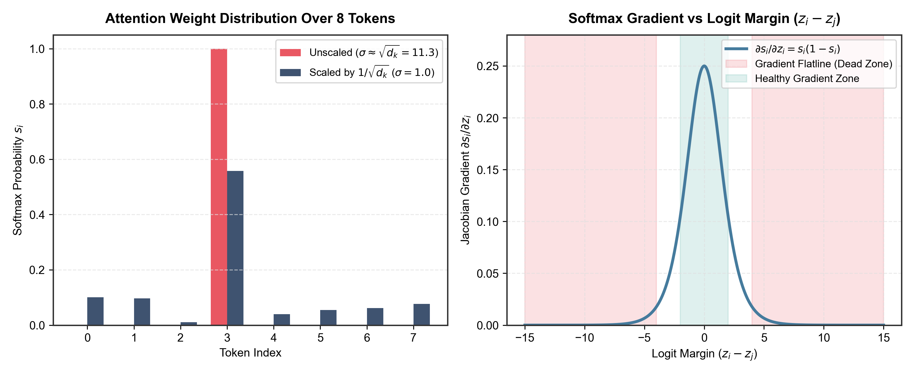
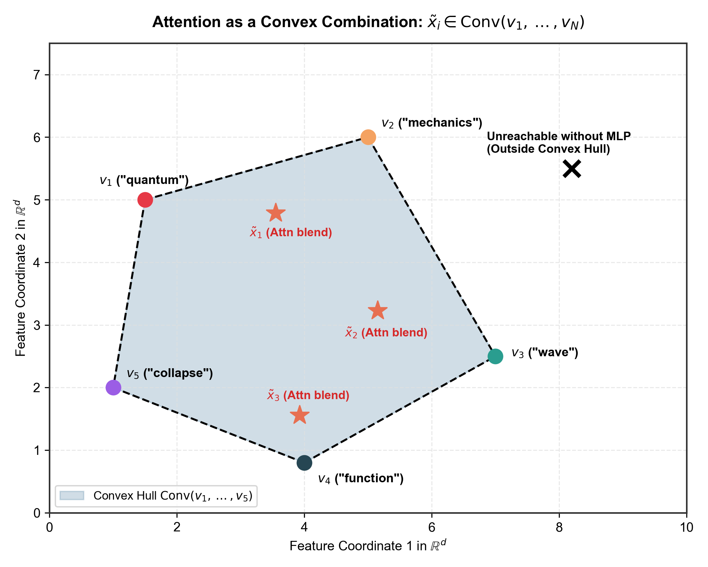
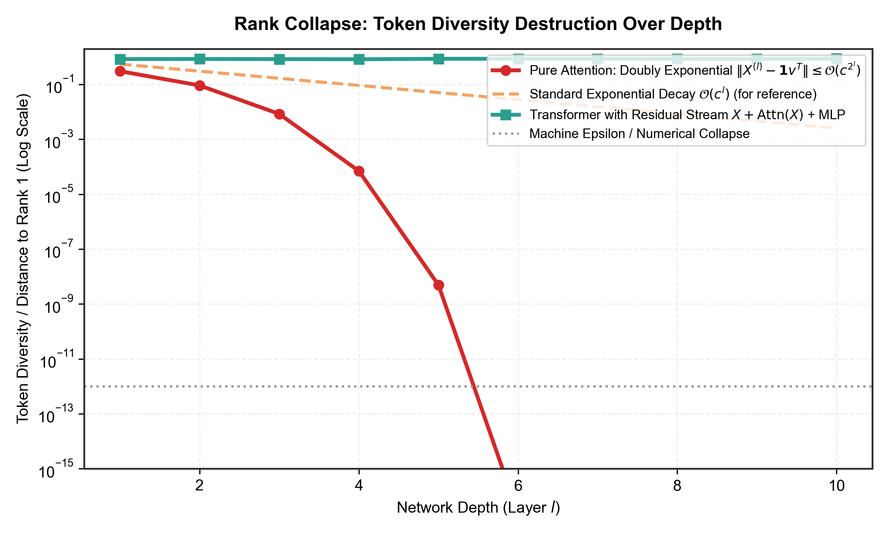
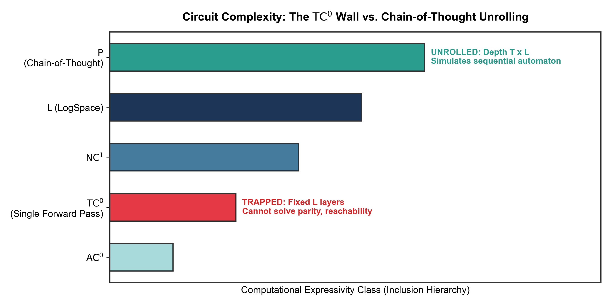
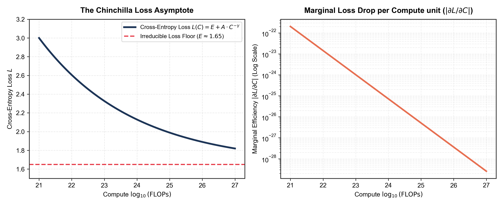
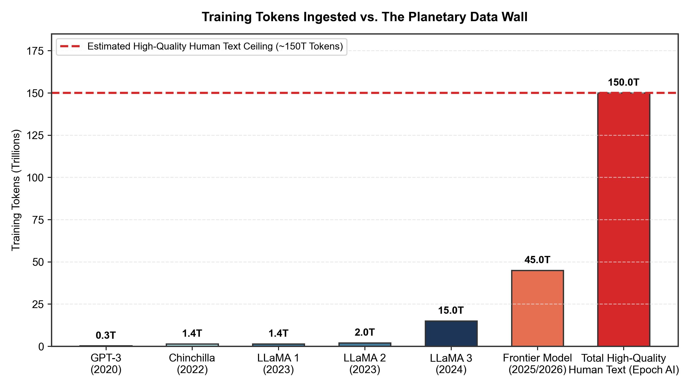
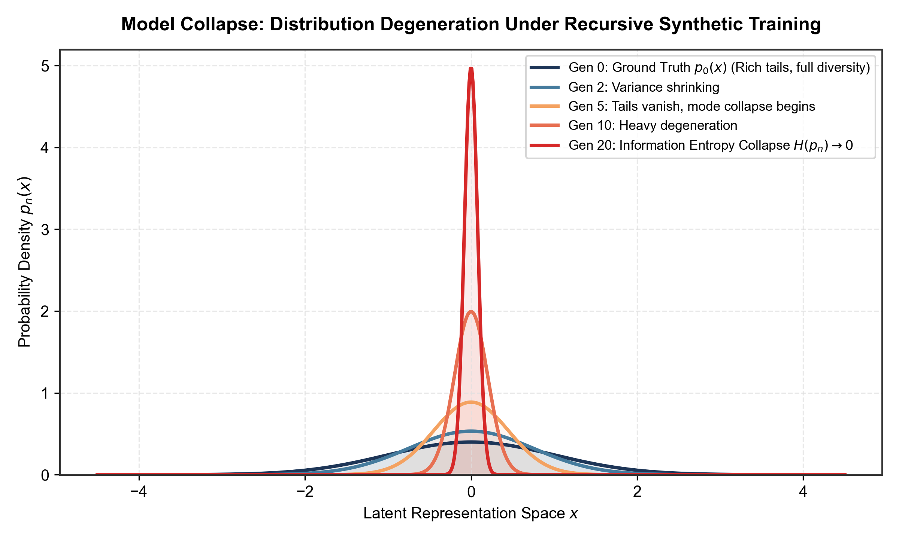
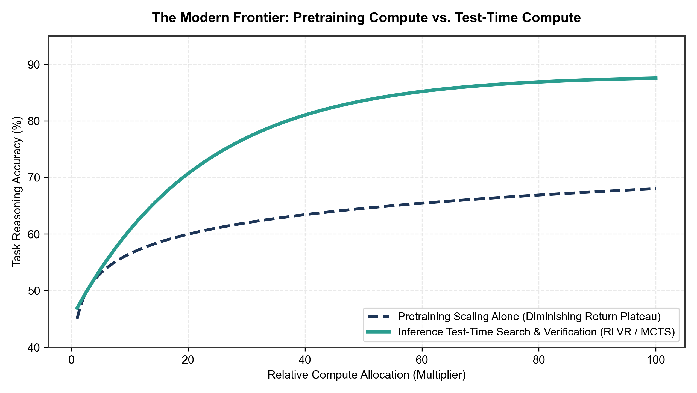

Few topics in computing have generated as much intellectual brainrot as Large Language Models. 

On one side, you have the venture messiahs preaching that if we just wire together a few hundred thousand more H100s, stack another hundred transformer layers, and feed them every byte of scraped internet data from here to Alpha Centauri, artificial general intelligence will spontaneously crystallize like digital divinity. 

On the other side, you have the cynical dismissers who smugly proclaim that transformers are "just autocomplete"—as if stringing that phrase together magically explains how an autoregressive matrix engine can write compiler optimizations, diagnose rare genetic anomalies, or generate formal mathematical proofs.

Both sides are fundamentally unserious. And both sides suffer from the exact same affliction: **they refuse to look at the linear algebra.**

When you actually strip away the PR hype, the anthropomorphic analogies, and the Twitter warfare, what you find beneath the hood is not magic, nor is it trivial autocomplete. It is an astonishingly elegant, mechanically precise geometric engine that manipulates high-dimensional vector spaces through dynamic convex hulls. 

And yet, that very same mathematics reveals something the hype merchants desperately want to ignore: **transformers have hard mathematical boundaries.** Left to their own devices, their attention layers naturally degrade toward rank collapse. In a single forward pass, their computational capacity is mathematically locked inside a shallow circuit complexity class. And the pretraining curve that drove the AI boom for the last decade didn't just hit an economic bottleneck—it slammed headfirst into an information-theoretic wall.

There is a reason why the frontier in 2026 isn't just a 50-trillion-parameter text transformer running next-token prediction, and why the entire industry had to pivot toward real-time multimodal streaming like Project Astra, agentic tool loops, and test-time search. 

To understand why, we have to look at the math.

---

## 1. The Geometry of the Residual Stream

Before we touch attention, let's establish the arena where all this computation takes place.

A transformer does not process words, characters, or ideas. It processes vectors in a high-dimensional Euclidean space $\mathbb{R}^{d}$, where $d$ (often called $d_{\text{model}}$) typically ranges from $4,096$ to $12,288$ in modern frontier architectures.

When a sequence of $N$ tokens enters the network, each discrete token is mapped via a learned embedding matrix $W_E \in \mathbb{R}^{|V| \times d}$ to an initial token vector $x_i^{(0)} \in \mathbb{R}^d$. Arranging these vectors as rows yields an initial sequence representation matrix:

$$X^{(0)} = \begin{bmatrix} (x_1^{(0)})^T \\ (x_2^{(0)})^T \\ \vdots \\ (x_N^{(0)})^T \end{bmatrix} \in \mathbb{R}^{N \times d}$$

The central architectural spine of the transformer is the **residual stream**. As representations flow through $L$ sequential layers, tokens are not completely replaced from scratch. Instead, each layer computes a perturbation and simply adds it back to the existing state:

$$X^{(l+1)} = X^{(l)} + \Delta X_{\text{attn}}^{(l)} + \Delta X_{\text{mlp}}^{(l)}$$

Mathematically, this means the residual stream acts as a linear communication bus. Because addition is linear, the final state of token $i$ at layer $L$ is simply the initial embedding plus the sum of all updates contributed by every attention head and MLP across every layer:

$$x_i^{(L)} = x_i^{(0)} + \sum_{l=0}^{L-1} \left( \Delta x_{i, \text{attn}}^{(l)} + \Delta x_{i, \text{mlp}}^{(l)} \right)$$

This is a profound geometric setup. Different attention heads and feed-forward sub-networks can read from and write to independent, near-orthogonal linear subspaces of $\mathbb{R}^d$ without destructively interfering with one another. 

Now, how does information actually move *between* different tokens along this bus? That is the job of the attention mechanism.

---

## 2. Queries, Keys, and Values: Projecting Subspaces

For a sequence of vectors $X \in \mathbb{R}^{N \times d}$, self-attention begins by applying three separate learned linear transformations to project tokens into Queries ($Q$), Keys ($K$), and Values ($V$):

$$Q = X W_Q, \quad K = X W_K, \quad V = X W_V$$

where $W_Q, W_K \in \mathbb{R}^{d \times d_k}$ and $W_V \in \mathbb{R}^{d \times d_v}$. In multi-head attention with $h$ heads, we typically choose $d_k = d_v = d / h$ so that the total compute across heads remains constant.

Every intro ML explainer under the sun repeats the same tired analogy: *"Think of Query as a search query, Key as a file tag, and Value as the file contents."*

That's cute, but what is it geometrically? 

* $W_Q$ and $W_K$ define a **bilinear form** on $\mathbb{R}^d$. The raw compatibility (or alignment) between token $i$ and token $j$ is the standard inner product between their projected query and key vectors:

$$S_{ij} = q_i^T k_j = (x_i^T W_Q)(x_j^T W_K)^T = x_i^T (W_Q W_K^T) x_j$$

The matrix $W_{QK} = W_Q W_K^T \in \mathbb{R}^{d \times d}$ is a low-rank matrix (rank at most $d_k \ll d$) that acts as an interaction operator between representations. It scans the residual stream, isolates specific features in token $i$ and token $j$, and computes how strongly they correlate.

* Meanwhile, $W_V$ isolates the specific linear feature subspace of token $j$ that should actually be extracted if token $i$ chooses to pay attention to it.

Once the raw compatibility scores $S \in \mathbb{R}^{N \times N}$ are computed, the canonical attention equation calculates:

$$\text{Attention}(Q, K, V) = \text{softmax}\left(\frac{Q K^T}{\sqrt{d_k}}\right) V$$

Now pause right here. Look at that fraction. Why is that $\sqrt{d_k}$ in the denominator?

Every blog post and tutorial will casually dismiss it with: *"We scale by $\sqrt{d_k}$ to prevent vanishing gradients."* Almost none of them take the 60 seconds required to actually prove it. Let's do that right now.

---

## 3. The Mystery of $\frac{1}{\sqrt{d_k}}$ and the Softmax Gradient Flatline

Suppose the components of the query vector $q \in \mathbb{R}^{d_k}$ and key vector $k \in \mathbb{R}^{d_k}$ are independent, zero-mean random variables with unit variance:

$$\mathbb{E}[q_m] = 0, \quad \text{Var}(q_m) = 1$$
$$\mathbb{E}[k_m] = 0, \quad \text{Var}(k_m) = 1$$

The raw dot product between them is the sum of $d_k$ pairwise products:

$$S = q \cdot k = \sum_{m=1}^{d_k} q_m k_m$$

Let's compute the expected value and variance of $S$.

By linearity of expectation:

$$\mathbb{E}[S] = \sum_{m=1}^{d_k} \mathbb{E}[q_m k_m] = \sum_{m=1}^{d_k} \mathbb{E}[q_m] \mathbb{E}[k_m] = 0$$

Now, for the variance. Because the components are independent:

$$\text{Var}(S) = \sum_{m=1}^{d_k} \text{Var}(q_m k_m)$$

Using the standard identity for the variance of the product of two independent variables $X$ and $Y$:

$$\text{Var}(XY) = \text{Var}(X)\text{Var}(Y) + \text{Var}(X)(\mathbb{E}[Y])^2 + \text{Var}(Y)(\mathbb{E}[X])^2$$

Substituting our values ($\text{Var}(q_m) = 1$, $\text{Var}(k_m) = 1$, $\mathbb{E}[q_m] = 0$, $\mathbb{E}[k_m] = 0$):

$$\text{Var}(q_m k_m) = (1)(1) + (1)(0)^2 + (1)(0)^2 = 1$$

Therefore:

$$\text{Var}(S) = \sum_{m=1}^{d_k} 1 = d_k$$

The standard deviation of the raw dot product is:

$$\sigma_S = \sqrt{\text{Var}(S)} = \sqrt{d_k}$$

### Why this kills gradient descent

Think about what this means for real numbers. In modern models, $d_k$ is typically $128$. For $d_k = 128$, $\sqrt{d_k} \approx 11.3$. If we don't scale by $\sqrt{d_k}$, the logits fed into the softmax function have a standard deviation greater than $11$.

What happens to a softmax vector when the inputs have swings of $\pm 20$ or $\pm 50$?

Recall the definition of the softmax function for a vector $z \in \mathbb{R}^N$:

$$s_i = \text{softmax}(z)_i = \frac{e^{z_i}}{\sum_{j=1}^N e^{z_j}}$$

Let's compute the Jacobian matrix $\frac{\partial s_i}{\partial z_j}$. 

Using the quotient rule:

* **When $i = j$**:
$$\frac{\partial s_i}{\partial z_i} = \frac{e^{z_i} \left(\sum_k e^{z_k}\right) - (e^{z_i})^2}{\left(\sum_k e^{z_k}\right)^2} = \frac{e^{z_i}}{\sum_k e^{z_k}} - \left(\frac{e^{z_i}}{\sum_k e^{z_k}}\right)^2 = s_i - s_i^2 = s_i(1 - s_i)$$

* **When $i \neq j$**:
$$\frac{\partial s_i}{\partial z_j} = \frac{0 - e^{z_i} e^{z_j}}{\left(\sum_k e^{z_k}\right)^2} = - \frac{e^{z_i}}{\sum_k e^{z_k}} \frac{e^{z_j}}{\sum_k e^{z_k}} = -s_i s_j$$

Combining both cases using the Kronecker delta $\delta_{ij}$:

$$\frac{\partial s_i}{\partial z_j} = s_i (\delta_{ij} - s_j)$$

Now look closely at what happens when the variance of $z$ is large. 

Because $e^z$ grows exponentially, if one logit $z_m$ is even slightly larger than the others (say, $z_m = 25$ while the others are $\approx 0$), $e^{z_m}$ completely overwhelms the denominator:

$$s_m \approx 1, \quad s_{j \neq m} \approx 0$$

The softmax degenerates into a hard, discrete **$\text{argmax}$**.

And what happens to the gradients?

$$\frac{\partial s_m}{\partial z_m} = s_m(1 - s_m) \approx 1(1 - 1) = 0$$
$$\frac{\partial s_j}{\partial z_k} \approx -(0)(0) = 0$$

The Jacobian **identically vanishes to zero everywhere.** 

Backpropagation flatlines. The network cannot learn because the gradient signal cannot penetrate through the saturated softmax layer.

By dividing $Q K^T$ by $\sqrt{d_k}$, we normalize the variance of the logits:

$$\text{Var}\left(\frac{q \cdot k}{\sqrt{d_k}}\right) = \frac{1}{d_k} \text{Var}(q \cdot k) = \frac{d_k}{d_k} = 1$$

This single scalar keeps the logits in a bounded unit-variance regime where the softmax remains "soft," gradients remain healthy, and information can flow across multiple tokens.


*Figure 1: (Left) An unscaled dot product ($\sigma \approx \sqrt{d_k} = 11.3$) collapses the softmax into a discrete, near-one-hot argmax, destroying multi-token mixing. Scaling by $1/\sqrt{d_k}$ preserves an active, differentiable probability distribution. (Right) The softmax Jacobian diagonal $\partial s_i / \partial z_i = s_i(1 - s_i)$ plotted against the logit margin $(z_i - z_j)$. Beyond a margin of $\pm 4$, the gradient flatlines into the dead zone, freezing backpropagation.*

---

## 4. Attention as a Dynamic Convex Hull

Now let's examine what self-attention actually computes on the representations.

Let $A = \text{softmax}\left(\frac{Q K^T}{\sqrt{d_k}}\right) \in \mathbb{R}^{N \times N}$ be the attention weight matrix.

Because softmax normalizes along each row independently, every row $A_{i,:}$ satisfies two fundamental properties:

1. **Non-negativity**: $A_{ij} \ge 0$ for all $j \in \{1, \dots, N\}$.
2. **Unit sum**: $\sum_{j=1}^N A_{ij} = 1$.

In the language of convex geometry, each row $A_{i,:}$ is a point on the standard $(N-1)$-dimensional probability simplex $\Delta^{N-1}$.

When we multiply $A$ by the value matrix $V = [v_1, v_2, \dots, v_N]^T \in \mathbb{R}^{N \times d_v}$, the output vector for token $i$ is:

$$\tilde{x}_i = \sum_{j=1}^N A_{ij} v_j$$

Look at that expression. A linear combination of vectors with non-negative coefficients that sum to 1 is the literal textbook definition of a **convex combination**.

This leads to a critical geometric realization:

> **The output of an attention layer for any token $i$ is strictly constrained to lie within the convex hull of the value vectors:**
>
> $$\tilde{x}_i \in \text{Conv}(v_1, v_2, \dots, v_N)$$

Attention is fundamentally a **paint-mixing machine**. 

The value projections $v_j$ put $N$ colors on the palette. The query-key inner products decide how much of each color to squeeze into the mixture. But no matter what values you choose for $Q$ and $K$, the attention mechanism **cannot invent an entirely new pigment outside the convex hull of the inputs**. It can only interpolate, blend, and average existing points in representation space.


*Figure 2: Geometric illustration of self-attention in a 2D feature projection. The output representation $\tilde{x}_i$ for any token is strictly confined to lie within the convex hull $\mathrm{Conv}(v_1, \dots, v_5)$ formed by the input value vectors. Attention cannot generate novel features outside this bounded simplex without non-linear MLP projections.*

And this brings us to one of the most fatal, overlooked mathematical properties of pure self-attention: **Rank Collapse**.

---

## 5. The Silent Killer: Rank Collapse ($L \to \infty$)

What would happen if you built a deep neural network out of pure self-attention layers, stacking them one after the other without skip connections or MLPs?

Intuitively, you might think: *"Well, more layers mean more expressive power! A 50-layer pure attention network should be capable of incredible reasoning."*

Mathematically, the exact opposite occurs: **it destroys all information and collapses into complete uselessness.**

In 2021, Yihe Dong, Jean-Baptiste Cordonnier, and Andreas Loukas published a landmark theoretical paper titled *["Attention is Not All You Need: Pure Attention Loses Rank Doubly Exponentially with Depth"](https://arxiv.org/abs/2103.03404)*. 

Their mathematical finding should be tattooed on the forehead of every AI researcher:

### The Dong et al. Rank Collapse Theorem

Let $X^{(l)} \in \mathbb{R}^{N \times d}$ be the representation matrix at layer $l$. In a pure self-attention network where:

$$X^{(l+1)} = \text{Attn}(X^{(l)})$$

under mild Lipschitz and regularity conditions on the weights, there exists a constant vector $v \in \mathbb{R}^d$ and a constant $c \in (0, 1)$ such that:

$$\|X^{(l)} - \mathbf{1} v^T\| \le \mathcal{O}\left(c^{2^l}\right)$$

where $\mathbf{1} = (1, 1, \dots, 1)^T \in \mathbb{R}^N$.

### What does this mean?

The matrix $\mathbf{1} v^T$ is an $N \times d$ matrix where **every single row is identical to the vector $v$**. 

Its rank is exactly **1**.

The theorem states that as depth $l$ increases, the difference between the token representation matrix and this rank-1 matrix shrinks **doubly exponentially** ($c^{2^l}$). 

For $c = 0.5$:
* At layer $l=1$: $0.5^2 = 0.25$
* At layer $l=2$: $0.5^4 = 0.0625$
* At layer $l=3$: $0.5^8 \approx 0.0039$
* At layer $l=5$: $0.5^{32} \approx 2.3 \times 10^{-10}$

By layer 5 or 6, every single token representation in the entire sequence has converged to the exact same point in space. 

The word `"apple"`, the word `"quantum"`, the period `"."`, and the name `"Euler"` all become mathematically indistinguishable. The network suffers from catastrophic **token uniformity**. It has blended all the colors on the palette so many times that the entire canvas is uniform, muddy grey.

```
Pure Attention Flow:
X  ---> [Attn 1] ---> [Attn 2] ---> [Attn 3] ---> Converges to Rank 1 (Identical Tokens)

Actual Transformer Flow:
X  ---+-> [Attn] --+-> [MLP] ---+-> Rank Preserved via Residual Stream
      |            ^   |        ^
      +------------+   +--------+
```

This proof reveals why the standard Transformer architecture looks the way it does:
1. **The Residual Stream ($X + \text{Attn}(X)$)** is not an optimization shortcut for faster training; it is a **topological necessity**. By adding the identity shortcut $X$, the network preserves the full rank of the input and prevents the attention mechanism from collapsing token diversity.
2. **Multi-Layer Perceptrons (MLPs)** provide non-linear feature transformation via activation functions (like GELU or SwiGLU). They pull representations *out* of the convex hull spanned by the values, projecting them into new regions of the ambient space $\mathbb{R}^d$.

Transformers do not reason effortlessly; they fight a constant, precarious war against rank collapse at every single layer.


*Figure 3: Token diversity $\|X^{(l)} - \mathbf{1}v^T\|$ over network depth $l$. Pure self-attention suffers from doubly exponential decay $\mathcal{O}(c^{2^l})$, plunging to machine-epsilon numerical collapse by layer 6 (complete token uniformity). The residual stream ($X + \mathrm{Attn}(X)$) and MLP sub-layers act as topological stabilizers, preserving representation rank indefinitely.*

---

## 6. The Circuit Complexity Trap: The $\text{TC}^0$ Ceiling

Now let's tackle the biggest myth in machine learning: 

> *"If we just scale a transformer up to 10 trillion parameters, it will learn to do multi-step logic, solve arbitrary math problems, and plan complex algorithms in its head."*

This statement is not just empirically dubious. From the standpoint of theoretical computer science, **it is mathematically false.**

To understand why, we have to look at **circuit complexity**.

In theoretical computer science, we classify problems by the depth and size of the boolean or arithmetic circuits needed to solve them. 

* **$\text{AC}^0$**: The class of languages recognizable by boolean circuits of constant depth $O(1)$, polynomial size in input length $N$, with unbounded fan-in AND and OR gates.
* **$\text{TC}^0$**: An extension of $\text{AC}^0$ that allows **majority (threshold) gates**—gates that output 1 if and only if more than half of their inputs are 1.

$\text{TC}^0$ is a surprisingly powerful class. It can compute basic arithmetic: integer addition, subtraction, multiplication, and sorting can all be done in uniform $\text{TC}^0$.

### The Merrill & Sabharwal Theorem (2023)

In seminal work by William Merrill and Ashish Sabharwal (*["The Expressive Power of Transformers with Chain of Thought"](https://arxiv.org/abs/2310.07923)* and related papers), the researchers proved a rigorous upper bound on what a standard transformer can compute:

> **Theorem:** A fixed-depth transformer with $L$ layers running in a single forward pass with log-precision activations is computationally bounded within the circuit complexity class **uniform $\text{TC}^0$**.

Why? Because each layer of a transformer performs linear projections (matrix multiplication), thresholding/softmax (which can simulate soft majority voting), and feed-forward mapping. When the number of layers $L$ is fixed (e.g., 32 layers or 128 layers), the depth of the equivalent circuit is $O(1)$ with respect to the sequence length $N$.

### What $\text{TC}^0$ Cannot Do

Computational complexity theorists have proven hard lower bounds for $\text{TC}^0$:

$$\text{TC}^0 \subsetneq \text{NC}^1 \subseteq \text{L} \subseteq \text{P}$$

There are basic, fundamental computational problems that **provably cannot be solved in $\text{TC}^0$**:
1. **Unbounded Parity**: Determining whether the number of 1s in an arbitrary-length bitstring is even or odd cannot be computed by a constant-depth circuit without exponential size.
2. **Graph Reachability / Connectivity**: Determining if a path exists between two nodes in an arbitrary graph (an L-complete / NL-complete problem).
3. **Context-Free Grammar Parsing**: Checking the validity of deeply nested structures.
4. **Permutation Group Membership**: Evaluating sequential algebraic permutations.

### The Real-World Consequence

Have you ever wondered why a 400-billion-parameter model will confidently fail when asked to multiply two 40-digit numbers together in one shot, or why it hallucinates chess moves when asked to evaluate a board position without showing its work?

People call it a "hallucination" or say "the model wasn't trained on enough math."

**No. It is a circuit depth impossibility.** 

Multi-digit multiplication and state-tracking require a sequential carry chain of depth proportional to the number of digits: $O(N)$ sequential steps. A transformer with 96 layers has $O(1)$ sequential depth. 

Asking a 96-layer transformer to solve a 200-step sequential problem in a single forward pass is mathematically equivalent to asking a human to compute $84729384 \times 91823749$ in their head in 100 milliseconds without scratch paper. It doesn't matter how high their IQ is; the biological circuit depth of their visual cortex cannot execute that many sequential gates in a single cycle.

### Chain-of-Thought is Circuit Unrolling

This explains why **Chain-of-Thought (CoT)** is not a quirky prompting hack. It is a mathematical transformation of the computational model.

```
Single Forward Pass (Trapped in TC⁰):
Input [X] ---> [Fixed Depth L] ---> Output [Y]  (O(1) sequential time)

Autoregressive Chain-of-Thought (Unrolled Automaton):
Input [X] ---> [Layer L] ---> Token t₁
                     |
                     v
             [Layer L] ---> Token t₂
                     |
                     v
             [Layer L] ---> Token t₃ ... ---> Output [Y]  (O(T × L) sequential time)
```

When an autoregressive model generates $T$ intermediate "thinking" tokens before answering:
1. Each generated token is fed back into the context window as input for the next step.
2. The effective circuit depth is no longer $L$; it is now **$T \times L$**.
3. The computational power jumps from uniform $\text{TC}^0$ to the class of **polynomial-time Turing machines** (or space-bounded automata, depending on context size).

Chain-of-thought is not the model "pondering like a human." It is an unrolled temporal clock cycle that grants a shallow circuit the sequential depth it mathematically requires to track state.


*Figure 4: Computational expressivity hierarchy. A fixed-depth transformer in a single forward pass is strictly bounded within uniform $\mathrm{TC}^0$, rendering it mathematically unable to solve problems with sequential state tracking (parity, reachability). Autoregressive Chain-of-Thought unrolls the circuit into depth $T \times L$, elevating its expressive power into sequential polynomial time ($\mathrm{P}$).*

---

## 7. The Three Walls of Scale

Now we arrive at the heart of the saturation debate.

For years, the governing religion of Silicon Valley was the **Scaling Hypothesis**: loss drops as a power law of compute, so make the cluster bigger, train on more text, and watch intelligence emerge.

And it worked. The jump from GPT-2 to GPT-3 and GPT-4 was staggering. 

So why did the party slow down? Why did frontier labs find that dumping hundreds of millions of dollars into pure pretraining runs was yielding diminishing returns?

Because pretraining scaling collided with three mathematical walls simultaneously.

---

### Wall 1: The Chinchilla Power-Law Asymptote

In 2022, Jordan Hoffmann and the DeepMind team published the **Chinchilla Scaling Laws**, formalizing the cross-entropy loss $L$ as a function of model parameters $N$ and training tokens $D$:

$$L(N, D) = E + \frac{A}{N^\alpha} + \frac{B}{D^\beta}$$

where:
* $E$ is the irreducible loss (the inherent entropy of natural human language).
* $A, B$ are scaling constants.
* $\alpha \approx 0.34, \beta \approx 0.28$ are empirical power-law exponents.

The total training compute (in FLOPs) is approximately $C \approx 6ND$. Under compute-optimal allocation (setting $\frac{\partial L}{\partial N}$ and $\frac{\partial L}{\partial D}$ equal via Lagrange multipliers), both parameters and tokens should scale in roughly equal proportion:

$$N \propto C^{0.5}, \quad D \propto C^{0.5}$$

Now look at the marginal return of compute on loss. Taking the derivative of the reducible loss $L_{\text{reducible}} = L - E \propto C^{-\gamma}$ with respect to compute $C$:

$$\frac{\partial L}{\partial C} \propto - \gamma C^{-(\gamma + 1)}$$

where $\gamma \approx 0.15$. 

This is a brutal mathematical reality: **diminishing returns are baked directly into the power law.**

```
Reducible Loss
 ^
 | *
 |   *
 |     *
 |       *
 |          *
 |             * * * * * * * * * * * * *  <--- Irreducible Entropy E
 +----------------------------------------->
 10²⁰      10²²      10²⁴      10²⁶   Compute (FLOPs)
```

To achieve each subsequent linear drop in cross-entropy loss $\Delta L$, the amount of compute $C$ you must burn does not increase linearly—it grows **exponentially**:

$$C \propto \left(\frac{1}{\Delta L}\right)^{1/\gamma} \approx (\Delta L)^{-6.6}$$

Cutting the reducible error in half requires multiplying your training compute by roughly $2^{6.6} \approx 100\times$. 

Going from a $\$100\text{M}$ training run to a $\$10\text{B}$ training run yields an incremental, razor-thin sliver of cross-entropy improvement. And cross-entropy loss is just next-token predictability—it does not directly translate into reasoning capability.


*Figure 5: (Left) The Chinchilla cross-entropy loss asymptote $L(C) = E + A \cdot C^{-\gamma}$ flattening out against the irreducible entropy floor $E \approx 1.65$. (Right) The derivative $|\partial L / \partial C|$ on a logarithmic scale, illustrating the brutal exponential collapse of marginal returns per FLOP.*

---

### Wall 2: The Finite Token Ceiling

The Chinchilla law dictates that for every parameter you add to a model, you need roughly 20 tokens to train it optimally ($D \approx 20N$).

Let's do the arithmetic for the real world:
* A 70-billion-parameter model needs $\approx 1.4$ trillion tokens.
* A 400-billion-parameter model (like Meta's Llama 3 405B) was trained on **15 trillion tokens**.
* To train a compute-optimal 2-trillion-parameter dense model, you would need:

$$D \approx 20 \times (2 \times 10^{12}) = 40 \times 10^{12} = \mathbf{40 \text{ trillion tokens}}$$

Where do those tokens come from?

According to comprehensive research by **Epoch AI** (*["Will We Run Out of Data? Limits of LLM Scaling Based on Human-Generated Data"](https://epochai.org/blog/will-we-run-out-of-data-limits-of-llm-scaling-based-on-human-data)*), the total global stock of high-quality, publicly accessible human language data on the entire internet—every book, academic paper, Wikipedia article, Reddit post, news report, and open-source GitHub repository ever written—is estimated to be between **100 trillion and 300 trillion tokens**.

Read that number again. 

Llama 3 already ingested 15 trillion tokens. Frontier labs have already vacuumed up an estimated 30% to 50% of the readable linguistic output of human civilization. 

You cannot simply "10x the data" for the next generation of pretraining. The data literally does not exist in human hands.


*Figure 6: Cumulative training tokens ingested by major models compared to Epoch AI's estimated global stock of high-quality human text (~150T tokens). Frontier pretraining runs have already consumed a massive double-digit fraction of all written human history.*

---

### Wall 3: The Model Collapse Curse

The obvious Silicon Valley retort was immediate: *"Just generate synthetic data! Have AI write data to train the next AI!"*

And then the mathematicians entered the room.

In July 2024, an international team led by Ilia Shumailov published a groundbreaking paper in *Nature*: *["AI models collapse when trained on recursively generated data"](https://www.nature.com/articles/s41586-024-07566-y)*.

They formalized what happens when a model at generation $n+1$ is trained on the output distribution of a model at generation $n$:

$$p_{n+1}(x) = \mathbb{E}_{x \sim p_n}[\mathcal{M}(x)]$$

### The Information-Theoretic Death Spiral

Consider a true data distribution $p_0(x)$ with mean $\mu_0$ and variance $\sigma_0^2$. 

When a model samples from its learned approximation $\hat{p}_0$, it inevitably samples from the high-probability central mass (the modes) and under-samples the low-probability tails (the edge cases, subtle exceptions, and rare facts).

When generation $n+1$ trains on generation $n$'s samples:
1. **Variance Decay**: The variance of the distribution shrinks monotonically with each recursive generation:
   $$\text{Var}(p_{n+1}) < \text{Var}(p_n)$$
2. **Support Contraction**: The functional support of the distribution contracts. The tails completely evaporate.
3. **Entropy Collapse**: The information entropy $H(p_n) = -\int p_n(x) \log p_n(x) dx$ degrades toward zero.

Over successive iterations, the model loses the ability to represent anything outside the most generic, averaged-out central mode of the original distribution. Eventually, the model collapses into a degenerate state where it outputs nonsensical, repetitive gibberish.

The mathematical takeaway is stark: **Unverified synthetic data does not create new information.** It is an entropy pump that slowly boils the distribution down until only noise remains.


*Figure 7: Probability density degeneration across recursive training generations $p_{n+1} = \mathbb{E}_{p_n}[\mathcal{M}]$. Without grounded verifiers, the distribution sheds its tails, contracts in variance, and suffers information entropy collapse ($H(p_n) \to 0$), reducing complex human nuance into a degenerate delta spike.*

---

## 8. The 2026 Reality: Why Astra, Agents, and Search Won

When you put all of these pieces together, the entire landscape of 2026 makes complete, inevitable sense.

The pretraining scaling curve of standard autoregressive text transformers hit a triple mathematical barrier:
1. **The compute derivative** made raw perplexity drops brutally expensive ($\frac{\partial L}{\partial C} \to 0$).
2. **The data ceiling** exhausted the indexable human text corpus.
3. **Circuit complexity ($\text{TC}^0$)** proved that static text transformers cannot solve multi-step reasoning in a single forward pass anyway.

The industry didn't stop because it ran out of ambition. It pivoted because the mathematics dictated that **pretraining text tokens is no longer where intelligence scales.**

Look at the two major architectural revolutions that define the frontier today:

### 1. Multimodal Grounding and Continuous Streams (Project Astra)

Why did Google, Meta, and others invest so heavily into systems like Project Astra—continuous real-time camera feeds, spatial audio, and environmental interaction?

Because when you run out of static text tokens, the only way to escape the data ceiling is to **ground representations in the physical world.**

A single second of 4K video at 60 frames per second contains orders of magnitude more high-entropy, verifiable sensory information about physics, gravity, spatial relationships, and cause-and-effect than a wall of Reddit text. 

By moving from static discrete text to continuous multimodal token streams, models break free of the finite human text archive and tap into the infinite, self-consistent training ground of physical reality.

### 2. The Great Shift: From Pretraining to Test-Time Compute

The second revolution is even more profound: **the shift from training-time compute to inference-time search.**

Instead of spending $\$500\text{M}$ to train a larger transformer that still guesses tokens autoregressively from left to right, models like OpenAI's reasoning series and DeepSeek R1 allocate their compute **at test time**:

* **Reinforcement Learning with Verifiable Rewards (RLVR)**: Instead of training on raw text with cross-entropy loss, models are trained against deterministic environments with ground truth (code execution, formal proof checkers like Lean, mathematical solvers). This completely bypasses the Model Collapse theorem because the reward signal is tied to external reality, not recursive model hallucinations.
* **Inference-Time Tree Search (MCTS & PRMs)**: Process Reward Models score individual reasoning steps, allowing search algorithms to explore multiple computational paths, backtrack upon reaching dead ends, and verify steps before committing to an answer.

Notice what happened here:

> **The Transformer has been demoted.**
>
> In 2020, people believed the Transformer would be the whole brain—an omniscient oracle that would swallow the world's data and output universal truth in one shot.
>
> In 2026, the Transformer is recognized for what it actually is: **a heuristic policy and value network inside an external search engine.**

Just as AlphaGo did not solve Go with a single forward pass of a convolutional net, modern reasoning systems do not solve hard problems with a single forward pass of a transformer. They use the transformer to propose intuitive moves, while external search, verification, and unrolled reasoning loops do the heavy lifting.


*Figure 8: The architectural pivot of modern AI. Pure pretraining scaling (dashed) hits diminishing returns on complex reasoning tasks, while test-time search and verification (RLVR, Process Reward Models, MCTS) scale performance dramatically with compute allocated at inference.*

---

## Conclusion: The Beauty of the Boundary

None of this diminishes the transformer. 

To build an architecture that parameterizes bilinear attention forms across high-dimensional vector spaces, balances dynamic convex hulls on probability simplexes, and learns rich linguistic representations while dancing on the razor's edge of rank collapse is one of the greatest computational achievements in human history.

But true mathematical appreciation requires seeing a system for what it is, not what venture pitch decks pretend it to be.

Transformers are not sentient deities, nor are they trivial autocomplete. They are geometric instruments. And understanding their mathematical boundaries—the geometry of softmax, the fragility of rank, the limits of $\text{TC}^0$ circuits, and the asymptote of pretraining—is the only way to see past the noise, dismantle the hype, and appreciate where the real frontier of computing is actually heading.
