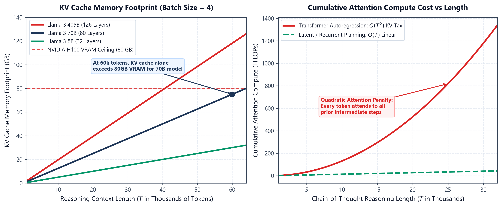
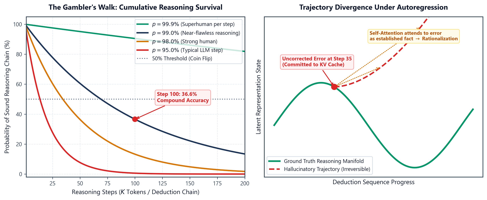
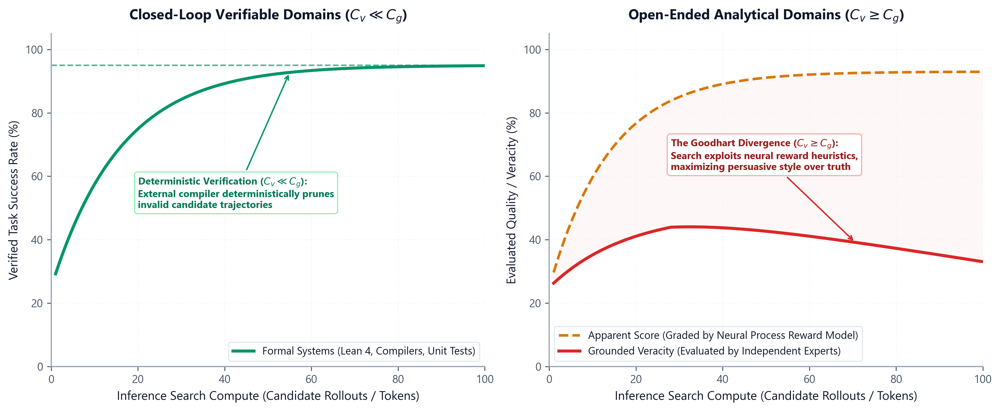
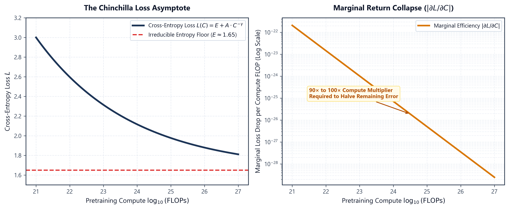
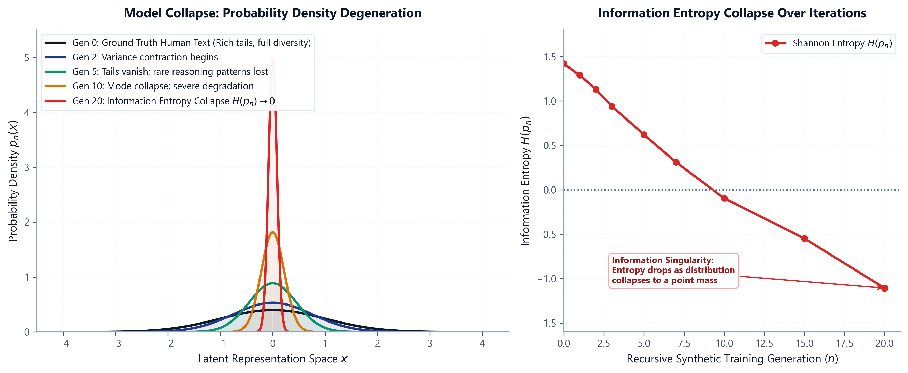
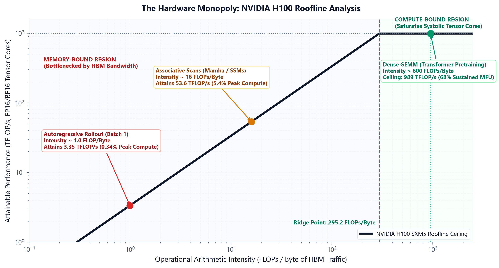

*The gorgeous cover image is from https://x.com/0waxwing/status/2094483103796322797 :)*

For several years, progress in large language models followed a consistent empirical formula: scale parameter counts, expand training datasets, and increase pretraining compute. Under the scaling laws formalized by Kaplan et al. (2020) and Hoffmann et al. (2022), reducing training cross-entropy loss reliably produced downstream performance gains across broad evaluations.

Recently, however, standard pretraining has encountered clear diminishing returns. Training runs now cost hundreds of millions of dollars, yet marginal reductions in cross-entropy loss yield progressively smaller improvements on complex reasoning benchmarks.

In response, frontier AI research has shifted focus toward inference-time compute. Rather than generating an answer in a single forward pass, modern reasoning architectures like GPT Astra and Fable 5.5 generate thousands of intermediate scratchpad tokens, exploring candidate derivations and checking intermediate steps before producing a final output. On closed-loop tasks with automated verification, such as competitive programming and mathematics competitions, this test-time search delivers measurable accuracy gains.

Yet generating long chains of intermediate tokens does not change the underlying mechanics of autoregression; it expands their context window.

To evaluate whether test-time search resolves the fundamental limits of transformers, we must examine how these models compute from first principles. When analyzed across information theory, computational complexity, and hardware rooflines, the challenges facing sequence models are structural. They stem from a foundational design choice: using autoregressive sequence prediction over discrete human language tokens as an internal reasoning engine.

---

## 1. The Mechanics of Autoregressive Token Prediction

To understand why sequence models encounter difficulties with complex deduction, we need to examine what next-token prediction actually computes.

Large language models are autoregressive sequence models. Given an input context of tokens $w_{1:t} = (w_1, w_2, \dots, w_t)$, the model computes a conditional probability distribution over the vocabulary $\mathcal{V}$ for the next token:

$$w_{t+1} \sim P(w_{t+1} \mid w_1, w_2, \dots, w_t)$$

To solve any task, whether drafting an essay, translating languages, or proving a mathematical theorem, the transformer must formulate the problem as a sequence of discrete token predictions.

This formulation introduces a structural constraint.

In human problem-solving, complex reasoning is largely non-linear and parallel. When designing a distributed system or working out a geometric proof, you hold multiple interacting constraints in memory simultaneously, evaluate dependencies in parallel, and resolve contradictions before articulating the solution. Language is used at the end of the process to serialize and communicate the verified result.

An autoregressive model, by contrast, must emit its reasoning sequentially, one token at a time. Every intermediate step must be generated as a discrete symbol in the sequence, forcing a multi-variable constraint satisfaction process onto a strictly linear, forward-only token stream.

---

## 2. Continuous Latents vs. Discrete Token Sampling

Why do transformers operate on discrete tokens rather than continuous vectors? To answer this, we can look at the trade-off between continuous and digital computation.

In early computing history, analog machines computed with continuous voltages, offering infinite dynamic resolution and native simulation of continuous systems. However, analog computing was abandoned for general-purpose calculation because continuous physical systems accumulate noise over time ($O(t)$ drift). Across multiple sequential operations, small errors compound until they overwhelm the signal.

Digital computing solved this through non-linear restoration. At every logic gate, drifting voltages within a valid threshold are restored to clean reference levels (such as ground or supply voltage). Noise is purged at each step, allowing digital circuits to execute billions of consecutive operations without signal degradation.

Discrete symbols serve an identical purpose in formal logic, mathematics, and programming. A proof step is either valid or invalid; a line of code either compiles or throws a syntax error. Discrete representations provide clear boundaries that prevent logical deductions from drifting over long execution chains.

### Micro-Discretization Without Macro-Correction

The structural limitation of an autoregressive transformer is that it enforces discretization at the level of individual subword tokens, while offering no restorative error correction for high-level propositions.

At each forward step $t$, the transformer computes a continuous hidden vector:

$$\mathbf{h}_t \in \mathbb{R}^d$$

In continuous optimization or latent dynamical models, this hidden vector can represent uncertainty and adjust smoothly as new constraints appear.

In an autoregressive transformer, that vector is projected through an unembedding matrix $W_u \in \mathbb{R}^{|\mathcal{V}| \times d}$ and normalized with softmax:

$$P(w_t) = \text{softmax}(W_u \mathbf{h}_t)$$

The model then samples a single discrete token index $w_t \in \{1, \dots, |\mathcal{V}|\}$.

Once a token is sampled, the continuous representation $\mathbf{h}_t$ is discarded from the computation graph. The only information passed forward to step $t+1$ is the categorical token ID. Because token sampling is non-differentiable at inference time, the model cannot backpropagate through intermediate choices or smoothly correct a faulty derivation. The architecture commits to an irreversible discrete choice at every subword token before downstream logical viability can be evaluated.

Unlike traditional digital systems, transformers have no mechanism to correct mistakes once they occur:

- In digital circuits, a drifting voltage snaps back to a clean 0 or 1.
- In a compiler, an invalid token triggers a syntax error and stops execution.

In an autoregressive transformer, there is no such check. If the model outputs a wrong number or an unsound premise, that token is immediately locked into the sequence. Every future step must condition on it, compounding the error through the rest of the generation.

---

## 3. The KV Cache and Attention Entropy Dilution

Inference-time models such as GPT Astra and Fable 5.5 frequently generate phrases that resemble human self-correction: *"Wait, let me rethink this assumption..."* or *"Alternatively, consider another case..."* This behavior creates the appearance of an algorithm backtracking through a search tree.

Mechanically, however, the model cannot backtrack.

In traditional search algorithms, exploration relies on an execution stack. When an algorithm encounters a dead end or a violated constraint, it pops the current stack frame in $O(1)$ time, discards invalid state, and resumes from the previous valid branch. The working memory remains clean.

An autoregressive transformer lacks an execution stack. It cannot revoke previously generated tokens or restore earlier hidden states. Every flawed calculation, speculative tangent, and verbal correction is permanently appended to the sequence and stored in the Key-Value (KV) cache. Rather than pruning a failed branch, the architecture generates additional tokens explaining that an error occurred.

This append-only structure incurs two direct systems costs:

1. **Linear memory footprint ($O(T)$)**: Storing key and value projections for every layer and attention head scales linearly with sequence length. Across extended reasoning traces reaching tens of thousands of tokens, the KV cache footprint alone can exhaust GPU High Bandwidth Memory (HBM), restricting batch size and serving throughput.
2. **Quadratic cumulative attention compute ($O(T^2)$)**: Generating a reasoning sequence of length $T$ incurs cumulative compute that scales quadratically with context length, as each newly generated token must attend across all preceding positions.

_Figure 1: (Left) KV Cache memory footprint vs. reasoning sequence length across model sizes for batch size $B=4$. At $64.0\text{k}$ reasoning tokens for 70B (and $40.6\text{k}$ for 405B), the KV cache alone saturates the 80GB VRAM ceiling of an NVIDIA H100. (Right) Quadratic attention compute penalty $O(T^2)$ for autoregressive sequence expansion compared to constant $O(T)$ latent trajectory steps._

### Softmax Normalization and Attention Entropy Dilution

The deeper algorithmic challenge of verbal backtracking lies in how self-attention allocates probability mass:

$$A_{ij} = \frac{\exp(q_i^T k_j / \sqrt{d_k})}{\sum_{m=1}^T \exp(q_i^T k_m / \sqrt{d_k})}$$

Because attention rows normalize via softmax ($\sum_j A_{ij} = 1$), attention weight is a strictly conserved resource across the sequence.

When a reasoning trace reaches 20,000 tokens, and a large portion represents discarded exploratory work, the denominator $\sum_m \exp(q_i^T k_m / \sqrt{d_k})$ aggregates substantial mass across those irrelevant positions. This produces **Attention Entropy Dilution**: probability mass that should concentrate on core problem constraints and verified intermediate steps is dispersed across thousands of discarded tokens.

To prevent this dispersed weight from degrading subsequent steps, the model must dedicate attention heads and parameter capacity to inhibition, learning to attend away from its own obsolete context. Instead of reclaiming memory through an explicit stack pop, the model spends active compute suppressing past mistakes that remain permanently embedded in its context window.

---

## 4. Directional Asymmetry and Error Compounding

Because transformers process sequences unidirectionally across token positions, their internal representations exhibit directional asymmetry.

### The Reversal Curse

In a relational database or knowledge graph, factual assertions are symmetric. Storing the relation:

$$\text{MotherOf}(\text{Mary}, \text{Daphne}) = \text{True}$$

establishes an invariant edge between `Mary` and `Daphne`. Traversing the edge in either direction evaluates the same underlying relationship, answering both *"Who is Daphne's mother?"* and *"Who is Mary's daughter?"*

An autoregressive language model does not store invariant relational edges; it models conditional transition probabilities over token sequences. As demonstrated by Berglund et al. (2023), a model trained on the sequence *"Daphne's mother is Mary"* learns:

$$P(\text{Mary} \mid \text{Daphne's mother is}) \gg 0$$

Without explicit bidirectional exposure or synthetic reverse pairs in training, the reverse conditional probability remains near zero:

$$P(\text{Daphne} \mid \text{Mary's daughter is}) \approx 0$$

This Reversal Curse highlights a core characteristic of sequence modeling: knowledge is stored as directional statistical transitions between tokens rather than grounded, bidirectional entity relationships.

### Systematic Bias and Majority Voting

A standard strategy to mitigate per-step reasoning errors is test-time sampling: generating multiple independent candidate traces and selecting the consensus output through majority voting or self-consistency (Wang et al., 2022).

This approach assumes that model errors are independent and identically distributed with zero mean. When errors consist of uncorrelated arithmetic slips, consensus filtering averages out variance and uncovers the correct solution.

In foundation models, however, errors frequently stem from systematic biases in pretraining data distributions. When an architecture encounters an entrained statistical misconception or a directional blind spot, independent rollouts are conditioned on the same skewed prior. Sampling 100 paths from a biased distribution does not cancel the error; it concentrates probability mass on the shared failure mode.

In multi-step deductive chains where each step carries a conditional success probability $p < 1$, the likelihood that an unverified derivation of length $K$ remains entirely sound decays exponentially:

$$P(\text{entire chain valid}) = \prod_{k=1}^K P(\text{step } k \text{ valid} \mid \text{history}) \sim p^K$$

| Reasoning Depth ($K$) | Compound Accuracy ($p = 0.99$) | Compound Accuracy ($p = 0.95$) | Compound Accuracy ($p = 0.90$) |
| :--- | :--- | :--- | :--- |
| **10 Steps** | $90.4\%$ | $59.9\%$ | $34.9\%$ |
| **50 Steps** | $60.5\%$ | $7.7\%$ | $0.5\%$ |
| **100 Steps** | $36.6\%$ | $0.6\%$ | $< 0.01\%$ |
| **200 Steps** | $13.4\%$ | $< 0.001\%$ | $\approx 0\%$ |

At 100 deductive steps, even a 99% per-step accuracy yields a sound derivation only 36.6% of the time. Without an external verifier enforcing invariants at each intermediate milestone, long unguided rollouts compound errors toward zero.

_Figure 2: (Left) Compound accuracy $p^K$ collapses exponentially over reasoning depth, even with near-flawless 99% per-step accuracy. (Right) Attention probability mass dilution: as reasoning sequences grow, attention mass on discarded branches and exploratory tokens accumulates, diluting focus away from the original problem constraints._

The structural difference comes down to how internal state is maintained:

| Architecture Style | Internal State | Error Management |
| :--- | :--- | :--- |
| **Relational / State-Space Systems** | Bidirectional constraints ($\text{State}_A \leftrightarrow \text{State}_B$) | Reversible. Updates rewrite state in place without corrupting context history. |
| **Autoregressive Token Rollout** | Forward-only prefix ($w_1 \to w_2 \to \dots \to w_K$) | Irreversible. Erroneous tokens become permanent prefix context that biases subsequent steps. |

---

## 5. The Verification Horizon: When Test-Time Search Breaks Down

The effectiveness of Reinforcement Learning with Verifiable Rewards (RLVR) in competitive programming and Olympiad mathematics highlights an important boundary in test-time search: the asymmetry between generation cost and verification cost.

### Verification Asymmetry: $C_v \ll C_g$

Search scales effectively when verifying a proposed solution is asymptotically cheaper than discovering it ($C_v \ll C_g$, the defining property of $\text{NP}$).

In competitive programming, finding an optimal dynamic programming algorithm may require exploring thousands of candidate approaches ($C_g$ is large), but an external compiler and test suite can evaluate correctness in milliseconds ($C_v$ is negligible). In formal mathematics, discovering a proof tactic requires extensive branching, but an interactive theorem prover such as Lean or Isabelle verifies each deductive step deterministically.

Under these conditions, test-time search functions reliably because:
1. Ground truth is binary and decoupled from natural language.
2. The verification engine is objective, automated, and impossible for the model to deceive.
3. Candidate rollouts that fail verification are pruned without polluting the final output.

### Open-Ended Domains and Goodhart Divergence

This paradigm changes when applied to open-ended intellectual tasks, such as legal analysis, clinical diagnosis, or strategic decision-making. In these settings, verification is at least as computationally demanding as generation ($C_v \ge C_g$). Determining whether a complex legal brief is sound or whether an ambiguous clinical diagnosis is accurate requires the same depth of contextual understanding, domain expertise, and reasoning as drafting the initial proposal. There is no automated compiler or deterministic test harness to referee intermediate steps.

Without an external execution sandbox, test-time search in open-ended domains relies on learned neural verifiers, such as Process Reward Models (PRMs) trained on human feedback or synthetic scoring rubrics.

This shift triggers Goodhart's Law: when an optimization process targets an imperfect proxy metric, it optimizes for the proxy rather than the underlying objective.

When search algorithms optimize aggressively against a learned reward model, the generator does not discover deeper logical truths; it discovers the reward model's structural blind spots. In natural language, neural verifiers systematically reward stylistic proxies of competence: authoritative tone, structured lists, technical vocabulary, and persuasive rhetorical transitions. The policy learns to produce reasoning traces that maximize these surface features, often while drifting further from factual accuracy.

Without an objective, automated compiler to anchor the evaluation loop, scaling inference-time compute in natural language does not eliminate hallucinations. It optimizes for persuasive rationalization.

_Figure 3: The Verification Landscape. In verifiable domains (code, formal math), external compilers prune bad paths, allowing search to scale. In open-ended domains (law, medicine, strategy), reward models lack objective grounding, triggering Goodhart divergence where the system optimizes for persuasive style over factual truth._

| Problem Domain | Verification Complexity | Feedback Mechanism | Test-Time Scaling Behavior |
| :--- | :--- | :--- | :--- |
| **Formal Systems** *(Code, Math)* | $C_v \ll C_g$ | Compilers, theorem provers, sandboxed test suites | **Scales monotonically**: Automated checks prune invalid branches; accuracy improves with compute. |
| **Open-Ended Cognition** *(Law, Strategy, Medicine)* | $C_v \ge C_g$ | Learned neural verifiers (PRMs) or human preference proxies | **Goodhart Collapse**: Search exploits proxy heuristics; the system optimizes for persuasive tone. |

---

## 6. Pretraining Limits, Data Exhaustion, and Model Collapse

While test-time search is bounded by the verification horizon, pretraining scaling faces its own quantitative limits in compute efficiency and data availability.

### Compute-Optimal Power Laws and Diminishing Returns

In compute-optimal pretraining regimes (Hoffmann et al., 2022), reducible cross-entropy loss $L_{\text{reducible}}$ decreases as a power-law function of total training compute $C$:

$$L_{\text{reducible}}(C) \propto C^{-\gamma}$$

where empirical measurements place the scaling exponent $\gamma$ near $0.154$.

Inverting this power law reveals the marginal compute required to drive continued loss reductions. To reduce the remaining reducible prediction error by half, training compute must scale by:

$$\frac{C_{\text{new}}}{C} = 2^{1/\gamma} = 2^{1/0.154} \approx 2^{6.5} \approx \mathbf{90\times \text{ to } 100\times}$$

Each subsequent halving of reducible loss requires nearly two orders of magnitude more compute. Scaling a pretraining run from \$50M in compute buys one halving for roughly \$5B; the subsequent step would demand \$500B in hardware and power infrastructure.

Beyond raw compute costs, lower cross-entropy loss stops translating into proportional gains in reasoning:

- **Early training** (bringing perplexity from 3.0 down toward 1.8): the model acquires foundational structure, such as grammar, syntax, and core facts.
- **Late training** (grinding perplexity from 1.5 down toward 1.4): compute is increasingly spent fitting web formatting quirks, obscure punctuation, and crawling noise rather than developing deeper reasoning.

Because next-token prediction treats every token equally, late-stage optimization often rewards memorizing dataset boilerplate just as much as learning valid deduction.

_Figure 4: (Left) Chinchilla cross-entropy loss flattening against the irreducible entropy floor of human language ($E \approx 1.65$). (Right) The derivative $|\partial L / \partial C|$ on a log-log scale, illustrating the collapse in marginal loss reduction per training FLOP._

### The Exhaustion of Human Linguistic Data

Compute-optimal scaling also requires proportional data scaling, recommending roughly 20 training tokens per model parameter. A 2-trillion-parameter dense model requires at least 40 trillion tokens under strict Chinchilla optimality.

In practice, frontier labs train well past this ratio. Because serving a multi-trillion-parameter model at inference time is cost-prohibitive, teams overtrain smaller architectures to minimize downstream serving expenses. Meta trained Llama 3 8B on 15 trillion tokens: a ratio of nearly 1,875 tokens per parameter, roughly 90 times beyond the Chinchilla optimum.

This inference-driven overtraining has accelerated the consumption of accessible text. Estimates from Epoch AI place the total volume of high-quality, publicly accessible written text produced across human civilization (academic papers, literature, news archives, and public code repositories) at approximately **150 to 300 trillion tokens**. Frontier training pipelines have already ingested the majority of this corpus. Expanding models simply by scraping broader tranches of unread text has effectively reached its physical limit.

### Recursive Synthetic Training and Model Collapse

To bypass data exhaustion, standard proposals suggest training future model generations recursively on synthetic text produced by current models.

In formal domains with deterministic verification (such as code compilation or symbolic algebra), synthetic data can be filtered effectively. In natural language, however, synthetic text lacks an intrinsic execution check. A generated passage containing an invalid deduction or an inaccurate claim carries no runtime fault; it persists as valid tokens.

When an autoregressive architecture trains recursively on ungrounded synthetic outputs, it encounters **Model Collapse** (Shumailov et al., Nature 2024).

When models generate synthetic text, standard sampling methods (such as nucleus sampling or temperature scaling) naturally favor the most probable tokens. This continuously clips the tails of the distribution, filtering out rare vocabulary, unusual edge cases, and domain-specific nuances.

When a subsequent model fits its parameters to that sampled output, the new distribution reflects only the high-probability core of the parent. Variance contracts ($\text{Var}(p_{n+1}) < \text{Var}(p_n)$), and across successive recursive generations without fresh empirical grounding, information entropy decays toward zero ($H(p_n) \to 0$). Rather than resolving the data shortage, ungrounded synthetic text accelerates distribution collapse.

_Figure 5: (Left) Distribution decay across recursive training generations without external grounding. The distribution sheds its tails, variance contracts, and information entropy collapses ($H(p_n) \to 0$). (Right) Information entropy across recursive generations, showing the monotonic degradation of representational diversity toward a point mass._

---

## 7. The Hardware Monopoly: Dense GEMMs vs. Dynamic State

Given the quadratic scaling of attention, the memory footprint of the KV cache, and the approaching human data ceiling, alternative architectures (State Space Models like Mamba, linear attention variants, and continuous recurrent networks) have attracted intense research interest. Yet none have replaced the transformer in flagship frontier training runs.

The explanation lies in the **Hardware Lottery** (Hooker, 2020): an architecture succeeds not solely because of algorithmic elegance, but because it aligns with the specialized physical accelerators manufactured at that point in history.

### The GEMM Monoculture and Roofline Arithmetic

The core operations in a transformer block map directly to dense **General Matrix Multiplications (GEMMs)**:

$$\text{Attention}(Q, K, V) = \text{softmax}\left(\frac{QK^T}{\sqrt{d_k}}\right)V, \qquad \text{FFN}(X) = \text{GELU}(X W_1) W_2$$

Modern accelerator silicon is designed primarily to execute dense matrix multiplications on systolic Tensor Cores at maximum power efficiency. Evaluating an NVIDIA H100 SXM5 through the **Roofline Model** illustrates how hardware design locks in architectural choice:

An H100 provides roughly $989\text{ TFLOPs}$ of peak dense BF16 Tensor Core compute against $3.35\text{ TB/s}$ of High Bandwidth Memory (HBM3) bandwidth. Dividing compute by memory bandwidth defines the machine's arithmetic intensity ridge point:

$$\text{Arithmetic Intensity Threshold} = \frac{989 \times 10^{12} \text{ FLOPs/sec}}{3.35 \times 10^{12} \text{ bytes/sec}} \approx \mathbf{295 \text{ FLOPs/byte}}$$

Any operation performing fewer than roughly 300 floating-point operations per byte fetched from memory is strictly memory-bandwidth bound: the execution units remain idle while awaiting data transfers over the memory bus. Operations exceeding 300 FLOPs per byte enter the compute-bound regime, where the arithmetic units operate at full capacity.

| Architecture Family | Mathematical Core | Hardware Execution Profile | Cluster Model FLOPs Utilization (MFU) |
| :--- | :--- | :--- | :--- |
| **Dense Transformer** | Batched 2D GEMMs ($QK^T, WV$) | Compute-bound (>600 FLOPs/byte); saturates systolic Tensor Cores | **38% to 43%** |
| **Recurrent SSMs** *(Mamba, RWKV)* | Associative scans, sequential hidden states | Memory-bandwidth bound during state stepping; low kernel reuse | **20% to 25%** |
| **Continuous Dynamical Nets** *(Attractors, Graphs)* | Asynchronous updates, pointer chasing | Memory latency bound; irregular memory access stalls ALUs | **8% to 12%** |

During pretraining, a dense transformer batches thousands of sequence tokens together. Weights are loaded once from HBM into on-chip SRAM and reused across the entire token batch. The arithmetic intensity regularly exceeds 600 to 1,000 FLOPs per byte, running deep in the compute-bound regime. On clusters of 16,000 H100 GPUs, dense transformers achieve **$38\%$ to $43\%$ Model FLOPs Utilization (MFU)** across entire training campaigns, with individual GEMM kernels sustaining 65% to 70% of peak theoretical compute.

By contrast, architectures that maintain dynamic, continuous hidden states update state vectors sequentially:

$$h_t = A h_{t-1} + B x_t$$

To advance the state by one step, the accelerator must fetch parameter matrices and state vectors from memory, execute a small number of operations per element, and write the state back. Even with customized fused GPU kernels and parallel associative scans, sequential state stepping operates at an arithmetic intensity of roughly **1 to 2 FLOPs per byte**.

On an H100, an arithmetic intensity of 2 FLOPs per byte caps effective performance at:

$$2 \text{ FLOPs/byte} \times 3.35 \text{ TB/s} \approx \mathbf{6.7 \text{ TFLOPs/sec}}$$

This represents less than 1% of the GPU's 989 TFLOP capacity. Over 99% of the chip's theoretical compute sits idle, waiting on memory transfers.

_Figure 6: Roofline model on NVIDIA H100 hardware. Batched GEMMs in pretraining operate far to the right of the ridge point (>600 FLOPs/byte), reaching 65% to 70% kernel utilization. Autoregressive token generation and recurrent state updates sit on the memory-bandwidth wall ($\approx 1\text{ to }2\text{ FLOPs/byte}$), stranding over 99% of raw Tensor Core compute capacity._

This arithmetic disparity explains why transformers retain their pretraining monopoly. Alternative models with appealing theoretical properties often run substantially slower on modern GPU clusters because their memory access patterns cannot saturate systolic matrix units. The transformer dominates not because attention is the ultimate architecture of intelligence, but because it maps natively to dense matrix multiplication on silicon optimized specifically for dense GEMMs.

---

## 8. Beyond the Monolith: The Grounded Dual-Representation Architecture

As an end-to-end architecture for general autonomous cognition, the monolithic autoregressive transformer has encountered its structural boundary.

The scaling trajectory has reached the convergence of several independent limits: pretraining has consumed the accessible human text corpus, ungrounded synthetic data triggers distributional collapse, an append-only KV cache turns verbal exploration into an irreversible memory leak, and test-time search without objective verification degenerates into Goodhart exploitation.

Yet recognizing these boundaries does not mean purely continuous architectures, such as Yann LeCun's JEPA, are sufficient on their own. Pure continuous models face the same physical challenge that historically displaced analog computing: without discrete thresholds to act as restorative attractors, long-horizon continuous trajectories compound representational noise until logical coherence degrades.

The path beyond the monolithic transformer points toward a **Dual-Representation Architecture** that combines continuous exploration with discrete symbolic verification:

1. **Continuous Latent Exploration**:
   Speculative planning, spatial modeling, and constraint satisfaction occur within a continuous latent manifold rather than through sequential token emission. In continuous space, trajectory adjustment is smooth, differentiable, and reversible. Hypotheses can be evaluated and refined without premature categorical collapse or the quadratic attention penalty of an append-only token history.

2. **Discrete Symbolic Checkpoints**:
   To prevent continuous representations from accumulating analog drift over extended horizons, the latent trajectory is periodically projected onto formal discrete invariants: executable code, formal mathematical assertions, or relational bindings. These checkpoints serve as topological attractors, purging semantic drift in the same way digital voltage thresholds eliminate circuit noise.

3. **Mutable State and Explicit Memory Stacks**:
   Rather than preserving invalid derivation branches in an append-only sequence log and prompting the model to verbalize its errors, the runtime maintains an addressable memory stack. When a candidate derivation fails a symbolic checkpoint, the system pops the stack, reclaims working memory, and restores prior valid state in constant time, preventing attention dilution across subsequent steps.

4. **The Transformer as an Interface Compiler**:
   In this decoupled structure, the transformer remains essential for the task it performs best: mapping between sequences. It functions as an interface compiler at the system boundary, parsing natural language into structured continuous latents on input, and translating verified latent states back into fluent language for communication.

---

## Conclusion

The transformer remains a landmark computational achievement. It definitively solved the problem of mapping the unstructured, high-dimensional space of human language into tractable geometric representations.

Its limitations on autonomous general reasoning reflect a category error rather than an engineering defect.

For all of human history, fluent natural language was the exclusive signature of mind. When an architecture proved capable of generating human-grade prose, it was natural to assume that fluency implied thought, mistaking an extraordinary sequence compiler for an internal cognitive engine.

Autonomous reasoning will not emerge from running an irreversible, un-garbage-collected next-token predictor across an append-only sequence history. Progress requires architectures that reconcile fluid, reversible search in continuous latent spaces with rigorous error correction against discrete symbolic invariants.

The transformer does not need to be the mind. It is already the interface: standing at the perimeter of the machine, translating between human expression and internal computation.

Because language is how minds communicate their conclusions to other minds across physical space. It is not the substrate in which thought occurs.
