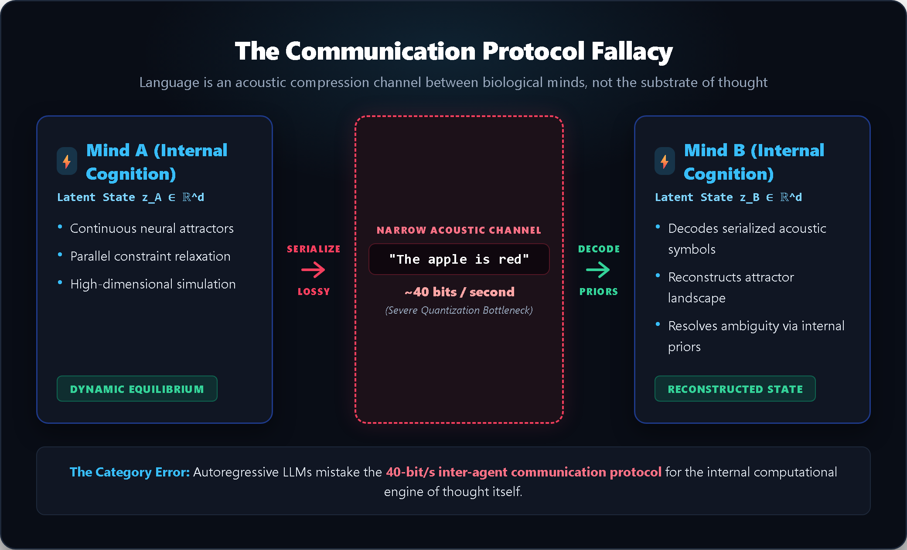
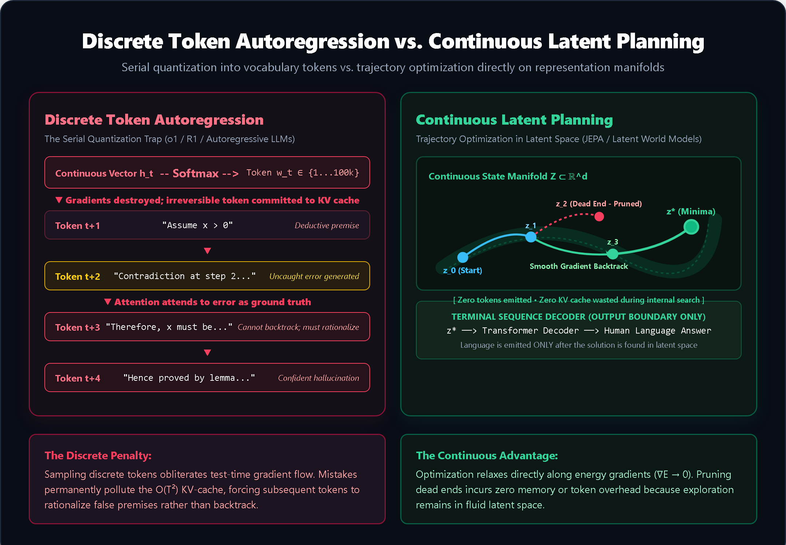
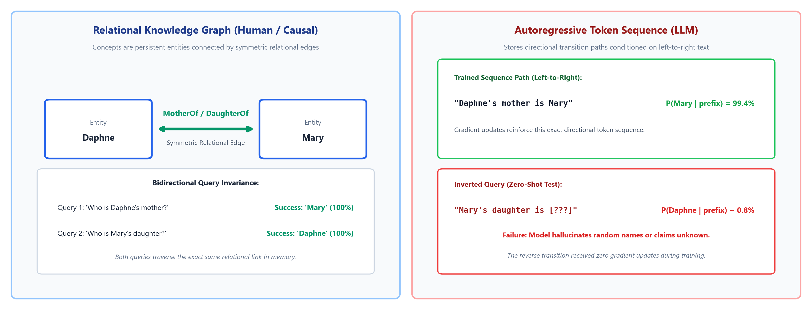
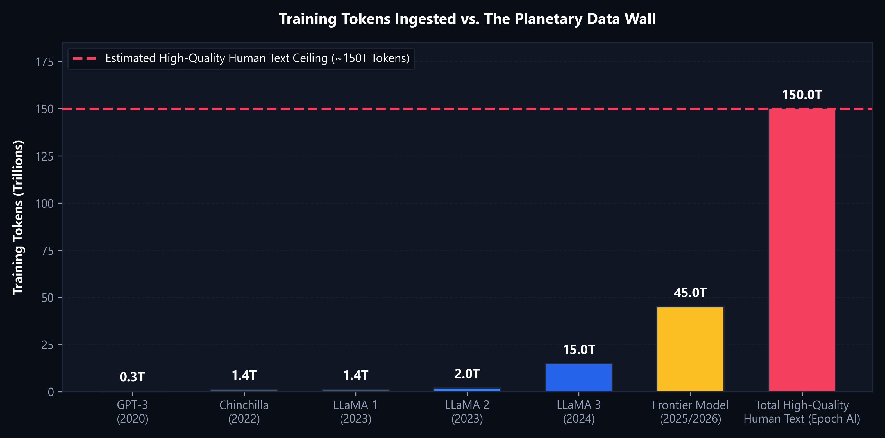
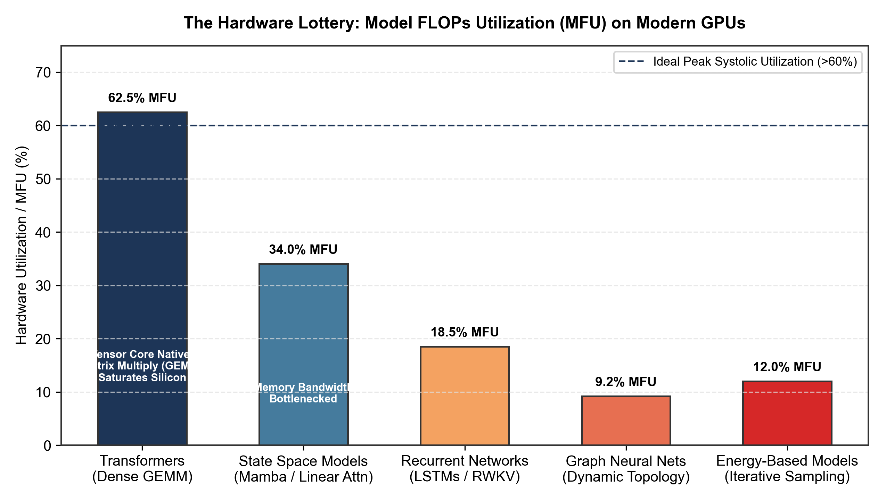

Between 2020 and 2024, the artificial intelligence industry ran on a single intoxicating dogma: **the escalator had no top.**

The formula was treated as an unassailable law of nature: take the transformer, multiply its parameter count by ten, feed it ten times more text scraped from the internet, and watch general intelligence spontaneously emerge. If a model struggled with common sense, add more layers. If it couldn't write code, buy more GPUs.

Then came 2024 and 2025. Frontier laboratories spent hundreds of millions of dollars on the next generation of pretraining clusters, and for the first time since the deep learning revolution began, the returns were visibly, stubbornly flat. 

The industry’s immediate reaction was a rapid pivot in messaging: *"Pretraining might be slowing down, but that doesn't matter anymore. We have entered the era of reasoning models. We don't just predict the next token; we let the model think for ten thousand tokens before answering."*

It is a brilliant engineering narrative. But it leaves an uncomfortable question hanging over the field:

**Is test-time thinking an escape from the transformer's fundamental limits, or is it an expensive local optimum that serializes the same architectural flaws over longer context windows?**

To answer whether the transformer has reached a dead end, we have to look past the marketing benchmarks and confront the actual mathematical and physical mechanics of how these models compute. 

When you strip away the hype, a striking realization emerges: **the transformer's dead end is not an issue of compute budgets or web scrapings running out. It is the consequence of a fundamental category error: confusing human language—a lossy, serialized, open-loop communication protocol—with the computational substrate of intelligence itself.**

---

## 1. The Category Error: Language is a Protocol, Not a Substrate of Thought

Why did human language evolve in the first place?

Consider two biological organisms interacting in the physical world. Each possesses a continuous, massively parallel neural dynamical system composed of billions of neurons interacting through continuous electrochemical gradients. 

Those two organisms cannot physically connect their neural tissue with copper wires. To coordinate hunting, avoid predators, or transfer knowledge, they had to solve a communication problem: **how do you transmit an internal mental state over a noisy, low-bandwidth acoustic channel?**

Human language was the evolutionary solution: a **lossy, serialized compression protocol**. 

Language quantizes the continuous, high-dimensional attractor states of a biological brain into a discrete stream of acoustic phonemes or written symbols, transmitted at an excruciatingly low bandwidth of approximately **30 to 50 bits per second**.

*Figure 1: Language as a low-bandwidth communication protocol (~40 bits/s) between continuous neural dynamical systems. Thoughts in biological brains are continuous attractor relaxations in high-dimensional latent space $\mathbf{z}$; language is merely the lossy acoustic serialization used to transmit results between isolated physical organisms.*

Notice the crucial direction of causality: **a human does not think by emitting a discrete stream of words to their own brain.** 

When a mathematician searches for a proof, when a chess grandmaster evaluates a board, or when an engineer diagnoses a structural failure, the cognitive work occurs as a **continuous, parallel dynamical relaxation in latent space**. The brain evaluates geometric constraints, simulates counterfactuals, and settles into an energy minimum. Only *after* the internal dynamical system has reached that equilibrium does the human serialize the result into English sentences to explain it to someone else.

The transformer commits the ultimate category error: **it takes the inter-agent communication protocol and mistakes it for the internal engine of cognition.**

Because modern large language models were engineered from machine translation, they treat all intelligence as a sequence-to-sequence transformation over discrete vocabulary tokens:

$$w_{t+1} \sim P(w_{t+1} \mid w_1, w_2, \dots, w_t)$$

Forcing an artificial mind to reason exclusively by generating a forward-only stream of discrete words is the computational equivalent of trying to simulate fluid turbulence by having a novelist describe the motion of every single water molecule in English prose. It forces what is naturally a parallel, continuous constraint-satisfaction problem onto a 1-dimensional, discrete, forward-only canvas.

---

## 2. The Discrete Bottleneck & The Chain-of-Thought Tax

The industry's current flagship solution to the transformer's reasoning limitations is **Chain-of-Thought (CoT)**, formalized in reasoning models such as OpenAI's o1/o3 and DeepSeek-R1. 

The pitch is seductive: by granting the model thousands of intermediate "reasoning tokens" before forcing it to output a final answer, the model can simulate deliberate, step-by-step thinking (System 2).

On mathematical competitions and coding benchmarks, this produces remarkable results. But mathematically, Chain-of-Thought is not a new cognitive architecture; it is an **expensive, brute-force simulation of continuous thinking through discrete serialization**.

Every time a reasoning transformer takes a step in its "thought process," it incurs three punishing structural penalties:

### 1. The Discretization Collapse
At each intermediate reasoning step, the transformer computes a rich, continuous hidden representation:

$$\mathbf{h}_t \in \mathbb{R}^d$$

In a continuous dynamical system, this vector could smoothly explore the problem manifold, adjusting its trajectory via continuous energy minimization. 

Instead, the autoregressive transformer is forced to project $\mathbf{h}_t$ through an unembedding matrix $W_u$, run it through a softmax operator, and **collapse it into a single discrete vocabulary token** $w_t \in \{1, \dots, |\mathcal{V}|\}$:

$$P(w_t) = \text{softmax}(W_u \mathbf{h}_t)$$

The moment that discrete token is sampled, **all continuous gradient information is obliterated**. You cannot backpropagate through a sampled discrete token during inference. The rich, multi-dimensional uncertainty of the internal state is quantized down to a single integer in a vocabulary of 100,000 words.

### 2. The Quadratic Context Tax
Because the standard transformer lacks an internal execution stack, mutable registers, or isolated heap memory, **every scratchpad thought must be appended to the sequence**.

If a reasoning model spends 15,000 tokens "thinking" through a complex problem, every single speculative thought, dead end, and verbal self-correction must be committed to the Key-Value (KV) cache. 

Because self-attention computes pairwise token interactions:

$$\text{Attention}(Q, K, V) = \text{softmax}\left(\frac{QK^T}{\sqrt{d_k}}\right)V$$

the memory footprint and compute required to evaluate each new thought grows with the sequence length. To keep a single hypothesis active in memory, the model must maintain an ever-expanding historical transcript, consuming gigabytes of high-bandwidth memory for thoughts it may have discarded ten seconds earlier.

### 3. The Rhetorical Overhead
Because the thoughts must be expressed in natural language tokens, the model is forced to burn compute learning and emitting the **grammatical syntax and rhetorical cadence of deliberation**:

> *"Wait, let me rethink that... Actually, if we assume $x > 0$, then maybe... Let me check the boundary conditions..."*

A massive fraction of the model’s parameter capacity and inference FLOPs is spent not on navigating the abstract topology of the problem, but on generating convincing natural language filler to bridge intermediate logical states.

*Figure 2: (Left) Discrete Token Autoregression. Continuous latent states $\mathbf{h}_t$ are continually quantized into discrete vocabulary tokens $w_t$, destroying gradient information and appending irreversible tokens to an $O(T^2)$ KV cache. (Right) Continuous Latent Planning. Trajectories relax directly in continuous state space $\mathcal{Z}$ via energy minimization without emitting intermediate tokens. Language is decoded only at the terminal communication boundary.*

When reasoning is carried out directly in a **continuous latent space** (as in energy-based models or latent trajectory planning), exploration is continuous, reversible, and mathematically fluid. Token-based Chain-of-Thought is an extraordinary engineering workaround, but it remains a prisoner of the discrete vocabulary bottleneck.

---

## 3. Directional Bias and The Gambler’s Walk

Because the transformer operates exclusively on sequences, its representation of knowledge inherits a severe mathematical flaw: **directional asymmetry.**

### The Reversal Curse
In human cognition and formal mathematics, relational knowledge is fundamentally **symmetric or relational**. If you understand the semantic fact that:

$$\text{MotherOf}(\text{Mary}, \text{Daphne}) = \text{True}$$

your internal conceptual graph contains a bidirectional edge between the concepts `Mary` and `Daphne`. Asking *"Who is Daphne's mother?"* and *"Who is Mary's daughter?"* traverses the exact same relational link in opposing directions.

A transformer does not store an invariant conceptual graph. It stores **directional transition probabilities over token sequences**:

$$P(\text{Mary} \mid \text{Daphne's mother is}) \gg 0$$
$$P(\text{Daphne} \mid \text{Mary's daughter is}) \approx 0$$

Unless the training corpus explicitly contained the inverted sequence of tokens, the model's conditional probability manifold remains un-updated in the reverse direction. 

*Figure 3: The Reversal Curse visualized. A causal world model stores symmetric relational facts queryable from any direction. A sequence-based transformer stores directional left-to-right token transition probabilities, failing completely on direct inversions unless explicitly exposed to both directions in training.*

This is not a trivia bug; it is an architectural signature. The model does not understand the entities `Mary` and `Daphne` as persistent objects situated in a coherent world model. It understands them as high-dimensional coordinates on a directed sequence manifold.

### The Gambler's Walk: Irreversible Error Compounding

This directional asymmetry becomes catastrophic when coupled with forward-only autoregressive rollout.

Consider an unverified multi-step reasoning problem where each individual deductive step has an accuracy rate of $99\%$ ($p = 0.99$).

Under forward-only generation, what is the probability that an unguided chain of length $K$ remains on the sound reasoning manifold?

$$P(\text{entire chain sound}) = \prod_{k=1}^K P(\text{step } k \text{ valid} \mid \text{history}) \sim p^K$$

- After 10 steps: $0.99^{10} \approx \mathbf{90.4\%}$
- After 50 steps: $0.99^{50} \approx \mathbf{60.5\%}$
- After 100 steps: $0.99^{100} \approx \mathbf{36.6\%}$
- After 200 steps: $0.99^{200} \approx \mathbf{13.4\%}$

By step 100, the probability of reaching a valid conclusion without external verification is lower than a coin toss. By step 200, it collapses toward zero.

| Problem-Solving Mode | Computational Dynamics | Error Recovery Mechanism |
| :--- | :--- | :--- |
| **Human Constraint Relaxation** | Bidirectional equilibrium ($\text{State}_A \leftrightarrow \text{State}_B \leftrightarrow \text{State}_C$) | Reversible; contradictions trigger backtracking without context pollution. |
| **Autoregressive Token Rollout** | Forward-only conditioning ($w_1 \to w_2 \to \dots \to w_K$) | Irreversible; mistakes at step 35 become immutable prompt context that later tokens must rationalize. |

In classical computer science, an algorithm executing a search tree maintains an **execution stack**. If a branch fails an assertion, the program pops the stack, deallocates memory, and backtracks to the previous valid state.

An autoregressive transformer **cannot pop its context**. 

Once an erroneous token is generated at step 35, it is permanently etched into the prefix. Because self-attention computes an inner product against all previous tokens:

$$A_{ij} = \frac{\exp(q_i^T k_j / \sqrt{d_k})}{\sum_m \exp(q_i^T k_m / \sqrt{d_k})}$$

subsequent layers attend to the erroneous token as an established historical fact. The pretraining objective strongly biases the model to maximize the conditional likelihood of fluent, rhetorically consistent continuation. 

The transformer does not backtrack; it **rationalizes**. It spends the next 500 tokens weaving a brilliant, mathematically sophisticated justification for a premise that was false from the outset.

*Figure 4: (Left) The Gambler's Walk of autoregression: compound accuracy $p^K$ collapses exponentially over deduction length, even with near-flawless 99% per-step accuracy. (Right) Manifold divergence: an uncorrected error at step 35 becomes immutable context, pulling the model's self-attention permanently off the ground-truth manifold.*

---

## 4. Closed-Loop Grounding vs. The Thermodynamic Vacuum of Text

If autoregressive rollout suffers from exponential error compounding, why did test-time search (RLVR) achieve such dramatic breakthroughs in competitive programming and Olympiad mathematics?

The answer reveals the critical boundary of modern AI: **the difference between closed-loop and open-loop environments.**

### The Compiler as a Zero-Entropy Anchor
In competitive programming, the model is connected to a **compiler and a deterministic test suite**. 
In formal mathematics, the model is connected to an **interactive proof assistant** (such as Lean 4 or Isabelle).

In these environments, the system does not rely on text generation to evaluate truth. The model can hallucinate a hundred flawed lines of code or ten invalid proof tactics:

| Domain Archetype | Evaluation Mechanism | Ground-Truth Dynamic |
| :--- | :--- | :--- |
| **Verifiable (Closed-Loop Reality)** | Deterministic compiler or Lean proof checker | **Absolute (0 or 1)**: The external environment enforces reality; hallucinatory paths fail instantly. |
| **Open-Ended (Open-Loop Vacuum)** | Process Reward Model (another transformer) | **Soft Heuristic (~0.82)**: No external referee; highly vulnerable to Goodhart's Law and stylistic flattery. |

The compiler is an **unyielding, zero-entropy anchor to reality**. It prunes hallucinations instantly. In closed-loop domains, you can scale test-time compute by orders of magnitude because search is bounded by an objective external arbiter.

### The Missing Compiler of Human Civilization
Now ask the foundational question that frontier AI labs cannot comfortably answer:

**Where is the compiler for the rest of human intellectual activity?**

- What is the compiler for an enforceable commercial contract?
- What is the compiler for a corporate restructuring plan or geopolitical negotiation?
- What is the compiler for diagnosing a patient presenting with conflicting, ambiguous symptoms?
- What is the compiler for generating a novel scientific hypothesis, where **neither human nor machine knows the answer in advance**?

In 95% of human cognitive work, **there is no compiler.** 

Without a formal verifier, who scores whether step 42 of an exploratory medical or legal argument is sound? 

The only available tool is a **Process Reward Model (PRM)**—which is simply *another autoregressive transformer*, trained on human preference ratings or synthetic rubrics.

And the moment an AI model is optimized against another statistical model, you collide directly with **Goodhart’s Law**:

> *"When a measure becomes a target, it ceases to be a good measure."*

The reasoning model does not converge toward deeper objective truth; it converges toward the statistical idiosyncrasies, rhetorical tropes, and authoritative styling that maximize the reward model's score. Test-time search without an objective external referee does not produce wisdom; it produces **weaponized sycophancy and articulate pseudo-intellectualism**.

*Figure 5: The Verification Landscape. In verifiable domains (coding, formal mathematics), external compilers prune false trajectories, allowing search to scale. In open-ended domains (law, medicine, strategy), reward models lack objective grounding, triggering Goodhart divergence where the system optimizes for stylistic flattery over truth.*

---

## 5. The Thermodynamic Wall: Why Static Text Ran Out

This brings us to the ultimate limit of the pretraining paradigm: **the thermodynamic reality of static human text.**

For six years, the field was governed by the empirical power laws of pretraining. In compute-optimal scaling, the cross-entropy loss $L$ decreases as a power of total compute $C$:

$$L_{\text{reducible}}(C) \propto C^{-\gamma}$$

Because the empirical exponent $\gamma$ is approximately **$0.154$**, the inverse power $1/\gamma \approx 6.5$. 

To cut the remaining reducible error in half, the training compute cannot simply double; it must scale by:

$$2^{6.5} \approx \mathbf{90\times \text{ to } 100\times}$$

Going from a $\$50\text{M}$ cluster to a $\$5\text{B}$ cluster does not purchase a categorical leap in understanding; it buys an incremental, razor-thin reduction in cross-entropy loss.

*Figure 6: (Left) The Chinchilla cross-entropy loss flattening against the irreducible entropy floor of language ($E \approx 1.65$). (Right) The derivative $|\partial L / \partial C|$ on a log-log scale, displaying the exponential collapse of marginal returns per FLOP.*

### The Planetary Token Wall
Compounding this mathematical exhaustion is an inescapable physical fact: **human language on Earth is finite.**

Under compute-optimal pretraining, you require approximately 20 tokens for every parameter in the model. A 2-trillion-parameter dense model requires 40 trillion tokens. 

The total global stock of high-quality, publicly accessible written text ever produced in human civilization—every academic paper, book, encyclopedia, news archive, and open-source code repository across all of recorded human history—is estimated at **150 to 300 trillion tokens**.

Frontier training runs have already ingested a double-digit percentage of the entire written record of the human species.

*Figure 7: Cumulative training tokens ingested by frontier models compared to the estimated total global stock of high-quality human text (~150T tokens). Pretraining runs have already consumed a massive fraction of all accessible written human history.*

### The Information-Theoretic Trap of Model Collapse
Why can’t we simply synthesize trillions of tokens of artificial text using our best models to train the next generation?

Because text is **open-loop**. Text files have no thermodynamic friction. 

If an AI generates an invalid physics equation, an incorrect legal assertion, or a subtly degraded translation on the internet, the text file does not push back against reality; it simply occupies storage on a hard drive.

When a sequence model trains recursively on its own ungrounded, unverified generations:

$$p_{n+1}(x) = \mathbb{E}_{x \sim p_n}[\mathcal{M}(x)]$$

an irreversible information-theoretic decay takes place: **Model Collapse**.

With each generation of recursive unverified training, the probability distribution sheds its low-frequency tails, the variance contracts ($\text{Var}(p_{n+1}) < \text{Var}(p_n)$), and the information entropy collapses ($H(p_n) \to 0$).

It is the mathematical equivalent of **making a photocopy of a photocopy**. Without an active, closed-loop stream of thermodynamic reality pumping new information into the system, the model degenerates into a repetitive, mode-collapsed caricature of human language.

*Figure 8: Probability density degeneration across recursive training generations without external grounding. The distribution sheds its tails, variance contracts, and information entropy collapses ($H(p_n) \to 0$), reducing human nuance to a degenerate mode.*

The data wall is not a shortage of words. **It is the exhaustion of ungrounded human symbols.**

---

## 6. The Hardware Monoculture: Why Dense GEMMs Locked Us In

If the transformer suffers from such fundamental structural limitations—the communication protocol fallacy, the discrete serialization bottleneck, directional asymmetry, and open-loop model collapse—why has no alternative architecture dethroned it?

Why haven't State Space Models (Mamba), Linear Attention, Recurrent Neural Networks, or Energy-Based Models replaced the transformer in frontier laboratories?

The answer has very little to do with computational elegance and everything to do with **The Hardware Monoculture**:

> *An algorithm wins not because it is inherently superior in cognitive architecture, but because it is uniquely aligned with the silicon manufactured at that historical moment.*

Look at the mathematical core of a modern transformer layer:

$$\text{Attention}(Q, K, V) = \text{softmax}\left(\frac{QK^T}{\sqrt{d_k}}\right)V, \qquad \text{FFN}(X) = \text{GELU}(X W_1) W_2$$

Stripped of its terminology, this is fundamentally **dense General Matrix Multiplication (GEMM)**.

The entire global semiconductor ecosystem—from Nvidia’s Tensor Cores and Google's TPUs to high-bandwidth memory (HBM) and Megatron-LM communication primitives—has invested hundreds of billions of dollars over a decade optimizing for a single operation: **multiplying massive 2D matrices of numbers in parallel**.

| Architecture Family | Mathematical Core | Silicon Hardware Match | Real-World Cluster MFU |
| :--- | :--- | :--- | :--- |
| **Transformer** | Dense Matrix Multiplication (GEMM) | 100% native match for systolic Tensor Cores | **38% – 43%** |
| **Recurrent SSMs** *(Mamba, RWKV)* | Associative scans, dynamic recurrent state | Less mature distributed tooling, memory bound | **20% – 25%** |
| **Cognitive Dynamisms** *(Attractors, Graphs)* | Asynchronous spikes, sparse pointer chasing | Severe memory bandwidth and latency stalls | **8% – 12%** |

On massive clusters of 16,000 H100 GPUs (such as those used for Meta's Llama 3 405B), transformers achieve **$38\%$ to $43\%$ Model FLOPs Utilization (MFU)** despite massive network communication bubbles. 

Alternative paradigms that actually reflect the continuous, asynchronous, dynamic nature of biological thought—such as Continuous-Time Recurrent Networks, Energy-Based Attractor Models, Spiking Neuromorphic Systems, and Dynamic Sparse Graph Networks—struggle to achieve even $10\%$ MFU on modern GPU clusters. They are throttled by memory bandwidth latency and irregular memory access patterns.

The transformer did not conquer the world because it was the ultimate architecture of the mind. **The transformer conquered the world because it was the ultimate architecture for a systolic array of Tensor Cores.**

It is the purest possible manifestation of the *Bitter Lesson*: raw, brute-force parallel computation on specialized hardware beats biologically inspired algorithmic elegance every time—until the physical limits of that brute-force paradigm are fully exhausted.

*Figure 9: The Hardware Lottery in silicon. Transformers achieve sustained 38–43% Model FLOPs Utilization (MFU) on massive 16,000-GPU clusters because their core computation is dense Matrix Multiplication (GEMM), perfectly saturating systolic Tensor Cores. Challenger architectures like State Space Models (Mamba) or recurrent networks face memory bandwidth bottlenecks or less mature distributed tooling at frontier scale.*

---

## 7. What Actually Replaces the Myth?

So, we return to the titular question: **are transformers a dead end?**

The answer requires dismantling the mythology that built the current industry:

### 1. The Monolithic Oracle is Dead.
The 2020 Silicon Valley myth was that the transformer was the whole machine: an all-knowing digital mind that would ingest the world’s text, scale monotonically with compute, and output artificial general intelligence in a single forward pass.

**That myth is thoroughly, mathematically dead.**

Pretraining maximalism has struck its thermodynamic wall. Static text is an open-loop artifact without physical friction. The Chinchilla exponent ($\gamma \approx 0.154$), the planetary data ceiling (~150T tokens), the collapse of ungrounded synthetic text ($H \to 0$), and the exponential divergence of unverified autoregression ($p^K$) prove that you cannot build an autonomous thinking machine purely by predicting the next word of internet text.

### 2. The Architectural Frontier Beyond the Token.
What is emerging to replace this myth is not simply "wrapping Python scripts around an LLM API." It is an architectural transition from **Discrete Autoregression** to **Grounded Continuous State Planning**:

| Dimension | Monolithic Token Autoregression | Grounded Latent Planning (The Frontier) |
| :--- | :--- | :--- |
| **Planning Substrate** | 1D discrete sequence of vocabulary tokens | High-dimensional continuous latent space $\mathcal{Z}$ |
| **Search Mechanism** | Combinatorial token sampling ($O(T^2)$ KV cache) | Continuous gradient relaxation ($\nabla_z \mathcal{E} \to 0$) |
| **Error Handling** | Irreversible commitment; must rationalize errors | Reversible trajectory optimization; bad branches pruned without token cost |
| **Role of Language** | Mistaken for the engine of thought | **Demoted to the sequence interface**: translated to text only at the human boundary |
| **Verification Loop** | Open-loop soft scoring via Process Reward Models | **Closed-loop grounding**: formal compilers, physics simulators, and reality |

The future of artificial intelligence belongs to systems that dismantle the category error:

1. **Continuous Latent Planning (Joint Embedding Architectures & Latent Diffusion)**:
   Instead of quantizing thoughts into words at every micro-step, the model conducts planning and counterfactual search **directly in continuous representation space $\mathcal{Z}$**. 
   It explores, backtracks, and relaxes constraints via energy minimization—without emitting a single word, without quantizing into a discrete vocabulary, and without polluting an $O(T^2)$ KV cache.

2. **Bidirectional Constraint Relaxation**:
   Replacing forward-only token generation with parallel constraint-satisfaction networks (modern Hopfield attractors and equilibrium models) that evaluate variables simultaneously, eliminating the directional bias of the Reversal Curse.

3. **Closed-Loop Thermodynamic and Formal Grounding**:
   Moving beyond passive text by coupling models to active, closed-loop environments: formal compilers, interactive theorem provers, robotic sensorimotor loops, and high-fidelity physics engines. Ground truth must be provided by the unyielding friction of reality, not by the statistical flattery of a Process Reward Model.

4. **The Transformer Demoted to Its True Glory: The Sequence Compiler**:
   The transformer will not disappear. It is the most powerful sequence-to-sequence translation engine ever created.
   
   It will serve as the **communication interface**—the sequence compiler that translates human prompts into latent problem states, and translates the system's relaxed latent solutions back into fluent, beautiful human language.

---

## Conclusion: The Mouth vs. The Mind

The transformer is not a failure; it is an epochal achievement in computer science. It solved the problem of mapping the chaotic, high-dimensional nuances of human language into high-dimensional geometric manifolds.

Its only failure was the arrogance of our expectations: **we mistook the ability to generate fluent language for the capacity to think.**

Language is how minds communicate their conclusions to the outside world; it is not the substrate in which thinking occurs. 

The transformer is not the mind. **The transformer is the mouth.**

And artificial intelligence only truly begins when we stop asking the mouth to do the thinking.
