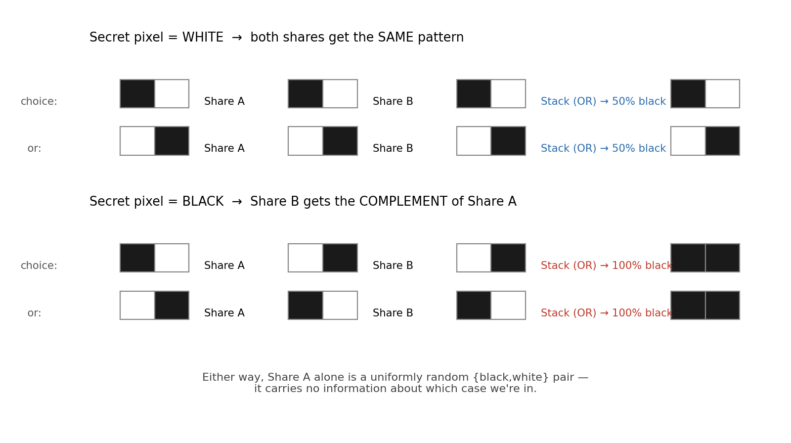
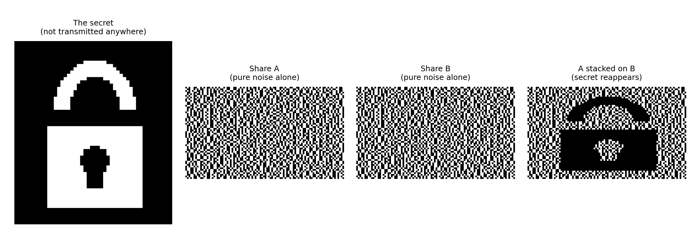
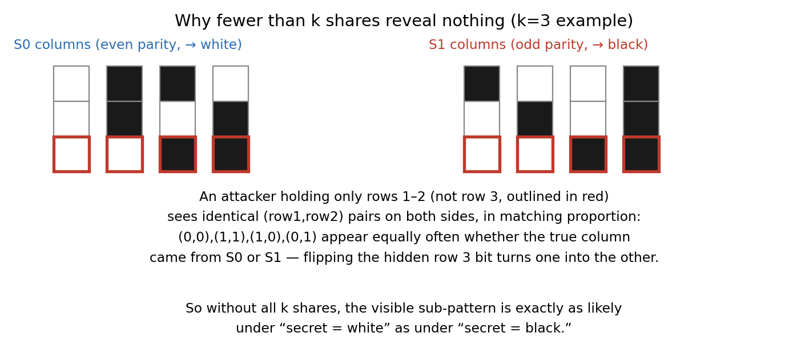
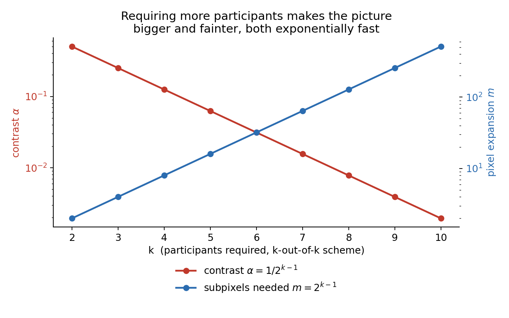

Most cryptography needs a computer to undo it, since you're usually reversing some modular arithmetic or an XOR or a rounding step, and there's no way around firing up a machine to do that math. Visual cryptography doesn't need any of that, which is honestly the reason I wanted to write about it in the first place. Naor and Shamir came up with it in 1994, and the idea is that you print two sheets, each one individually looking like plain television static, hand one to each of two people, and when they physically lay one transparency on top of the other, a picture shows up. No arithmetic, no device, just two pieces of plastic and your eyes.

I went in a little skeptical, since there's a lot of stuff in cryptography that looks cute as a demo and turns out to be secure only in a fairly loose, hand wavy sense once you actually poke at it. This isn't that, though. Either sheet on its own is provably indistinguishable from random noise, and the proof underneath it is pure combinatorics, counting and parity, nothing you'd need a number theory course to follow.

## Splitting a pixel into pieces

Take a black and white image, the secret you're trying to split up. Visual cryptography works on it one pixel at a time, and the whole thing is shaped by a single physical fact about transparent sheets, which is that stacking them can only add ink, never take it away.

Because of that, a single subpixel per share can't hold any information, since OR just gives you back whichever of the two is darker and there's nothing left over to hide in that. So each pixel gets expanded into a small block of subpixels instead, and it's the pattern inside that block that actually carries the secret, not any single bit.

In the simplest version of the scheme, where two people are needed and both are required, each pixel becomes a 1x2 block per share. There are only two ways to fill a block with one black subpixel and one white one, and every share gets one of those two on every pixel, picked at random. The only thing that changes, depending on what the secret pixel actually is, is whether the second share's pattern matches the first one or not.

If the secret pixel is white, both shares get handed the same random pattern, so stacking them just gives that pattern back, one black subpixel and one white one, which comes out to 50% coverage. If the pixel is black, the two shares get opposite patterns instead, so now every subpixel position has ink somewhere on one sheet or the other, and the block reads as fully black once stacked.



Neither share tells you anything by itself, and this took me a second to really believe even after reading the definition a few times, because a block with one black and one white subpixel looks exactly the same whether it came from the white branch of the construction or the black one, since the random choice gets made before either branch happens. All the information lives in how the two shares relate to each other, and none of it lives in either share on its own.

## Seeing in it working

I built a small padlock icon, 48 by 56 pixels, and ran the real algorithm against it rather than only describing it in the abstract.

```python
import numpy as np

rng = np.random.default_rng(11)
H, W = secret.shape  # secret: 1 = black, 0 = white

share1 = np.zeros((H, W*2), dtype=np.uint8)
share2 = np.zeros((H, W*2), dtype=np.uint8)
patterns = [np.array([1,0]), np.array([0,1])]

for y in range(H):
    for x in range(W):
        choice = patterns[rng.integers(0, 2)]
        if secret[y, x] == 0:      # white -> identical patterns
            p1, p2 = choice, choice
        else:                        # black -> complementary patterns
            p1, p2 = choice, 1 - choice
        share1[y, x*2:x*2+2] = p1
        share2[y, x*2:x*2+2] = p2

overlay = np.maximum(share1, share2)  # stacking transparencies = elementwise OR
```

Here's what actually came out of running it: the original padlock, which never gets transmitted anywhere in this whole process, the two individual shares, and what you get once you stack them on top of each other.



The two shares just look like plain noise, roughly balanced, about half black each, with nothing in either one on its own that hints there's a padlock hiding underneath. Put them together, though, and the padlock comes right back, not perfectly, since the white parts of the image reconstruct as a kind of even grey rather than clean white, but it's completely readable all the same, and you can tell what it is at a glance.

That grey versus black gap has a name in the literature, it's called the contrast of the scheme, and it isn't something you can tune away by being cleverer about the construction. It's baked into the math itself, and there's an exact number for how much of it you get, which I'll work out properly a bit further down.

## The formal version

Naor and Shamir describe the general threshold version of the scheme using two collections of matrices, one for encoding white pixels and one for encoding black ones, usually written $\mathcal{C}_0$ and $\mathcal{C}_1$. Each matrix has one row per participant and some number of columns equal to however many subpixels a single pixel ends up expanding into, and encoding a pixel just means picking a matrix at random from the correct collection, permuting its columns, and handing each participant their corresponding row. That's really just the same random pattern idea from before, written out more formally.

Two conditions need to hold for something to actually count as a working threshold scheme in this sense.

The first is contrast, which says that stacking any large enough group of rows together needs to produce a result whose blackness depends measurably on whether the underlying matrix came from the white collection or the black one, so that a white pixel and a black pixel are still visually distinguishable once reconstructed.

The second is security, which says that if you take a smaller group of rows, too few to reconstruct the pixel, the patterns you'd see restricted to just those rows need to look statistically identical no matter which collection the matrix actually came from. This second condition is the one doing all the real cryptographic work, so it's worth proving properly instead of just stating it and moving on the way a lot of explanations of this scheme tend to do.

## Why it's actually secure

The two person case is easy enough to check by hand, since a single share's block is one of the two possible patterns with equal probability no matter what the secret pixel actually was, because the random choice happens before anything branches on the secret's value at all. One share on its own carries zero information about the pixel.

The general case, where every one of $k$ people is required, took me a couple of passes through the original paper before it actually clicked, but the construction itself is pretty neat once you see it. You set the number of subpixels per pixel to $2^{k-1}$, and you let the white collection's columns be every length-$k$ binary vector with an even number of ones, of which there are exactly $2^{k-1}$, while the black collection uses every vector with an odd number of ones instead.

Reconstruction turns out to be the easier half to convince yourself of. Pick any single subpixel position and OR together all $k$ shares' bits at that position, and notice that an odd weight vector can never be entirely zero, since the all-zero vector has weight zero, which counts as even, so an odd weight column always has a one somewhere and ORs to black. Every column in the black collection behaves this way, so a genuinely black pixel comes back looking completely black with no exceptions.

An even weight vector, by contrast, is entirely zero for exactly one of its columns and has at least one 1 in every other column, so a white pixel reconstructs with one column's worth of white left over out of the total, dark overall but not quite as dark as true black. That single missing column turns out to be the entire contrast budget the scheme has to offer.



The security argument for this construction, worked out for three people so it's actually visible rather than just asserted, goes like this. Take any two of the three shares, leaving the third one hidden, and grab any column from the white collection, then flip its bit in that hidden row. Flipping a single bit always flips the parity of the whole vector, which means this operation maps every even weight column to a distinct odd weight one without ever touching a row that's actually visible to whoever's looking. Because of that, for every pattern the visible rows might show, exactly as many white collection columns produce it as black collection columns do, so what a smaller group can actually observe looks identical either way, and nothing about the secret leaks through.

## What it costs

None of this comes free, and the price grows quickly as you add more required participants.

Both the number of subpixels needed and the resulting contrast scale exponentially with the number of people required, doubling and halving respectively with each additional participant. A scheme requiring just two people doubles the image size for a comfortable, easily readable contrast, which is exactly what the padlock example above used, but push that up to five required participants and you're paying a factor of sixteen in image size for a contrast of only around six percent, which is close to the point where a human eye genuinely starts struggling to tell very dark grey apart from actual black.



I don't think that's really a flaw in this particular construction so much as a hard limit that comes from doing reconstruction with nothing but a Boolean OR operation. It's worth saying, though, that this exponential cost is specific to schemes where literally every participant is required, since ordinary threshold schemes, where any smaller subset out of a larger pool suffices, don't have to pay nearly as much, and constructions for that more general case exist in the same original paper. Working out the smallest possible pixel expansion for a given access structure turned into its own small corner of combinatorial design theory, and people still seem to be actively working on it.

## A few places this shows up

David Chaum proposed using something along these lines for voting receipts, where your printed receipt is one share of your ballot, meaningless entirely on its own, so that you could later confirm your vote had been recorded correctly without anyone who intercepted the receipt learning how you'd actually voted.

It also shows up in anti counterfeiting and in print and scan verification more broadly, since reconstruction needs zero computation, meaning a document only checks out once a specific transparent overlay gets physically placed on top of it, with nothing electronic required on site at all.

It's also just a genuinely good example to teach with, maybe one of the better ones out there, since the entire proof comes down to counting and parity, with no modular inverses and no elliptic curves anywhere in sight, nothing that needs several semesters of number theory before it makes sense.

There's an older, related idea worth knowing about too, Kafri and Keren's random grids technique from 1987, which achieves a similar overlay effect using a single sheet of noise plus one derived sheet, with no pixel expansion at all, though it only really handles the two person case cleanly and doesn't generalize to larger thresholds nearly as well as the matrix based construction does.

## Some things I wondered about while writing this

Is there a way around the pixel expansion?

Not really, not while you're restricted to plain black and white subpixels with strict OR based reconstruction, since the exponential figure derived above is a genuine combinatorial floor for that particular setup rather than a sign that nobody's tried hard enough to beat it. Schemes that relax something, whether that's allowing grayscale sharing, tolerating an occasional visual glitch probabilistically, or using the random grid approach mentioned earlier, are all trading away some amount of fidelity or generality in exchange for bringing that number down.

Can this handle a grayscale photo instead of a simple line drawing?

Yes, you'd halftone the image into a binary dot pattern first and then run the same construction on that result, and the underlying security argument doesn't change at all, since all the extra complexity lives entirely in the preprocessing step rather than in the cryptography itself.

Is a single share actually random, or does it just happen to look random in this one example that got generated?

It's actually random, in the same sense that a properly used one time pad produces something actually random rather than merely hard to distinguish from randomness, since the distribution over a single share's possible patterns is identical no matter what the secret pixel underneath it was, and that's a statement about the entire space of possibilities the construction defines, not just an observation about one padlock picture that happened to come out looking convincing.

## Summary

Visual cryptography splits an image into several shares by expanding each pixel into a small block of subpixels, arranged so that stacking together enough of those shares reconstructs a legible image while any smaller group of shares stays provably indistinguishable from plain noise. The simplest version, requiring two people, needs only two subpixels per original pixel for a clean, easily readable contrast, demonstrated above with an actual generated example rather than just described in words.

The general version, requiring every one of $k$ people and built from even and odd parity vectors, needs a number of subpixels that doubles with each additional required participant, for a contrast that correspondingly halves each time, and its security comes down to a simple bit flip argument between the two column sets that never touches whichever row happens to be missing from an attacker's view. There's no modular arithmetic involved anywhere in it, just combinatorics solid enough that a sheet of transparent plastic can do the decrypting on its own.
